# Contents
 
* [1.0 Introduction](#10-introduction)
	* [1.1 Overview](#11-overview)
	* [1.2 The Chain of Trust](#12-the-chain-of-trust)
* [2.0 Intel® Cloud Integrity Technology Architecture](#20-intel-cloud-integrity-technology-architecture)
* [3.0 Intel® Cloud Integrity Technology Components](#30-intel-cloud-integrity-technology-components)
	* [3.1 Attestation Server](#31-attestation-server)
	* [3.2 Key Broker Service](#32-key-broker-service)
	* [3.3 Key Broker Proxy](#33-key-broker-proxy)
	* [3.4 Trust Director](#34-trust-director)
	* [3.5 Trust Agent](#35-trust-agent)
	* [3.6 OpenStack Plugins](#36-openstack-plugins)
	* [3.7 Attestation Reporting Hub](#37-attestation-reporting-hub)
* [4.0 Intel® Cloud Integrity Technology Setup](#40-intel-cloud-integrity-technology-setup)
	* [4.1 Installing the Attestation Server](#41-installing-the-attestation-server)
		* [4.1.1 Installation Prerequisites](#411-installation-prerequisites)
		* [4.1.2 Package Dependencies](#412-package-dependencies)
        * [4.1.3 Installation](#413-installation)
	* [4.2 Installing the OpenStack Controller Extensions](#42-installing-the-openstack-controller-extensions)
		* [4.2.1 Prerequisites](#421-prerequisites)
		* [4.2.2 Minimum Requirements](#422-minimum-requirements)
		* [4.2.3 Extension Dependencies](#423-extension-dependencies)
		* [4.2.4 Installation](#424-installation)
	* [4.3 Installing the Key Broker Service](#43-installing-the-key-broker-service)
		* [4.3.1 Prerequisites](#431-prerequisites)
		* [4.3.2 Minimum Requirements](#432-minimum-requirements)
		* [4.3.3 Package Dependencies](#433-package-dependencies)
		* [4.3.4 Installation](#434-installation)
	* [4.4 Installing the Key Broker Proxy (KMS Proxy)](#44-installing-the-key-broker-proxy-kms-proxy)
		* [4.4.1 Prerequisites](#441-prerequisites)
		* [4.4.2 Minimum Requirements](#442-minimum-requirements)
		* [4.4.3 Package Dependencies](#443-package-dependencies)
		* [4.4.4 Installation](#444-installation)
	* [4.5 Installing the Trust Director](#45-installing-the-trust-director)
		* [4.5.1 Prerequisites](#451-prerequisites)
		* [4.5.2 Minimum Requirements](#452-minimum-requirements)
		* [4.5.3 Recommended Hardware](#453-recommended-hardware)
		* [4.5.4 Package Dependencies](#454-package-dependencies)
		* [4.5.5 Installation](#455installation)
	* [4.6 Installing the Trust Agent - Linux](#46-installing-the-trust-agent---linux)
		* [4.6.1 Package Dependencies](#461-package-dependencies)
		* [4.6.2 Supported Operating Systems](#462-supported-operating-systems)
		* [4.6.3 Prerequisites](#463-prerequisites)
		* [4.6.4 Installation](#464-installation)
	* [4.7	Installing the Trust Agent - Windows](#47installing-the-trust-agent---windows)
		* [4.7.1 Package Dependencies](#471package-dependencies)
		* [4.7.2 Supported Operating Systems](#472-supported-operating-systems)
		* [4.7.3 Prerequisites](#473-prerequisites)
		* [4.7.4 Installation](#474-installation)
* [5.0 Host Attestation](#50-host-attestation)
	* [5.1 Overview](#51-overview)
	* [5.2 Extending Host Attestation](#52-extending-host-attestation)
	* [5.3 Required Components](#53-required-components)
	* [5.4 Importing Whitelist Values](#54-importing-whitelist-values)
	* [5.5 Host Registration](#55host-registration)
		* [5.5.1 Registering Multiple Hosts Using a Flat File](#551-registering-multiple-hosts-using-a-flat-file)
		* [5.5.2 Registering a Host Individually](#552-registering-a-host-individually)
	* [5.6 Host Attestation](#56-host-attestation)
		* [5.6.1 Remediation of Untrusted Attestations](#561-remediation-of-untrusted-attestations)
* [6.0 Image Integrity (VM and Docker)](#60-image-integrity-vm-and-docker)
	* [6.1 Required Components](#61-required-components)
	* [6.2 Creating the Image Trust Policy (VM and Docker container)](#62-creating-the-image-trust-policy-vm-and-docker-container)
	* [6.3 Hash Only](#63-hash-only)
	* [6.4 Hash and Enforce](#64hash-and-enforce)
	* [6.5 VM Migrations](#65-vm-migrations)
	* [6.6 VM Snapshots](#66-vm-snapshots)
	* [6.7 Shared Storage](#67-shared-storage)
	* [6.8 VM and Docker Attestation](#68-vm-and-docker-attestation)
	* [6.9 Workflow Example #1 – VM images](#69-workflow-example-1--vm-images)
	* [6.10	Workflow Example #2 – Docker container images (Uploaded Images to Trust Director or Downloaded from Docker hub)](#610workflow-example-2--docker-container-images-uploaded-images-to-trust-director-or-downloaded-from-docker-hub)
* [7.0 Image Privacy](#70-image-privacy)
	* [7.1 Required Components](#71-required-components)
	* [7.2 VM Migrations](#72-vm-migrations)
	* [7.3 VM Snapshots](#73-vm-snapshots)
	* [7.4 Shared Storage](#74-shared-storage)
	* [7.5 Encrypting an Image](#75-encrypting-an-image)
	* [7.6 Launching an Instance of an Encrypted Image](#76-launching-an-instance-of-an-encrypted-image)
		* [7.6.1 VM Encryption for Microsoft Windows Compute Nodes](#761-vm-encryption-for-microsoft-windows-compute-nodes)
	* [7.7 Workflow Example for a Virtual Machine](#77-workflow-example-for-a-virtual-machine)
* [8.0 PCR Definitions](#80-pcr-definitions)
	* [8.1 TPM 1.2](#81-tpm-12)
	* [8.2 TPM 2.0](#82-tpm-20)
	* [8.3 MLE Administration](#83-mle-administration)
	* [8.4 TLS Policy Overview](#84-tls-policy-overview)
		* [8.4.1 TLS Policy Types](#841-tls-policy-types)
		* [8.4.2 Policy Scope](#842-policy-scope)
		* [8.4.3 Default Policy Selection](#843-default-policy-selection)
		* [8.4.4 Legacy Behavior](#844-legacy-behavior)
	* [8.5 Asset Tags](#85-asset-tags)
		* [8.5.1 Prerequisites](#851-prerequisites)
		* [8.5.2 Asset Tag Provisioning Workflow](#852-asset-tag-provisioning-workflow)
		* [8.5.3 Asset Tag Provisioning Modes](#853-asset-tag-provisioning-modes)
		* [8.5.4 Tags and Selections](#854-tags-and-selections)
		* [8.5.5 Asset Tag Provisioning](#855-asset-tag-provisioning)
			* [8.5.5.1 Push Provisioning](#8551-push-provisioning)
			* [8.5.5.2 Pull Provisioning](#8552-pull-provisioning)
			* [8.5.5.3 Creating an XML file for Asset Tag Provisioning](#8553-creating-an-xml-file-for-asset-tag-provisioning)
			* [8.5.5.4 Encrypting the Asset Tag XML](#8554-encrypting-the-asset-tag-xml)
			* [8.5.5.5 Decrypting and Verifying the Selection XML File](#8555-decrypting-and-verifying-the-selection-xml-file)
			* [8.5.5.6 Provisioning Usage](#8556-provisioning-usage)
		* [8.6 Database Configuration for Remote Database Servers](#86-database-configuration-for-remote-database-servers)
		* [8.7 Password Guidelines](#87-password-guidelines)
			* [8.7.1 Changing the Database Password](#871-changing-the-database-password)
		* [8.8 Trust Policies](#88-trust-policies)
			* [8.8.1 Choosing Files for Measurement](#881-choosing-files-for-measurement)
			* [8.8.2 Creating a Trust Policy](#882-creating-a-trust-policy)
				* [8.8.2.1 Creating a Trust Policy for a Virtual Machine Image](#8821-creating-a-trust-policy-for-a-virtual-machine-image)
				* [8.8.2.2 Creating a Trust Policy for a Docker container Images](#8822-creating-a-trust-policy-for-a-docker-container-images)
			* [8.8.3 Downloading a Docker image from Docker Hub using Trust Director](#883-downloading-a-docker-image-from-docker-hub-using-trust-director)
			* [8.8.4 Uploading a Docker image to Trust Director – Manual Upload](#884-uploading-a-docker-image-to-trust-director--manual-upload)
			*  [8.8.5 Uploading Image to Trust Director – Remote File Upload](#885-uploading-image-to-trust-director--remote-file-upload)
			* [8.8.6 Creating a Trust Policy for a Non-Virtualized Server](#886-creating-a-trust-policy-for-a-non-virtualized-server)
* [9.0 Whitelisting Guidelines](#90-whitelisting-guidelines)
	* [9.1 For BIOS MLEs:](#91-for-bios-mles)
	* [9.2 For VMM/OS MLEs:](#92for-vmmos-mles)
	* [9.3 Encrypted Images](#93encrypted-images)
* [10.0 OpenStack Controller Changes](#10-openstack-controller-changes)
	* [10.1 Horizon Changes](#101-horizon-changes)
		* [10.1.1 Library and Configuration Changes](#1011-library-and-configuration-changes)
		* [10.1.2 Instance View Changes](#1012-instance-view-changes)
		* [10.1.3 Images Dashboard Changes](#1013-images-dashboard-changes)
		* [10.1.4 Attestation Service](#1014-attestation-service)
		* [10.1.5 Trust Agent](#1015-trust-agent)
		* [10.1.6 Trust Director](#1016-trust-director)
		* [10.1.7 Attestation Reporting Hub](#1017-attestation-reporting-hub)
		* [10.1.8 Key Management Service](#1018-key-management-service)
			* [10.1.8.1 Check Server Version](#10181-check-server-version)
			* [10.1.8.2 Check Server Status](#10182-check-server-status)
			* [10.1.8.3 Start and Stop the Server](#10183-start-and-stop-the-server)
			* [10.1.8.4 Add, edit, or Remove User Permissions](#10184-add-edit-or-remove-user-permissions)
			* [10.1.8.5 List Users](#10185-list-users)
			* [10.1.8.6 Execute All Setup Tasks](#10186-execute-all-setup-tasks)
			* [10.1.8.7 Execute Specific Setup Tasks](#10187-execute-specific-setup-tasks)
			* [10.1.8.8 Validate a Setup Task Without Executing It](#10188-validate-a-setup-task-without-executing-it)
			* [10.1.8.9 Force Execution of a Setup Task Even if It is Already Validated](#10189-force-execution-of-a-setup-task-even-if-it-is-already-validated)
			* [10.1.8.10 Continue Executing Subsequent Setup Tasks Even if One Fails](#101810-continue-executing-subsequent-setup-tasks-even-if-one-fails)
			* [10.1.8.11 Setup Task Reference](#101811-setup-task-reference)
			* [10.1.8.12 Uninstall](#101812-uninstall)
			* [10.1.8.13 Help](#101813-help)
		* [10.1.9 KMS Proxy](#1019-kms-proxy)
			* [10.1.9.1 Check Server Version](#10191-check-server-version)
			* [10.1.9.2 Check Server Status](#10192-check-server-status)
			* [10.1.9.3 Start and Stop the Server](#10193-start-and-stop-the-server)
			* [10.1.9.4 Execute All Setup Tasks](#10194-execute-all-setup-tasks)
			* [10.1.9.5 Execute Specific Setup Tasks](#10195-execute-specific-setup-tasks)
			* [10.1.9.6 Validate a Setup Task Without Executing It](#10196-validate-a-setup-task-without-executing-it)
			* [10.1.9.7 Force Execution of a Setup Task Even if It is Already Validated](#10197-force-execution-of-a-setup-task-even-if-it-is-already-validated)
			* [10.1.9.8 Continue Executing Subsequent Setup Tasks Even if One Fails](#10198-continue-executing-subsequent-setup-tasks-even-if-one-fails)
			* [10.1.9.9 Setup Task Reference](#10199-setup-task-reference)
			* [10.1.9.10 Uninstall](#101910-uninstall)
			* [10.1.9.11 Help](#101911-help)
		* [10.1.10 Attestation Service](#10110-attestation-service)
			* [10.1.10.1 Check Server Version](#101101-check-server-version)
			* [10.1.10.2 Check Server Status](#101102-check-server-status)
			* [10.1.10.3 Start and Stop the Server](#101103-start-and-stop-the-server)
			* [10.1.10.4 Change the Database Password and Update Configuration Files](#101104-change-the-database-password-and-update-configuration-files)
			* [10.1.10.5 Output Attestation Service SSH Key and SAML Certificate Fingerprints](#101105-output-attestation-service-ssh-key-and-saml-certificate-fingerprints)
			* [10.1.10.6 Detect and Output Currently-Installed Version of and Installation Location Java](#101106-detect-and-output-currently-installed-version-of-and-installation-location-java)
			* [10.1.10.7 Detect and Output Currently-Installed Version and Installation Location of MySQL](#101107-detect-and-output-currently-installed-version-and-installation-location-of-mysql)
			* [10.1.10.8 Create a New MySQL SSL Certificate Authority](#101108-create-a-new-mysql-ssl-certificate-authority)
			* [10.1.10.9 Detect and Output Currently Installed Version and installation location of Tomcat](#101109-detect-and-output-currently-installed-version-and-installation-location-of-tomcat)
			* [10.1.10.10 Generate a New Tomcat SSL Certificate](#1011010-generate-a-new-tomcat-ssl-certificate)
			* [10.1.10.11 Check the Status of the Tomcat Web Server](#1011011-check-the-status-of-the-tomcat-web-server)
			* [10.1.10.12 Backup and Restore All Keys, Certificates, and Secrets Used by the Attestation Service](#1011012-backup-and-restore-all-keys-certificates-and-secrets-used-by-the-attestation-service)
			* [10.1.10.13 Execute All Setup Tasks](#1011013-execute-all-setup-tasks)
			* [10.1.10.14 Execute Specific Setup Tasks](#1011014-execute-specific-setup-tasks)
			* [10.1.10.15 Validate a Setup Task Without Executing It](#1011015-validate-a-setup-task-without-executing-it)
			* [10.1.10.16 Force Execution of a Setup Task Even if It is Already Validated](#1011016-force-execution-of-a-setup-task-even-if-it-is-already-validated)
			* [10.1.10.17 Continue Executing Subsequent Setup Tasks Even if One Fails](#1011017-continue-executing-subsequent-setup-tasks-even-if-one-fails)
			* [10.1.10.18 Uninstall](#1011018-uninstall)
			* [10.1.10.19 Help](#1011019-help)
		* [10.1.11 Trust Agent](#10111-trust-agent)
			* [10.1.11.1 Start](#101111-start)
			* [10.1.11.2 Stop](#101112-stop)
			* [10.1.11.3 Restart](#101113-restart)
			* [10.1.11.4 Status](#101114-status)
			* [10.1.11.5 Version](#101115-version)
			* [10.1.11.6 Authorize](#101116-authorize)
			* [10.1.11.7 Setup](#101117-setup)
			* [10.1.11.8 Uninstall](#101118-uninstall)
			* [10.1.11.9 Help](#101119-help)
		* [10.1.12 Trust Director](#10112-trust-director)
			* [10.1.12.1 Start](#101121-start)
			* [10.1.12.2 Stop](#101122-stop)
			* [10.1.12.3 Restart](#101123-restart)
			* [10.1.12.4 password-vault](#101124-password-vault)
			* [10.1.12.5 director-envelope-key](#101125-director-envelope-key)
			* [10.1.12.6 director-envelope-key-registrationStart](#101126-director-envelope-key-registrationstart)
			* [10.1.12.7 Uninstall](#101127-uninstall)
			* [10.1.12.8 Help](#101128-help)
		* [10.1.13 Attestation Reporting Hub](#10113-attestation-reporting-hub)
			* [10.1.13.1 Start](#101131-start)
			* [10.1.13.2 Stop](#101132-stop)
			* [10.1.13.3 Restart](#101133-restart)
			* [10.1.13.4 password-vault](#101134-password-vault)
			* [10.1.13.5 Uninstall](#101135-uninstall)
	* [10.2 Installation and Configuration Options](#102-installation-and-configuration-options)
		* [10.2.1 Attestation Service](#1021-attestation-service)
			* [10.2.1.1 Installation Options](#10211-installation-options)
			* [10.2.1.2 Configuration Options](#10212-configuration-options)
			* [10.2.1.3 Security Configuration](#10213-security-configuration)
			* [10.2.1.4 Encrypting Configuration Files](#10214-encrypting-configuration-files)
			* [10.2.1.5 Changing the Database Password](#10215-changing-the-database-password)
		* [10.2.2 Trust Agent](#1022-trust-agent)
			* [10.2.2.1 Trust Agent without OpenStack](#10221-trust-agent-without-openstack)
			* [10.2.2.2 Trust Agent for OpenStack Compute Node](#10222-trust-agent-for-openstack-compute-node)
			* [10.2.2.3 OpenStack Compute Changes](#10223-openstack-compute-changes)
			* [10.2.2.4 Command-Line Options](#10224-command-line-options)
		* [10.2.3 Key Management Service](#1023-key-management-service)
			* [10.2.3.1 Installation Options](#10231-installation-options)
			* [10.2.3.2 Configuration](#10252-configuration)
			* [10.2.3.3 Configuring the KMS to use an External Barbican or KMIP-Compliant Key Vault](#10233-configuring-the-kms-to-use-an-external-barbican-or-kmip-compliant-key-vault)
			* [10.2.3.4 Command-Line Options](#10234-command-line-options)
		* [10.2.4 KMS Proxy](#1024-kms-proxy)
			* [10.2.4.1 Configuration](#10241-configuration)
			* [10.2.4.2 Command-Line Options](#10242-command-line-options)
		* [10.2.5 Trust Director](#1025-trust-director)
			* [10.2.5.1 Setup](#10251-setup)
			* [10.2.5.2 Configuration](#10252-configuration-1)
		* [10.2.6 OpenStack Controller](#1026-openstack-controller)
			* [10.2.6.1 Setup](#10261-setup)
			* [10.2.6.2 Configuration](#10262-configuration)
		* [10.2.7 Attestation Reporting Hub](#1027-attestation-reporting-hub)
	* [10.3 High Availability Guidelines](#103-high-availability-guidelines)
		* [10.3.1 Attestation Service](#1031-attestation-service)
			* [10.3.1.1 Prerequisites](#10311-prerequisites)
			* [10.3.1.2 Deployment Instructions](#10312-deployment-instructions)
			* [10.3.1.3 Failover](#10313-failover)
		* [10.3.2 Key Management Service](#1032-key-management-service)
		* [10.3.3 Key Management Proxy](#1033-key-management-proxy)
	* [10.4 Nova Changes](#104nova-changes)
		* [10.4.1 Filter Code](#1041-filter-code)
	* [10.5 OpenStack Compute Node Changes](#105openstack-compute-node-changes)
* [11.0 Configuration](#110-configuration)
	* [11.1 Directory Layout](#111-directory-layout)
		* [11.1.1 Key Broker Service](#1111-key-broker-service)
			* [11.1.1.1 Linux Directory Layout](#11111-linux-directory-layout)
			* [11.1.1.2 Home Directory Layout](#11112-home-directory-layout)
			* [11.1.1.3 Custom Directory Layout](#11113-custom-directory-layout)
		* [11.1.2 KMS Proxy](#1112-kms-proxy)
			* [11.1.2.1 Linux Directory Layout](#11121-linux-directory-layout)
			* [11.1.2.2 Home Directory Layout](#11122-home-directory-layout)
			* [11.1.2.3 Custom Directory Layout](#11123-custom-directory-layout)
* [12.0 Uninstallation](#120-uninstallation)
	* [12.1 Attestation Service](#121-attestation-service)
	* [12.2 Trust Agent](#122-trust-agent)
	* [12.3 Trust Director](#123-trust-director)
	* [12.4 Key Broker Service](#124-key-broker-service)
	* [12.5 KMS Proxy](#125-kms-proxy)
	* [12.6 OpenStack Patches](#126-openstack-patches)
	* [12.7 Attestation Reporting Hub](#127-attestation-reporting-hub)
* [13.0 Troubleshooting](#130-troubleshooting)
	* [13.1 Attestation Service](#131-attestation-service)
	* [13.2 Key Management Service](#132-key-management-service)
	* [13.3 KMS Proxy](#133-kms-proxy)
	* [13.4 Trust Agent](#134-trust-agent)
	* [13.5 OpenStack Controller Extensions](#135-openstack-controller-extensions)
	* [13.6 Attestation Reporting Hub](#136-attestation-reporting-hub)
* [14.0 Building OpenCIT from Source](#140-building-opencit-from-source)
	* [14.1	Preparing the Build Environment](#141preparing-the-build-environment)
		* [14.1.1 Minimum Requirements](#1411-minimum-requirements)
		* [14.1.2 Installing the Required Packages](#1412-installing-the-required-packages)
		* [14.1.3 Installing the Java Development Kit (JDK)](#1413-installing-the-java-development-kit-jdk-for-ubuntu-and-rhel)
        * [14.1.4 Installing Apache Maven](#1414-installing-apache-maven-for-ubuntu-and-rhel)
		* [14.1.5 Editing setting.xml](#1415-editing-settingsxml)
		* [14.1.6 Modifying Environment Files](#1416-modifying-environment-files)
	* [14.2 Intel® CIT Source Code](#142-intel-cit-source-code)
		* [14.2.1 Downloading the Source Code](#1421-downloading-the-source-code)
		* [14.2.2 Building the Source Code](#1422-building-the-source-code)
	* [14.3 Binary Locations](#143-binary-locations)
* [15.0 TXT/TPM Prerequisites and Activation](#150-txttpm-prerequisites-and-activation)
	* [15.1 Trusted Boot Provisioning](#151-trusted-boot-provisioning)
* [16.0 Frequently Asked Questions](#160-frequently-asked-questions)
* [17.0 Sample Use Cases](#170-sample-use-cases)
	* [17.1 Attesting Open vSwitch (OVS)](#171-attesting-open-vswitch-ovs)
	* [17.1.2 Configuration Steps](#1712-configuration-steps)
* [18.0 Known Issues and Errata](#180-known-issues-and-errata)

# 1.0 Introduction
Intel® Cloud Integrity Technology (Intel® CIT) extends a hardware-based *Root of Trust* up through the Cloud solution stack to ensure the privacy and integrity of Cloud platforms and workloads.

## 1.1 Overview
Intel® CIT secures Cloud-based workloads through workload placement, encryption, and launch control bound to the hardware-rooted Chain of Trust. By using Intel® Trusted Execution Technology (Intel® TXT) to measure server firmware and software components during system launch, serverconfigurations can be verified against tampering. Extending this Chain of Trust, additional software components, hypervisors, virtual machines and now Docker containers can be similarly attested and verified. By encrypting workload images and tying the decryption key to server hardware using a Trusted Platform module, final control over where a virtual machine may or may not launch is given to the customer, preventing unauthorized access and enabling data sovereignty.

## 1.2 The Chain of Trust
The *Chain of Trust* begins with Intel® TXT, which acts as an unchanging hardware measurement agent, referred to as a hardware Root of Trust. By using Intel® TXT to measure software that in turn measures other software, a chain of trust can be established, where each step of the boot process measures the next step. Intel® CIT extends the concept of the “chain of trust” using a remote Attestation Service to verify the measured server components against previously-stored known-good measurements. While previous incarnations were only capable of measuring the BIOS, OS kernel, and hypervisor components, Intel® Cloud Integrity Technology now adds to this capability, using administrator- customizable Trust Policies to define specific files and folders to be measured, both for bare-metal servers and for virtual machines, bringing the chain of trust beyond platform attestation and enabling application-level integrity verification. Since each measurement is performed by a component that was itself measured by another component further down the chain, all the way to the hardware root of trust and remotely verified through the trust attestation process, Cloud adopters can be assured their workloads are run only on hardware and software that meets their criteria for security.
  

# 2.0 Intel® Cloud Integrity Technology Architecture
**Figure 1** shows a component overview of Intel® CIT architecture.

**Figure 1. Component Overview — Workload Confidentiality and Integrity**

**Figure 2** shows a more detailed overview of the architecture.

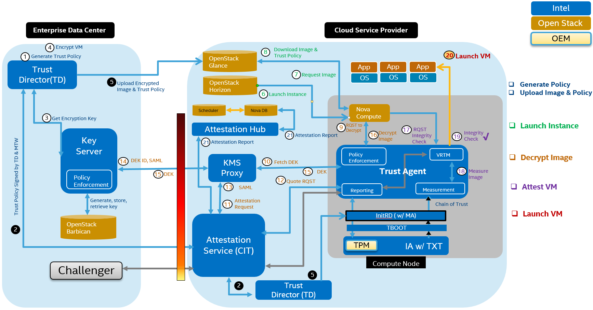

**Figure 2. Detailed Architecture Overview**

# 3.0 Intel® Cloud Integrity Technology Components
This section describes the various Intel® Cloud Integrity Technology components.

## 3.1 Attestation Server
The Attestation Server component of Intel® CIT performs remote attestation of physical servers, comparing Intel® TXT measurements of BIOS, OS, Asset Tag, and other components against a database of *known-good* values. The attested trust status of each server is used to make policy decisions for workload placement.

As a server boots, Intel® TXT begins extending measurements to a *Trusted Platform Module* (TPM). Each chain of trust component is measured, and these measurements are remotely verified using the Attestation Server.

Known-good measurements for each of these components can be directly imported from a sample server, and additional software components can be measured using an administrator-defined Trust Policy (created using the Trust Director application).

Each server to be attested is registered with the Attestation Server. This process includes setting the expected values for future attestations, and the generation of the *Attestation Identity Key* (AIK). The AIK is an asymmetric keypair generated by the host's Trusted Platform Module for the purpose of cryptographically securing attestation quotes for transmission to the Attestation Server.

## 3.2 Key Broker Service
The key broker enables key distribution using platform trust to authorize key transfers. By retaining image decryption keys, unauthorized access can be prevented, even from within the Cloud Service Provider.

The *Key Broker Service* (KMS) provides and retains encryption/decryption keys for virtual machine images. When a compute node requests the decryption key to launch an instance of an encrypted image, the KMS verifies the host's attestation from the Attestation Server, verifies all digital signatures, and retains final control over whether the decryption key is issued. If the server's attestation meets the policy requirements, the KMS issues a decryption key itself, wrapped using the AIK from the host that was attested, cryptographically ensuring that only the attested host can decrypt the requested image.

The KMS is primarily a policy broker that analyzes key requests, decides how to respond, and wraps keys using the AIK-derived binding key. The Key Broker Service connects to a back-end 3rd Party KMIP-compliant key management service, like OpenStack Barbican, for key creation and vaulting services.

## 3.3 Key Broker Proxy
The *Key Broker Proxy* (KMS Proxy) is a lightweight performance-enhancement service that limits the necessary communication between the Key Broker Server and the Cloud Service Provider components. The KMS Proxy receives the instance launch request for an encrypted image from the Trust Agent and requests an attestation for that host from the Attestation Service. The KMS Proxy then sends the request along with the signed SAML attestation to the appropriate Key Broker Service.
 
## 3.4 Trust Director
The Trust Director application is used for the generation of VM image, Docker image, and non-virtualized server Trust Policies, and for the encryption of VM images using keys generated by the Key Management Service. The Trust Director requires access to mount the file system of a server or virtual machine image, allowing the user to select those files and folders to be included in the Trust Policy. Once the user defines the Policy, it is digitally signed by both the Trust Director and the Attestation Service. In the case of a virtual machine image, the Trust Policy is included in a *tgz* archive, and follows the image and all resulting instances as it is uploaded to OpenStack Glance. In the case of a physical server, the Trust Policy is copied to the server file system, where it acts as an extension of the files measured by the chain of trust, secured via remote attestation by the Attestation Service.

## 3.5 Trust Agent
The Trust Agent resides on physical servers and enables both remote attestation and the extended chain of trust capabilities. The Agent maintains ownership of the server's Trusted Platform Module, allowing secure attestation quotes to be sent to the Attestation Service. The Trust Agent is also responsible for intercepting launch requests for encrypted images and Docker container images so that they can be decrypted before being sent to the hypervisor, as well as actual measurement of the virtual machine images themselves as they are launched.

The Trust Agent is supported for Microsoft Windows Server 2012, Microsoft Hyper-V, Ubuntu and Red Hat Enterprise Linux (RHEL). Refer to [Section 4.6.2](#462-supported-operating-systems) for specific versions supported.

## 3.6 OpenStack Plugins
Several modifications are made to both the OpenStack controller and compute node components. These changes update the controller UI to display Cloud Integrity-related information and functions, and add a “trust filter” to the scheduler. This filter lets the scheduler query the Attestation Service about the trust status of managed hosts, allowing instances to be landed only on hosts with an appropriate trust attestation. UI changes include icons for both hypervisors and instances detailing trust attestation status, and image options settings allowing the configuration of host trust and asset tag policy requirements.

OpenStack plugins are supported for unmodified OpenStack deployments only.

## 3.7 Attestation Reporting Hub
The Attestation Hub acts as a middle-man between the Attestation Service and one or more scheduler services (such as OpenStack), and "pushes" attestation information retrieved from the Attestation Service to one or more scheduler services according to an assignment of hosts to specific tenants.  In this way, Tenant A can receive attestation information for hosts that belong to Tenant A, but receive no information about hosts belonging to Tenant B. 
The Attestation Hub serves to disassociate the process of retrieving attestations from actual scheduler queries, so that scheduler services can adhere to best practices and retain better performance.  The Attestation Hub will regularly query the CIT Attestation Service for SAML attestations for each host.  The Attestation Hub maintains only the most recent currently valid attestation for each host, and will refresh attestations when they would expire.  The Attestation Hub will verify the signature of the SAML attestation for each host assigned to a tenant, then parse the attestation status and asset tag information, and then will push the parsed key/value pairs to the plugin endpoints enabled.

# 4.0 Intel® Cloud Integrity Technology Setup
This section describes the installation and configuration steps for each component of the Intel® CIT architecture.

## 4.1 Installing the Attestation Server

### 4.1.1 Installation Prerequisites
The Intel® Cloud Integrity Technology Attestation Server can be run as a VM or as a bare-metal server.

**Supported Operating Systems:**

* Ubuntu 14.04

**Recommended Hardware:**

* 2 vCPUs
* RAM: 4 GB Recommended; 2 GB Minimum
* 2 GB free space to install the Attestation Server services. Additional free space may be needed if the Attestation Server database will be located on the same disk (database space requirement is dependent on the number of managed servers and the frequency with which they will be attested).
* One network interface with network access to all managed servers.
* (Optional) One network interface for Asset Tag provisioning (only required for “pull” tag provisioning; required to provision Asset Tags to VMware ESXi servers).

### 4.1.2 Package Dependencies
The Intel® CIT Attestation Service requires the following packages and their dependencies:

* Monit (optional)
* Logback (optional)
* Apache Tomcat
* Java 8 JDK
* OpenSSL
* Postgres client and server 9.3
* Unzip

If they are not already installed, the Attestation Service installer attempts to install these packages automatically using the package manager. Automatic installation requires access to package repositories, which may require an Internet connection. If the packages are to be installed from the package repository, be sure to update your repository package lists before installation.

### 4.1.3 Installation
**Figure 3** shows deployment scenarios for environments consisting of VMWare ESXi, Citrix XenServer, and Trust Agent servers. Depending on the individual deployment strategy, different deployment scenarios can also be considered.

**Figure 3. Deployment Scenarios**

**Figure 4** shows the high-level procedure required to configure host attestation using Intel® Cloud Integrity Technology Attestation Service.

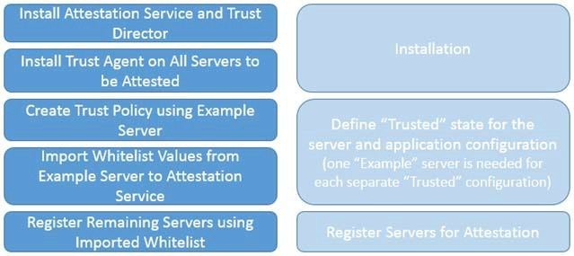

**Figure 4. High-Level Procedure to Configure Host Attestation**

To install the Attestation Service, follow these steps:

1. Copy the Attestation Service installation binary to the `/root/` directory.
2. Create the `mtwilson.env` installation answer file for an unattended installation.

A sample minimal `mtwilson.env` file is provided next. For all configuration options and their descriptions, refer to [Section 10.2.1](#1021-attestation-service)

    export INSTALL_PKGS="java logrotate tomcat postgres privacyca monit SERVICES PORTALS" 
    export MTWILSON_SERVER=<IP address or hostname for the Attestation Server>
    export MTWILSON_API_BASEURL="https://${MTWILSON_SERVER}:8443/mtwilson/v1" 
    export WEBSERVER_VENDOR=tomcat
    export DATABASE_VENDOR=postgres 
    export DATABASE_PORTNUM=5432
    export MC_FIRST_USERNAME=administrator 
    export MC_FIRST_PASSWORD=password 
    export TOMCAT_ADMIN_USERNAME=tomcatadmin
    export TOMCAT_ADMIN_PASSWORD=setininstall 
    export PRIVACYCA_DOWNLOAD_USERNAME=pcaadmin 
    export PRIVACYCA_DOWNLOAD_PASSWORD=password
    #####################################################################################################
    export MTWILSON_TLS_POLICY_ALLOW=certificate,certificate-digest,public-key,public-key- digest,TRUST_FIRST_CERTIFICATE
    export MTWILSON_DEFAULT_TLS_POLICY_ID=TRUST_FIRST_CERTIFICATE
    #####################################################################################################
    export LOG_ROTATION_PERIOD=daily export LOG_COMPRESS=compress
    export LOG_DELAYCOMPRESS=delaycompress export LOG_COPYTRUNCATE=copytruncate 
    export LOG_SIZE=100M
    export LOG_OLD=7
    ##################################################################################################### 
    export JAVA_REQUIRED_VERSION=1.7.0_51
    export MTWILSON_API_SSL_VERIFY_HOSTNAME=false 
    export DATABASE_HOSTNAME=127.0.0.1
    export DATABASE_SCHEMA=mw_as 
    export DATABASE_USERNAME=root 
    export DATABASE_PASSWORD=password
    ##################################################################################################### 
    export POSTGRES_REQUIRED_VERSION=9.3
    export POSTGRES_HOSTNAME=${DATABASE_HOSTNAME} 
    export POSTGRES_PORTNUM=${DATABASE_PORTNUM} 
    export POSTGRES_DATABASE=${DATABASE_SCHEMA} 
    export POSTGRES_USERNAME=${DATABASE_USERNAME} 
    export POSTGRES_PASSWORD=${DATABASE_PASSWORD}
    export ADD_POSTGRESQL_REPO=yes 
    export POSTGRESQL_KEEP_PGPASS=true
    ##################################################################################################### 
    export TOMCAT_REQUIRED_VERSION=7.0
    export TOMCAT_CREATE_SSL_CERT=yes
    export TOMCAT_SSL_CERT_CN=${MTWILSON_SERVER},127.0.0.1 
    export PRIVACYCA_SERVER=${MTWILSON_SERVER}
    export INSTALLED_MARKER_FILE=/var/opt/intel/.mtwilsonInstalled 
    export INSTALL_LOG_FILE=/tmp/mtwilson-install.log
    #####################################################################################################
    # ASSET TAG Configuration
    export MTWILSON_TAG_SERVER_PRIVATE=${MTWILSON_SERVER}
    export TAG_PROVISION_EXTERNAL=false 
    export TAG_PROVISION_NOCACHE=true
    export TAG_PROVISION_XML_ENCRYPTION_REQUIRED=false 
    export TAG_PROVISION_XML_PASSWORD=password
    export MTWILSON_TAG_KEYSTORE="/opt/mtwilson/configuration/serverAtag.jks" 
    export MTWILSON_TAG_KEYSTORE_PASSWORD=password
    export MTWILSON_TAG_KEY_PASSWORD=password 
    export MTWILSON_TAG_CERT_IMPORT_AUTO=true 
    export TAG_PROVISION_XML_REQUIRED=false 
    export TAG_VALIDITY_SECONDS=31536000
    export TAG_ISSUER_DN="CN=mtwilson-tag-ca"
    export MTWILSON_TAG_HTML5_DIR="/opt/mtwilson/share/apache-tomcat-7.0.34/webapps/mtwilson-portal/tag" 
    export MTWILSON_TAG_ADMIN_USERNAME=tagadmin
    export MTWILSON_TAG_ADMIN_PASSWORD=password

3. Execute the installer binary.
	
When the installation completes, the Attestation Service is available. If the web portal component was installed (recommended), the portal UI is now accessible at the following URL:

*https://[Attestation Server IP address]:8443/mtwilson-portal/index.html*

The services can also be verified by running **mtwilson status** from the Attestation Service command line.

## 4.2 Installing the OpenStack Controller Extensions

### 4.2.1 Prerequisites
The following must be completed before installing the OpenStack Controller Extensions:

* OpenStack Mitaka release is supported.  
* OpenStack Controller must be installed and running.
* The OpenStack Horizon and Nova services must be running on the same controller.
* The Attestation Service must be installed and running.
* The OpenStack controller must have a credentials file named /root/adminrc witht eh following contents:

### 4.2.2 Minimum Requirements
Intel® Open Cloud Integrity Technology supports the following OpenStack releases:

* Mitaka
Refer to the OpenStack documentation for OpenStack minimum requirements for specific releases.
> **Note:** Intel Open Cloud Integrity Technology currently supports only the base OpenStack community distribution versions. 

### 4.2.3 Extension Dependencies
The Intel® Open Cloud Integrity Technology extension installation script requires the following OpenStack components be installed on the same controller machine.

* OpenStack Horizon
* OpenStack Nova

> **Note:** If services are configured to run separately, the installation script requires modification.

### 4.2.4 Installation
To install the Intel® OpenCIT extensions to the OpenStack Controller, follow these steps:

1. Create the *mtwilson-openstack-controller.env* installation answer file.

A sample *mtwilson-openstack-controller.env* file is provided below. For all configuration options and their descriptions, refer to [Section 10.2.6](#1026-openstack-controller).

    MTWILSON_SERVER=<IP address or hostname for Attestation Service> 
    MTWILSON_SERVER_PORT=8443
    MTWILSON_ASSET_TAG_API_USERNAME=<Attestation Service MTWILSON_TAG_ADMIN user> 
    MTWILSON_ASSET_TAG_API_PASSWORD=<password>

> **Note:** The username and password required by the OpenStack Controller Extensions can be satisfied by the MTWILSON_TAG_ADMIN user created during the installation of the Attestation Service.

2. Copy the OpenStack Controller Extensions installation binary to the `/root/` directory.
3. Execute the OpenStack Controller Extensions installer.

When the installation completes, the Horizon Dashboard should reflect the new Intel® CIT UI changes, and now supports host trust attestation-based scheduler filters for instance placement.

## 4.3 Installing the Key Broker Service

### 4.3.1 Prerequisites
The following must be completed before installing the Key Broker Service:

* Attestation Service server must be installed and active.
* (Choose Barbican or KMIP) Barbican service must be configured and available.
* (Choose Barbican or KMIP) KMIP service must be configured and available.

### 4.3.2 Minimum Requirements
Following are the minimum requirements:

* Ubuntu 14.04
* Minimum 512 MB RAM (1 GB recommended)
* Minimum 1 vCPU (virtual machines only)
* 1 GB free disk space
* 1 Network Interface with network access to the Trust Director
* 1 Network Interface with network access to the KMS Proxy

### 4.3.3 Package Dependencies
The Intel® CIT Key Broker Service requires the following packages and their dependencies:

* Unzip
* Authbind

If they are not already installed, the Key Broker installer attempts to install these automatically using the package manager. Automatic installation requires access to package repositories, which may require an Internet connection. If the packages are to be installed from the package repository, be sure to update the repository package lists before installation.

### 4.3.4 Installation
To install the Intel® CIT Key Broker Service, follow these steps:

1. Copy the KMS installer binary to the `/root/` directory
2. Execute the KMS installer binary.
3. From the KMS command line, run the following command to create the administrator account (replace admin and password with any username and password):
        
	   kms password admin password --permissions *:*
4. Run the following commands to configure the KMS endpoint URL:
             
	   ifconfig
           kms config endpoint.url http://<KMS IP>
           kms restart

5. (Optional, not required for KMIP key management) To use Barbican for key creation and vaulting services:

       kms config key.manager.provider com.intel.kms.barbican.client.BarbicanKeyManager kms config barbican.project.id <Barbican Project ID>
       kms config barbican.endpoint.url <http://barbican.example.com:9311>
       kms config barbican.keystone.public.endpoint http://keystone.example.com:5000
       kms config barbican.tenant.name <Tenant name>
       kms config barbican.password <Barbican password>
       kms config barbican.username <Barbican username>
       kms restart
    
6. (Optional, not required for Barbican key management) To use another KMIP-compliant application for key creation and vaulting services:

       kms config key.manager.provider com.intel.kms.kmip.client.KMIPKeyManager
       kms config kmip.targetHostname <http://kmip.example.com:<KMIP Port>/KMIPWebAppServer/KMIPServlet>
       kms restart

7. Browse to the Attestation Service URL and log on.

    *https://AttestationServiceIpAddress:8443/mtwilson-portal*
    
8. From the Attestation Service portal, browse to **Administration > View Certificates** and click the **Download Configuration Data Bundle** link. This downloads an archive named *databundle*, containing Attestation Service certificates needed by the Key Broker (KMS).
9. Log in to the Key Broker web UI (the URL is *https://MyKmsIpAddress*) using the username and password configured in **Step 4**.
10. From KMS UI, select **Settings > More Settings > Upload Settings**.
11. Click the **Choose File** button and select the *databundle* file downloaded from the Attestation Service in **Step 8**.
12. Click the **Upload** button to upload the configuration data bundle.

## 4.4 Installing the Key Broker Proxy (KMS Proxy)

### 4.4.1 Prerequisites
The following must be completed before installing the Key Broker Proxy:

* Attestation Service server must be installed and active.
* Key Broker Service must be installed and active.

### 4.4.2 Minimum Requirements

* Ubuntu 14.04
* Minimum 512 MB RAM (1 GB recommended)
* Minimum 1 vCPU (virtual machines only)
* 1 GB free disk space
* 1 Network Interface with network access to all Trust Agent servers and the Attestation Service
* 1 Network Interface with network access to the Key Broker Service (typically Internet/VPN)
 

### 4.4.3 Package Dependencies
The Intel® CIT KMS Proxy requires the following packages and their dependencies:

* Unzip
* Authbind

If they are not already installed, the KMS Proxy installer attempts to install these packages automatically using the package manager. Automatic installation requires access to package repositories, which may require an Internet connection. If the packages are to be installed from the package repository, be sure to update the repository package lists before installation.

### 4.4.4 Installation
To install the Key Broker Proxy, follow these steps:

1. Create the `kmsproxy.env` installation answer file.
 A sample `kmsproxy.env` file is provided next. For full installation options and their descriptions, refer to [Section 10.2.4](#1024-kms-proxy).
 
     MTWILSON_TLS_CERT_SHA256=<SHA256 of the Attestation Service TLS certificate> 
     MTWILSON_API_URL=https://<Attestation Service IP or Hostname>:8443/mtwilson 
     JETTY_PORT=8080
     JETTY_SECURE_PORT=8443
     
> **Note:** The Attestation Service TLS certificate SHA256 can be found by running the following command on the Attestation Service server: *mtwilson export-config --stdout |grep sha256*

2. Copy the KMS Proxy installation binary to the */root/* directory.
3. Run the KMS Proxy installation binary.
4. After installation is complete, configure the KMS Proxy endpoint URL:
                 
       kmsproxy config endpoint.url http://<KMSProxy IP>
5. Update the KMS Proxy Shiro configuration:
 
       kmsproxy setup shiro-ssl-port
       
6. Restart the KMS Proxy services:
      
       kmsproxy restart
7. Browse to the Attestation Service URL and log on using an administrative account.
8. Browse to the **Administration** tab, then select **Pending Requests**.
9. Select the **kmsproxy** user, then click **Details**.
10. Select the **Attestation** and **Challenger** roles, then click **Approve**.

## 4.5 Installing the Trust Director

### 4.5.1 Prerequisites
The following must be completed before installing the Trust Director:

* Attestation Service server must be installed and active.
* (Optional. Required only for VM Privacy use case) Key Management Service must be installed and active.
* (Optional. Required only for VM Privacy use case) KMS Proxy Service must be installed and active. 

### 4.5.2 Minimum Requirements

* Ubuntu 14.04 Server (physical server or VM)
* Minimum 2 GB RAM
* Approximately 1 GB free disk space for the Trust Director application.
* Additional storage requirements depending on the number and size of images uploaded to the Trust Director.

### 4.5.3 Recommended Hardware

* 4 vCPUs
* RAM: 4GB Recommended 

### 4.5.4 Package Dependencies
The Intel® CIT Trust Director requires no packages to be pre-installed.  All dependency packages are distributed as part of the installation binary. 

### 4.5.5	Installation
To install the Trust Director Application, follow these steps:

1. Create the `director.env` installation answer file. This file contains additional properties depending on the use cases.

A sample `director.env` file is provided next (required for all use cases). For configuration options, refer to [Section 10.2.5](#1025-trust-director).

    MTWILSON_USERNAME="<Attestation Service user with Administrative rights>" 
    MTWILSON_PASSWORD="<Password for Attestation Service user with administrative rights>" 
    MTWILSON_SERVER="<Attestation Service Ip or Hostname>"
    MTWILSON_SERVER_PORT="8443"
    DIRECTOR_ID="<User-defined string used as an identifier; should be unique for each instance of Trust Director>"

    JAVA_KEYSTORE_PASSWORD="<user-defined Java keystore password - default is changeit>"
    MTWILSON_API_URL="https://<Attestation Service IP or Hostname>:8443/mtwilson/v2" 
    MTWILSON_TLS="<SHA256 of Attestation Service TLS Certificate>"

    DIRECTOR_DB_NAME="director_data_pu" 
    DIRECTOR_DB_HOSTNAME="localhost" 
    DIRECTOR_DB_PORTNUM="5432"
    DIRECTOR_DB_DRIVER="org.postgresql.Driver" 
    DIRECTOR_DB_USERNAME="<Database username>" 
    DIRECTOR_DB_PASSWORD="<Database password>"

    DIRECTOR_VM_WHITELIST_HASH_TYPE="SHA256"
    DIRECTOR_BAREMETAL_WHITELIST_HASH_TYPE="SHA1"

(Optional. Required only for Docker container use cases):

    DIRECTOR_DOCKER_WHITELIST_HASH_TYPE="SHA256"
    
(Optional. Required only for VM Integrity and VM Privacy use cases):
 
    TENANT_NAME="<Tenant in OpenStack Glance>" 
    GLANCE_API_ENDPOINT="https://glance.example.com:9292"
    GLANCE_KEYSTONE_PUBLIC_ENDPOINT=”https://keystone.example.com:5000”
    GLANCE_IMAGE_STORE_USERNAME="<Glance Username>" 
    GLANCE_IMAGE_STORE_PASSWORD="<Glance Password>"

(Optional. Required only for VM Privacy use case):

    KMS_ENDPOINT_URL="https://<KMS IP or Hostname>" 
    KMS_LOGIN_BASIC_USERNAME="<KMS username>" 
    KMS_LOGIN_BASIC_PASSWORD="<KMS password>" 
    KMS_TLS_POLICY_CERTIFICATE_SHA256="<SHA256 of KMS TLS Certificate>"

> **Note:** The KMS_LOGIN_BASIC_USERNAME and password required by the Trust Director is the user created after installation of the KMS with the following command:
      
    kms password <username> <password> --permissions *:*
The KMS TLS certificate SHA1 can be found in `/opt/kms/configuration/https.properties`. The KMS username and password are the username and password created by the **kms password** command after installing the KMS (see [Section 4.3 “Installing the Key Management Service”](#43-installing-the-key-broker-service) )
>**Note:** The Attestation Service TLS certificate SHA256 can be found by running the following command on the Attestation Service server:
    
    mtwilson export-config --stdout |grep sha256
>**Note:** If SSL will be used for communication with Glance, the Glance SSL certificate must be first imported into the Java keystore on the Trust Director server.  Download the Glance SSL certificate to a file, and then use the following command to import the certificate into the keystore:
    
    keytool -import -trustcacerts -alias imagestore -file ssl.crt -keystore $JAVA_HOME/jre/lib/security/cacerts
    
    
2. Copy the Trust Director installation binary to the `/root/` directory.
3. Execute the Trust Director installer. When prompted to create the **supermin appliance** by the installer, select **yes**.
4. Create an administrative user for the Trust Director:
  
       director password <username> <password> --permissions *:*
    For example:
         
       director password admin password --permissions *:*
5. Log on to the Trust Director* (https://TrustDirectorIpOrHostname)* using the username and password configured in [Step 4]().

**Integrating OpenStack Glance as External image store**

The External storage settings determine where the Trust Director will upload images, and must be configured before Docker and VM image Trust Policies can be uploaded.

1. Navigate to the **Settings** menu and click on **Configure External Storage**

	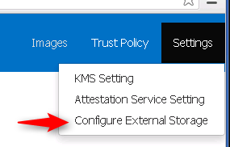

2. Click on the **Add External Storage** button. 
3. Provide the External storage name and the connector. Names can only contain “dashes”. 
4. Select **Glance** as the connector. 
5. Check the boxes **Image**, **Docker**, **Tarball** then hit **Next**

	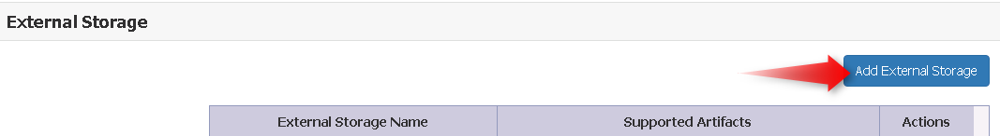

	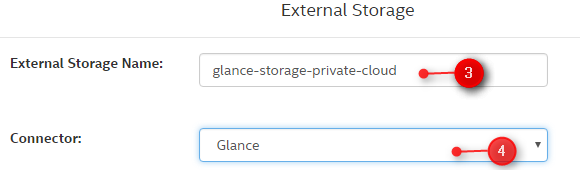

	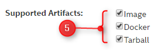

6. The next screen configures the URI and credential settings for OpenStack Horizon/Glance and Keystone. If your glance repository is set to private, set it to **Private**, otherwise set it to **Public**. 

| Form name              | Possible values               |
|------------------------|-------------------------------|
| API Endpoint           | *http://nova.server:9292*     |
| Authorization Endpoint | *http://keystone.server:5000* |
| Tenant Name            | *Tenant-a*                    |
| UserName               | *TenantA-username*            |
| Password               | *Changeit*                    |
| Visibility             | *Public OR Private*           |

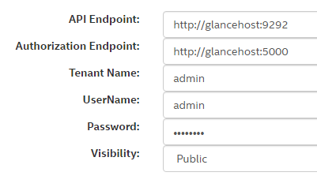

7. After supplying the values, the settings can be tested by pressing the Test Connection button. Validation may take several seconds. 

	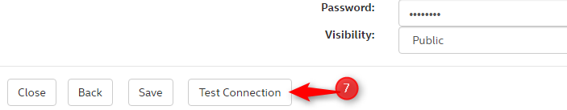
	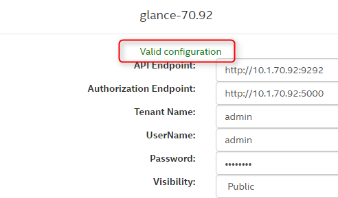

8. Click Save to save the configuration settings. 

    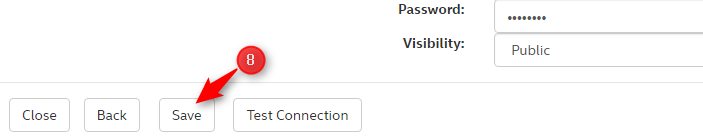

Proceed to the [Section 8.8.2.1  “Creating a trust Policy for VM images”](#8821-creating-a-trust-policy-for-a-virtual-machine-image)  or [8.8.2.2 “Creating  a Trust Policy for Docker images”](#8822-creating-a-trust-policy-for-a-docker-container-images)

## 4.6 Installing the Trust Agent - Linux

### 4.6.1 Package Dependencies
The Intel® CIT Trust Agent requires the following packages and their dependencies:

* trousers
* tboot
* tpm-quote-tools
* openssl
* make
* gcc
 
If they are not already installed, the Trust Agent installer attempts to install these automatically using the package manager. Automatic installation requires access to package repositories, which may require an Internet connection. If the packages are to be installed from the package repository, be sure to update the repository package lists before installation.

### 4.6.2 Supported Operating Systems
The Intel® CIT Trust Agent supports Ubuntu 16.04 and Red Hat Enterprise Server 7.  When the Trust Agent is built from source, the “tbootxm” component will also be built and will incorporate build headers from the build machine.  The resulting Trust Agent will support only those kernel headers present on the build server at built time.  If a new kernel must be supported, a new version of the Trust Agent will need to be built and installed, incorporating the new kernel header.

### 4.6.3 Prerequisites
The following must be completed before installing the Trust Agent:

* (Optional, OpenStack deployments only) OpenStack Cloud Controller deployed and active.
* (Optional, OpenStack deployments only) OpenStack Compute Node resources installed and running.
* Supported server hardware including an Intel® Xeon® processor with Intel® Trusted Execution Technology activated in the system BIOS.
* Trusted Platform Module installed and activated in the system BIOS, with cleared ownership status.
* System must be booted to a tboot boot option 
* Intel® Cloud Integrity Technology Attestation Service server installed and active.
* (Optional, required for the Image Integrity and Image Privacy use cases) Intel® Cloud Integrity Technology Key Management Service installed and active.
* (Optional, required for the Image Integrity and Image Privacy use cases) Intel® Cloud Integrity Technology KMS Proxy installed and active.
* Intel® Cloud Integrity Technology Trust Director must be installed and active.
* (Optional, required for Docker container use cases only) Docker-engine must be installed (supported versions: 1.10, 1.11, 1.12, 1.13)
* (Optional, required for Docker container use cases only) nova-Docker driver (Mitaka)

### 4.6.4 Installation
To install the Intel® CIT Trust Agent (VM use cases)

1. (Required for non-OpenStack deployments only) Create the `trustagent.env` answer file in the `/root/` directory (for configuration options, see [Section 10.2.2](#1022-trust-agent) )

       MTWILSON_API_URL=https://<Attestation Service IP or Hostname>:8443/mtwilson/v2 
       MTWILSON_API_USERNAME=<Attestation Service PrivacyCA username> 
       MTWILSON_API_PASSWORD=<Attestation Service PrivacyCA password> 
       MTWILSON_TLS_CERT_SHA256=<SHA1 of Attestation Service TLS Certificate> 
       REGISTER_TPM_PASSWORD=y
       MANIFEST_PATH="/boot/trust/manifest.xml"
       GRUB_FILE="<full path to the grub boot loader, grub.cfg>"  
       TRUSTAGENT_LOGIN_REGISTER=true
       
>**Note:** The MTWILSON_API_USERNAME and password required by the Trust Agent can be satisfied by the PRIVACYCA_DOWNLOAD_USERNAME user created during the installation of the Attestation Service.

2. (Required for OpenStack deployments only) Create the `mtwilson-openstack.env` answer file in the `/root/` directory (sample `env` file provided below; for full configuration options and their descriptions, refer to [Section 10.2.2.2](#10222-trust-agent-for-openstack-compute-node) ).

       MTWILSON_API_URL=https://<Attestation Service IP or Hostname>:8443/mtwilson/v2 
       MTWILSON_API_USERNAME=<Attestation Service administrative username> 
       MTWILSON_API_PASSWORD=<Attestation Service administrative password> 
       MTWILSON_TLS_CERT_SHA256=<SHA1 of Attestation Service TLS Certificate> 
       REGISTER_TPM_PASSWORD=y
       MANIFEST_PATH="/boot/trust/manifest.xml"  
       GRUB_FILE="<full path to the grub boot loader, rub.cfg>" 
       KMSPROXY_SERVER="<IP or hostname of KMS Proxy>" 
       KMSPROXY_SERVER_PORT="8080" 
       TRUSTAGENT_LOGIN_REGISTER=true
       
>**Note:** The MTWILSON_API_USERNAME and password required by the Trust Agent can be satisfied by the PRIVACYCA_DOWNLOAD_USERNAME user created during the installation of the Attestation Service.

3. (Required for Openstack Docker containers only) Create the `mtwilson-openstack.env` answer file in the `/root/` directory (sample `env` file provided below; 

       MTWILSON_API_URL=https://<Attestation Service IP or Hostname>:8443/mtwilson/v2 
       MTWILSON_API_USERNAME=<Attestation Service administrative username> 
       MTWILSON_API_PASSWORD=<Attestation Service administrative password> 
       MTWILSON_TLS_CERT_SHA256=<SHA1 of Attestation Service TLS Certificate> 
       REGISTER_TPM_PASSWORD=y
       MANIFEST_PATH="/boot/trust/manifest.xml" 
       GRUB_FILE="<full path to the grub boot loader, grub.cfg>" 
       TRUSTAGENT_LOGIN_REGISTER=true
       DEPLOYMENT_TYPE="docker"
       
4. Copy the Trust Agent installer binary to the `/root/` directory.
>**Note:** There are separate Trust Agent installers for Ubuntu or Red Hat. Select the installer appropriate for your OS.
5. Execute the Trust Agent installer, and wait for the installation to complete.
6. Browse to the Trust Director (*https://TrustDirectorIpOrHostname*) to create the non-virtualized server Trust Policy.
7. Select **Trust Policy**, then select **Non-Virtualized Server** and click **Add New Policy**.

	

8. Provide a name for the new Trust Policy, as well as SSH details for the host that will be used to generate the Policy (root permissions are needed to browse the full file structure of the remote host).

	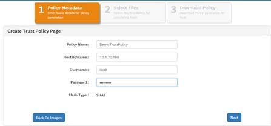

9. Browse through the directory tree of the host to select files and folders to be included in the Trust Policy. Any files selected for the Trust Policy are included in later attestations; be sure to select only files that will not change between reboots. Files related to the Trust Agent are automatically selected for measurement on non-virtualized hosts; this is mandatory to preserve the Chain of Trust. 

	

10. For Docker containers, if you want to check the integrity of the Docker engine after every reboot, select the file `/usr/bin/Docker` as part of the manifest as shown below:

	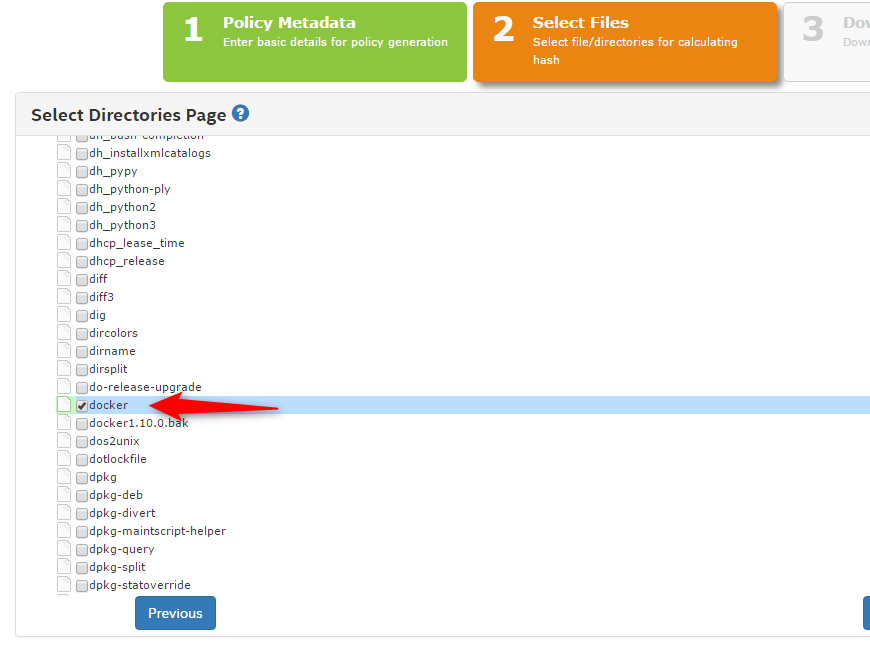

11. Folders can be “locked” by clicking the blue lock icon. Locking a folder causes the folders exact contents to be measured, not just specific files. This means that adding any new file to a locked folder, or removing or changing any file, causes the host to become Untrusted on the next boot-time measurement. Regular expressions can be used to specifically include or exclude file types, and the selection can be made recursive, affecting all sub-folders. Use caution when locking folders; only files and folders that will not change between reboots should be selected.

	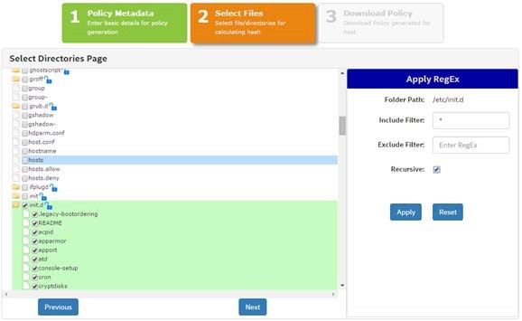

12. Once all required files and folders have been defined for the Trust Policy, click Next. The Trust Policy (`trustpolicy.xml` and `manifest.xml`) are created and placed in the `/boot/trust` directory on the host.

	

To deploy the same Trust Policy to other hosts, click the provided Download link. The `trustpolixy.xml` and `manifest.xml` files are downloaded in a tgz archive, and can be provisioned to all hosts that will have identical measured files to the source host.

13. A new GRUB boot option is created by the Trust Agent installer whose label begins with “TCB Protection”. Update the default boot option (typically in `/etc/default/grub`) to use the TCB Protection option, and run update-grub (Ubuntu) or grub2-mkconfig –o `/boot/grub/grub.cfg` (RHEL) so the change takes effect.
14. Reboot the server so that the Trust Policy is included in the server attestation measurements. This causes the new Trust Policy measurements to be calculated and extended to PCR 19 in the TPM.
 
 
## 4.7	Installing the Trust Agent - Windows
### 4.7.1	Package Dependencies

The Intel® OpenCIT Windows Trust Agent has the following software dependencies:

* cygwin64 must be installed.

* Microsoft Visual C++ 2010 Redistributable

* Microsoft Visual C++ 2013 Redistributable

* Java JDK 8 

For the last three dependencies, If these are not already installed, the Trust Agent installer attempts to install them, which may require an Internet connection.

### 4.7.2 Supported Operating Systems

The Intel® OpenCIT Windows Trust Agent supports the following operating systems:

* Microsoft Windows Server 2012

* Microsoft HyperV 2012

### 4.7.3 Prerequisites

The following must be completed before installing the Trust Agent:

* Supported server hardware including an Intel® Xeon® processor with Intel® Trusted Execution Technology activated in the system BIOS.

* Trusted Platform Module installed and activated in the system BIOS, with cleared ownership status.

* Intel® OpenCIT Attestation Service server installed and active.

* (Optional, required for the Image Integrity and Image Privacy use cases) Intel® Cloud Integrity Technology Key Management Service installed and active.

* (Optional, required for the Image Integrity and Image Privacy use cases) Intel® Cloud Integrity Technology KMS Proxy installed and active.

* Intel® Cloud Integrity Technology Trust Director must be installed and active.

* BitLocker must be activated.

### 4.7.4 Installation

**For Baremetal deployment**

1. This procedure describes the steps to install the CIT component on a Baremetal Windows. Before executing the installer, create the `system.ini` configuration file in the same folder than the `mtwilson-openstack-trusted-node-windows-3.2.1-SNAPSHOT.exe` file (sample `system.ini` file provided below).

       [COMMON]

       ; if left blank then the default installation directory would be "C:\Program Files (x86)\Intel"

       INSTALLATIONTYPE=BM

       INSTALLATIONDIR=

       [TRUST_AGENT]

       ; CIT server settings 

       MTWILSON_API_URL=https://<Attestation Service IP or Hostname>:8443/mtwilson/v2 

       MTWILSON_API_USERNAME=<Attestation Service PrivacyCA username> 

       MTWILSON_API_PASSWORD=<Attestation Service PrivacyCA password> 

       MTWILSON_TLS_CERT_SHA256=<SHA256 of Attestation Service TLS Certificate> 

>**Note:** The MTWILSON_API_USERNAME and password required by the Trust Agent can be satisfied by the 	PRIVACYCA_DOWNLOAD_USERNAME user created during the installation of the Attestation Service.

2.   Execute the `mtwilson-openstack-trusted-node-windows-3.2.1-SNAPSHOT.exe` file. The CIT-Compute-Node Setup orchestrator installer will be displayed. This orchestrator will conduct the installation of all the CIT components required for the Windows host depending on the option set in the `system.ini` file.
	
    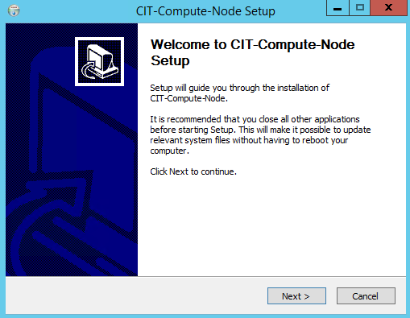
    
3. 	Click Next. The install location screen.

	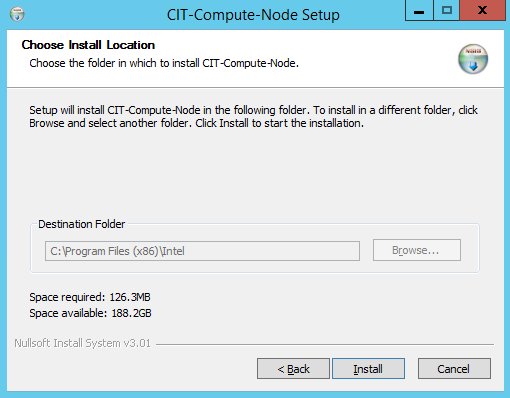
    
4. 	Click Install. The Tbootxm Setup window will be displayed. 

 	
    
5. 	Click Next and then in the next window Install.  A Microsoft Window will be displayed asking to restart the computer. NOTE: Do NOT click Restart Now.

	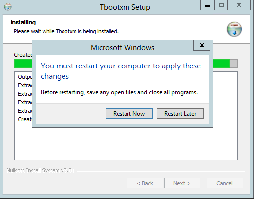
    
6. 	Click Restart Later. The installation log will show the line Completed. Make sure no errors are displayed in the log lines then click Next. The Completing Tbootxm Setup window will be displayed.

	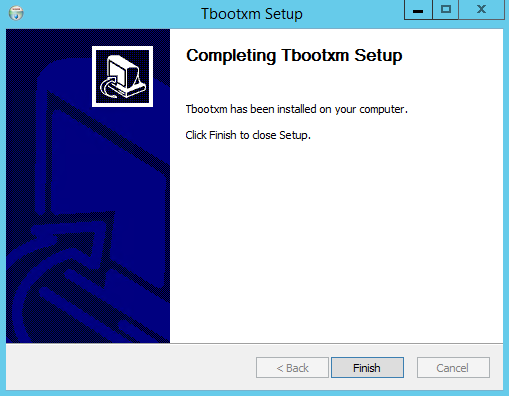
    
7. 	Click Finish. The Intel CIT Trust Agent Setup window will be displayed saying the Microsoft Visual C++ package is not installed.

	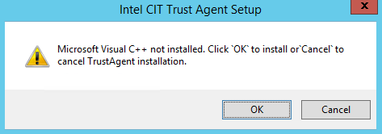
    
8. 	Click OK. The required package will be installed then the Welcome to Intel CIT Trust Agent Setup window will be displayed.

	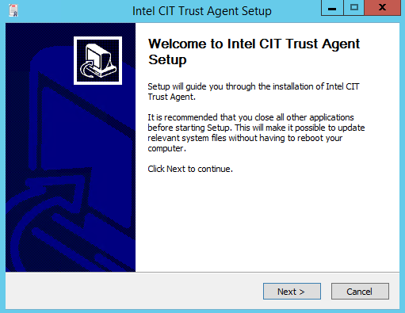
    
9. 	Click Next. The Checking Environment for Installation window will be displayed. 

	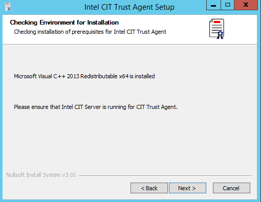
    
10. Click Next. The Install Location window will be displayed.

	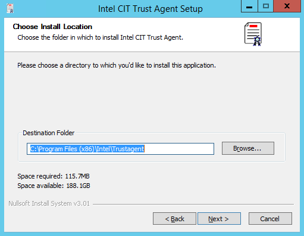
    
11. Click Next. The Setting up configuration window will be displayed.

	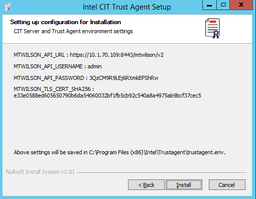
    
12. Click Install. After some minutes the installation log will show the line Completed. Make sure no errors are displayed in the log lines then click Next. The Completing CIT Trust Agent Setup window will be displayed.

	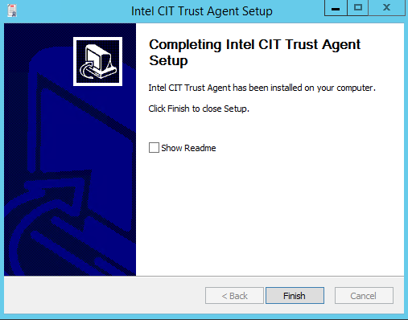
    
13. Click Finish. Once this window disappears the Openstack-Extensions Setup installation log will show the line Completed. Make sure no errors are displayed in the log lines then click Next. The Completing Openstack-Extensions Setup window will be displayed.

	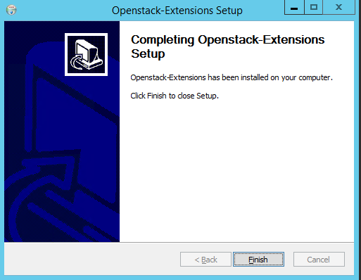
    
14. Click Finish. The CIT-Compute-Node Setup window will show the installation log and the Completed line. Make sure no errors are displayed in the log lines then click Next. The Completing CIT-Compute-Node Setup window will be displayed.

	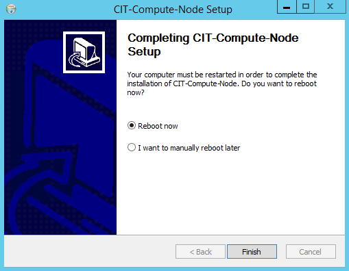
    
15. Select the desired option, Reboot Now or I want to manually reboot later, and then click  Finish. 

> **Note:** A reboot is required before start using the CIT components already installed. 

**For VM Attestation deployment**

1. This procedure describes the steps to install the CIT component on a Windows compute node already attached to an Openstack controller. Before executing the installer, create the `system.ini` configuration file in the same folder than the `mtwilson-openstack-trusted-node-windows-3.2.1-SNAPSHOT.exe` file (sample `system.ini` file provided below).

       [COMMON]

       ; if left blank then the default installation directory would be "C:\Program Files (x86)\Intel"

       INSTALLATIONTYPE=VM

       INSTALLATIONDIR=

       [TRUST_AGENT]

       ; CIT server settings 

       MTWILSON_API_URL=https://<Attestation Service IP or Hostname>:8443/mtwilson/v2 

       MTWILSON_API_USERNAME=<Attestation Service PrivacyCA username> 

       MTWILSON_API_PASSWORD=<Attestation Service PrivacyCA password> 

       MTWILSON_TLS_CERT_SHA256=<SHA256 of Attestation Service TLS Certificate> 

	   [POLICY_AGENT]
	   ; Needed in case of creating new drive for encryption
	   ; if left blank the drive provided in DriveUsedForEncryption below will be used for encryption
	   DriveUsedForPartition=

	   ; Size to be given to new partition if created (in MB)
	   SizeOfNewPartition=20480            

	   ; Drive letter of an existing drive which will be used for encryption if DriveUsedForPartition above is blank
	   ; else Unique Drive letter to be assigned to new partition
	   DriveUsedForEncryption=D

	   ; KMS configurations
	   ; if left blank, will need to be populated manually for encryption flow
	   KMSPROXY_SERVER=<KMS Service IP or Hostname>
	   KMSPROXY_SERVER_PORT=<KMS Port>

	   [TBOOTXM]

	   [VRTM]

	   [MTWILSON_OPENSTACK_NODE]

2. Execute the `mtwilson-openstack-trusted-node-windows-3.2.1-SNAPSHOT.exe` file. The CIT-Compute-Node Setup orchestrator installer will be displayed. This orchestrator will conduct the installation of all the CIT components required for the Windows host depending on the option set in the `system.ini` file.

	
    
3. 	Click Next. The install location screen. 

	
    
4. 	Click Install. The Tbootxm Setup window will be displayed. 

 	
    
5. 	Click Next and then in the next window Install.  A Microsoft Window will be displayed asking to restart the computer. NOTE: Do NOT click Restart Now.

	
    
6. 	Click Restart Later. The installation log will show the line Completed. Make sure no errors are displayed in the log lines then click Next. The Completing Tbootxm Setup window will be displayed.

	
    
7. 	Click Finish. The Intel CIT Trust Agent Setup window will be displayed saying the Microsoft Visual C++ package is not installed.

	![](images/TAWindows06.PNG
    
8. 	Click OK. The required package will be installed then the Welcome to Intel CIT Trust Agent Setup window will be displayed.

	![](images/TAWindows07.PNG
    
9. 	Click Next. The Checking Environment for Installation window will be displayed. 

	
    
10. Click Next. The Install Location window will be displayed.

	
    
11. Click Next. The Setting up configuration window will be displayed.

	
    
12. Click Install. After some minutes the installation log will show the line Completed. Make sure no errors are displayed in the log lines then click Next. The Completing CIT Trust Agent Setup window will be displayed.

	
    
13. Click Finish. The Vrtm Setup window will be displayed.

	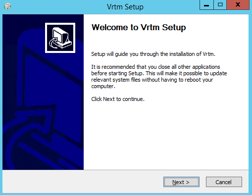
    
14. Click Next and then Install in the next window.  The Vrtm Setup window will be displayed saying the Microsoft Visual C++ 2010 Redistributable package is not installed.

	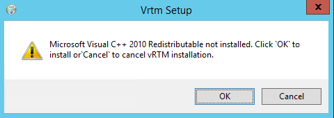
    
15. Click Ok. The required package will be installed then a new Vrtm Setup window will be displayed saying the Ext2Fsd driver is not installed.

	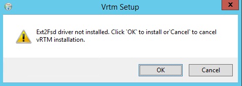
    
16. Click OK. The required package will be installed then the Vrtm Setup Installation Complete window will be displayed and the installation log will show the line Completed. Make sure no errors are displayed in the log lines then click Next. The Completing Vrtm Setup window will be displayed. 

	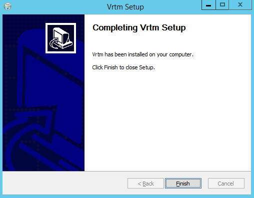
    
17. Click Finish. The Welcome to Policyagent Setup window will be displayed. 

	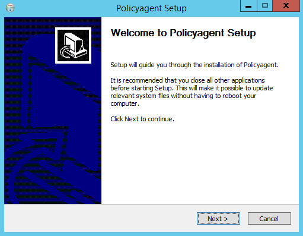
    
18. Click Next and then Next in the Install Location window. Windows describing information about the drive that is going to be use for encryption will be displayed.  NOTE: Since the drive/partition that is going to be use for encryption will be created/prepared and then encrypted by Bitlocker the Policyagent Setup windows could also show a Not Responding message. 

	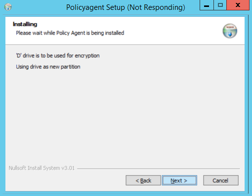
    
19. Once Bitlocker is done a Policyagent Setup window will be displayed saying the Bitlocker drive setup is completed.

	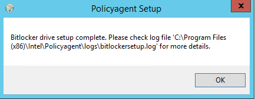
    
20. Click OK. The Policyagent Setup installation log will show the line Completed. Make sure no errors are displayed in the log lines then click Next. The Completing Policyagent Setup window will be displayed.

	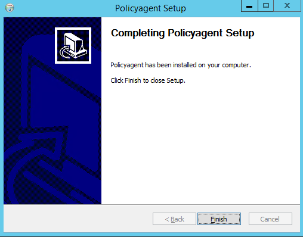
    
21. Click Finish. The Welcome to Openstack-Extensions Setup window will be displayed.

	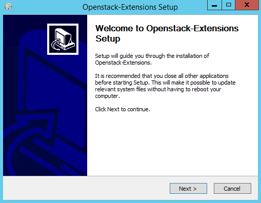
    
22. Click Finish. The Welcome to Openstack-Extensions Setup window will be displayed. 

	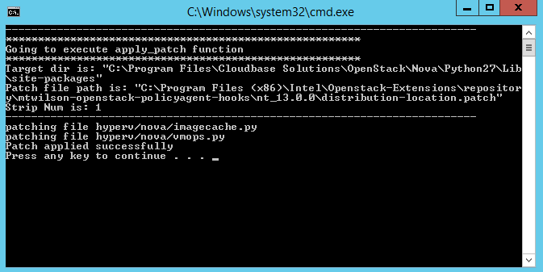
    
23. Hit the Enter key. A second Windows command prompt window will be displayed asking for a confirmation to apply patches to some other files already installed.
	
    
24. Hit the Enter key. A third Windows command prompt window will be displayed for few second saying the nova-compute services are being restarted.  Once this window disappears the Openstack-Extensions Setup installation log will show the line Completed. Make sure no errors are displayed in the log lines then click Next. The Completing Openstack-Extensions Setup window will be displayed.

	
    
25. Click Finish. The CIT-Compute-Node Setup window will show the installation log and the Completed line. Make sure no errors are displayed in the log lines then click Next. The Completing CIT-Compute-Node Setup window will be displayed.

	
    
26. Select the desired option, Reboot Now or I want to manually reboot later, and then click  Finish. NOTE. A reboot is required before start using the CIT components already installed. 

# 5.0 Host Attestation

# 5.1 Overview
Host Trust Attestation is the process of comparing known-good measurements against boot-time measurements to detect deviations in protected components. This always includes at a minimum attestation of the BIOS, SINIT ACM, and the OS kernel. Intel® Open Cloud Integrity Technology 3.2 extends this capability for Linux hosts, allowing the list of files measured during the boot process to be customized. The list of files that are measured in addition to the defaults is called the “non-virtualized
server Trust Policy”.

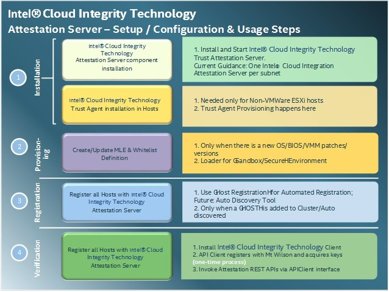

**Figure 5. Attestation Server Setup, Configuration, and Usage Steps**

## 5.2 Extending Host Attestation
Customized non-virtualized server Trust Policies are represented by an XML file, located on the host itself (by default in `/boot/trust/`). The Trust Policy includes a list of files and directories; when the host boots, a Trust Agent component measures each of these files and directories and extends the measurement into PCR 19.

>**Important:** Extended attestation using Trust Policies is currently supported only on Linux systems using the Intel® CIT Trust Agent. VMware* and Citrix* Xen hosts may still be attested, but the attestation is platform-only, including the BIOS, SINIT ACM, OS, and VMM components (VMware hosts also automatically include all installed VIB packages in the attestation 
report as modules extended to PCR 19).

Trust Policies are generated using the Trust Director. Once created, the Trust Policy can be copied to one or more physical servers where identical files are attested.

Once the server has been booted using the Trust Policy, the PCR 19 measurement can be compared against a known-good measurement by the Attestation Service. Host Trust Policies can be created on an individual per-server basis (which good-known measurements imported to the Attestation Service for each), or one Host Trust Policy can be copied to many servers and attested by the Attestation Service using only one set of good-known values.

>**Important:** Once the Host Trust Policy is configured and imported for attestation, any change to a measured file or folder is detected on the next attestation after a server reboot. Do not select files for attestation that will change between reboots.
For physical servers running the Trust Agent and using a non-virtualized server Trust Policy, a hypervisor is no longer required for trust attestation. For example, a physical database server can be attested using a Trust Policy to measure the static database libraries, executables, and configuration files at system launch, even though the server does not have a hypervisor installed and can run no virtual machines.

Extending host attestation through non-virtualized Trust Policies is currently supported only for non-virtualized servers running the Trust Agent on Ubuntu 16.04 or Red Hat Enterprise Linux 7. See [Section 4.6, “Installing the Trust Agent”](#46-installing-the-trust-agent---linux).

For instruction on creating Trust Policies, refer to [Section 8.8, “Trust Policies”](#88-trust-policies).

For VMware ESXi or Citrix Xen servers, “basic” trust attestation of the default Trusted Boot measurements is still supported.

## 5.3 Required Components
Following are the required components:

* Attestation Service must be installed and active.
* Trust Agent must be installed on at least one non-virtualized server.
* (Optional, required for custom Trust Policies only) Trust Director must be installed and active.

## 5.4 Importing Whitelist Values
To provide trust attestations, a set of good-known measurements must be established as the basis for comparison. The Attestation Server allows measurements to be imported from an existing server (manual definition of good-known values is also possible, but not recommended).

Whitelist values consist of two logical groups of measurements, called *Measured Launch Environments* (MLEs). One MLE contains the platform-specific measurements and is referred to as the “BIOS MLE.” The other, referred to as the “VMM MLE”, defines the good-known measurements for everything higher in the stack, including tboot (the open source trusted computing measurement agent), the OS kernel, and any other OS-level components (the hypervisor, files defined in the Host Trust Policy, and so on).

Whitelist values are specific to the precise version and configuration of the files on the server from which they are imported. This means the BIOS version 1.1 (for example) has a different measurement from BIOS version 1.2, and OS kernel 3.13.0-24-generic has a different measurement from OS kernel 3.13.0-30-generic. If a measured file is updated from one version to another, the measurement changes, and this results in an untrusted attestation after the server is rebooted.

Each type of MLE can be applied to one or many servers. For example, if a sample data center uses only one type of server using identical BIOS, OS, hypervisor, and other measured components, only one BIOS and one VMM MLE is required to attest all servers in the data center. Alternatively, a new BIOS and VMM MLE can be created for each individual host.

A new BIOS MLE is required whenever a new BIOS version is installed. Likewise, a new VMM MLE is required any time one of the components measured by the VMM MLE is updated (including at least the OS kernel, tboot, and the hypervisor, but also including any additional components measured by the Host Trust Policy).

> **Important:** Before importing MLE values, be sure that the Host Trust Policy has been created and the server rebooted afterward. If this step is completed out of order, the MLE values in the Attestation Server will mismatch the host on the host's next reboot, when the Host Trust Policy measurements are taken and extended to PCR 19.

To import whitelist MLEs from an existing server:
1. Browse to the Attestation Server URL, log on, and select to **Whitelist > Import from Trusted Host**.

    

	The **Import Whitelist from Trusted Host** screen displays.

	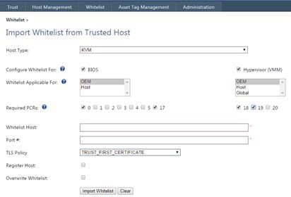

2. Select the **Host Type** (Linux, Linux KVM, Citrix XenServer, VMware ESXi, Windows or Xen). For Docker containers, use the Linux KVM from the drop down list.

>**Note:** For Trust Agent hosts, an additional field is available to specify the Trust Agent authentication credentials. This field is only required if the Trust Agent credentials were NOT pre-registered with the Attestation Service during installation. By default, the credentials are pre-registered and so the Attestation Service already knows which credentials to use.

3. Select the MLEs to import (BIOS, VMM, or both), and to what servers they will apply:

* Servers of any OEM (Global)
* Servers of a single OEM (OEM)
* Only one server (Host).

>**Note:** The Host Trust Policy (if used) measurements are always extended to PCR 19 in the VMM MLE

4. (Optional) Select the TPM PCRs that will be used to define the good-known measurements (for details on different PCRs, refer to [Section 8.0](#80-pcr-definitions)).  If no selections are made, default PCRs for the chosen host type will automatically be used (Recommended).
5. Input the connectivity details for the server from which the measurements will be imported (for Trust Agent hosts, this includes the IP/Hostname and the port number for the Trust Agent (1443 by default); for VMware ESXi servers, this includes the host IP/hostname, vCenter Server IP/ hostname, and credentials for a vCenter Server user with the “Validate session” permission applied to the root VCenter Server object).
6. Select a **TLS Policy** to use (for more information on TLS Policies, refer to [Section 8.4](#84-tls-policy-overview)).
7. Select whether to register the server after importing the measurements.
8. Select whether to overwrite existing whitelist measurements, if measurements already exist for the same components/versions being imported.
9. Click **Import Whitelist**. The current measurements for the specified server are imported and stored in the database for future attestations.

## 5.5	Host Registration
In order to perform a trust attestation for a given server, that server must be registered in the Attestation Server database. Registration includes defining the type of host, establishing connectivity details, and configuring which whitelist values (both a BIOS MLE and a VMM MLE) to be used for attestation.

If whitelist values are being imported from a server, the same server can be registered at the same time (see [Section 5.4, “Importing Whitelist Values”](#54-importing-whitelist-values)). This is particularly useful if a separate BIOS and VMM MLE will be created for each server.

Existing hosts can be deleted or modified (for example, different MLEs can be selected for attestation) under the Host Management tab on the Attestation Service web portal.

### 5.5.1 Registering Multiple Hosts Using a Flat File
One or more servers can be registered with the Attestation Server in bulk using a text file, as long as there is an existing BIOS and VMM MLE appropriate for all necessary BIOS and OS versions already imported.
To register servers using a text file (flat file):

1. Browse to the Attestation Server URL and select **Host Management > Import….**

    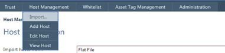

	The **Host Registration** page displays:

    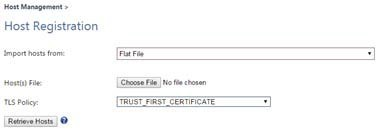

2. Create a plain-text file listing the servers to be registered using the following format for each host.

>**Note:** The Trust Agent connection string with username and password is only required if the Trust Agent password has not been pre-registered with the Attestation Service at the time of Trust Agent installation.

    For Linux Trust Agent servers: intel|host_name|host_port_no
    e.g. intel|myTrustAgent|https://MyTrustAgent:1443
    OR intel|myTrustAgent|https://MyTrustAgent:1443/;username;password
    
    For Windows Trust Agent servers: microsoft|host_name|host_port_no
    e.g. microsoft |myTrustAgent|https://MyTrustAgent:1443
    OR microsoft |myTrustAgent|https://MyTrustAgent:1443/;username;password

    For VMware ESXi hosts: vmware|Host_Name|Vmware_Connection_String*
    e.g.       vmware|myVmwareHost|https://myVcenterServer.mydomain.com:443/sdk;Administrator;Password
    For Citrix XenServer Hosts citrix|Host_Name|Citrix_Connection_String*
    e.g.     citrix|myCitrixHost|https://192.168.1.1:443/;Administrator;Password
    
>**Note:** The connection string must be a valid URL. The “/” after the port number is required. For VMware ESXi hosts, the username and password included in the connection string must be valid for a vCenter Server account with the “Validate session” permission applied to the root VCenter Server object:

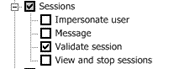

3. Select the text file defining the host(s) to be registered using the **Choose File** button.
4. Select a **TLS Policy** to use for all hosts in the text file
>**Note:** If multiple hosts will be registered, a shared TLS Policy applicable to all hosts must be used. For details on TLS Policies, refer to [Section 8.4](#84-tls-policy-overview).
5. Click **Retrieve Hosts** to assemble the list of hosts to be registered from the provided flat file.

    

6.	For each host, select which applicability type of BIOS and VMM MLE (Global, OEM, Host) and whether to register the server.
7.	Click Register Host to register all selected servers.

### 5.5.2 Registering a Host Individually
The **Add Host** tool allows hosts to be registered individually, and provides more detailed control over the MLEs used for attestation. While the **Import** tool automatically detects the BIOS and OS-VMM versions, the manual registration tool allows any BIOS and VMM MLE (within limits; attempting to register a vCenter host using a Trust Agent VMM MLE does not work simply because the vCenter connection details are missing) to be used to attest the host. Be aware that selecting a mismatched MLE results in the host appearing as untrusted when attested. Intel generally advises using the automated Import tool for host registration.
  
1. On the **Host Management** tab, select **Add Host**.

    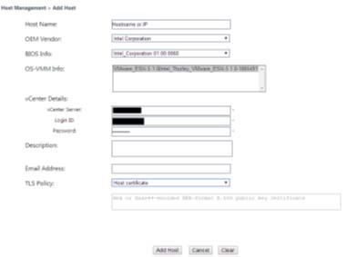

2. In the Host Name field, Enter the hostname or IP Address for the host to be registered.
3. Select the OEM vendor from the **OEM Vendor** drop-down list.
4. Select the appropriate BIOS version from the **BIOS Info** drop-down list. This is the BIOS MLE, and is populated according to the OEM Vendor selected.
5. Select the OS-VMM combination from the **OS-VMM Info** list. This is the VMM MLE.
6. Enter connection details.

* For vCenter, enter the hostname or IP Address of the vCenter server that manages the host, and credentials for a vCenter user with the “Validate session” permission applied to the root VCenter Server object.
* For Citrix Xen enter the port number (Citrix Xen uses port 443 by default) and the administrative credentials for the host.
* For Trust Agent hosts (including Linus and Windows), simply enter the port number for the Trust Agent (the default is 1443). If the Trust Agent username and password were not pre-registered with the Attestation Service when the Trust Agent was installed, provide the Trust Agent credentials as well.

The correct fields appear when the appropriate OS-VMM MLE is selected.

7. Select a **TLS Policy** for use with this host (either a new host-specific policy, or an existing shared policy. For details on TLS policies, refer to [Section 8.4.1](#841-tls-policy-types).
8. Click **Add Host** to register the host.

## 5.6 Host Attestation
The Attestation Server now features an automated background process that regularly checks for attestations that are nearing their expiration (by default attestations are considered valid for 90 minutes). When a given attestation is within five minutes of expiring, the Attestation Server initiates a new trust attestation for the attested server (retrieving a fresh quote from the server to be attested and attesting the values in the quote against the expected values in the whitelist). Attestations may be manually refreshed using the **Refresh All** button, or the refresh icon next to each host on the Trust Dashboard.

The current (most recent) trust attestation for registered servers can be seen on the Attestation Service portal in the Trust Dashboard:

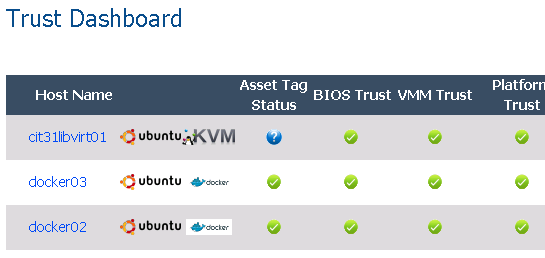

**Figure 6. Trust Dashboard**

On the OpenStack Controller, the current trust attestation for all hypervisors can also be seen on the “hypervisors” page (after configuration of the Attestation Reporting Hub to push attestation information to OpenStack):

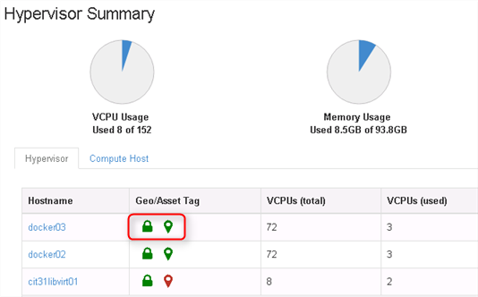

**Figure 7. Hypervisors Page**

An attestation of “Trusted” means that all measurements match up to the known-good MLE measurements. Any difference (mismatched hash value, extra component, missing components, etc) results in an “Untrusted” attestation.

An “Unknown” attestation results when a server cannot be contacted for an attestation (the server is powered off, there is a networking problem preventing communication, the Trust Agent is not running, ans so on). For Asset Tags, the Asset Tag portion of the trust attestation shows “Unknown” if no currently-valid asset tag certificate for the server is found in the Attestation Service database.

### 5.6.1 Remediation of Untrusted Attestations
If a server attests as “Untrusted”, a detailed attestation report can reveal the cause. Clicking the **Trust Report** button on the Trust Dashboard shows the detailed report.  A mismatched module or PCR measurement will be colored red.  However, extra or missing modules (modules present in the actual measurement but absent from the expected whitelist, or modules missing from the actual measurement and expected in the whitelist) will not be colored red, and will instead show a missing value in either the “Value” or “WhiteList” column.

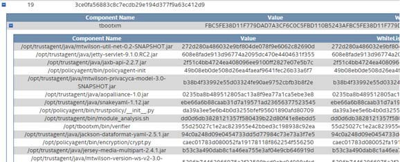

**Figure 8. Trust Report**

This report shows all of the PCRs measured when the server last booted, along with the whitelist value expected. See the Appendix for details on PCR definitions.

PCR 19 contains the “module” measurements; a module is effectively a file that has been measured, including any files measured as part of a Host Trust Policy. Modules are measured individually and “extended” to PCR 19 (this is why PCR 19 is a “calculated” hash; it changes from one server to the next, but the expected value can be calculated and verified against the actual PCR 19 value).
Expanding the PCR 19 object shows a list of all modules with their corresponding measurements and whitelist values. In the case of Trust Agent hosts, further expanding the *tbootxm* module shows all of the files measured for that host's Trust Policy. Any mismatches appear in red; these are the cause(s) of an “Untrusted” attestation, and can be re-mediated as required.

For example, if an application configuration file is measured as part of the Host Trust Policy, and this file was changed between reboots, PCR19 (and therefore the entire host) become untrusted. Expanding the *tbootxm* module in PCR19 to view the measurements shows that the configuration file that changed is colored red and no longer matches its expected value, and is the cause of the untrusted status.

If this is the result of a normal, authorized configuration change, the VMM MLE (which includes PCR19 and all modules) can be re-imported and overwritten with the new, current value. This causes the host to become “trusted” again.

If this is not the result of an authorized change, the incident can be flagged for a security response.

# 6.0 Image Integrity (VM and Docker)
This section describes utilizing the Trust Director to establish a Trust Policy for a virtual machine or Docker container image, allowing that image to be attested to detect any changes in secured configurations. Image attestations can be set the following:

* **Hash Only** — Involves attesting the image against its Trust Policy without taking any other action.
* **Hash and Enforce** — Prevents any instance of the attested image from being powered on if it does not match the Trust Policy.

If the host of an instance becomes untrusted itself (typically this means the host was tampered with and then rebooted, and the instance is powered back on after the host boots), the instance appears untrusted as well, regardless of whether the instance files have changed.

## 6.1 Required Components 
The following prerequisites are required for the Image Integrity use case:

* OpenStack Controller with Intel® Open Cloud Integrity Technology extensions must be installed and active.
* Attestation Service must be installed and active.
* Attestation Reporting Hub must be installed and active
* Linux Trust Agent with Image Integrity must be installed on at least one OpenStack Compute Node. 
* Linux Trust Agent Compute Nodes must be registered with the Attestation Service
* Compute nodes must be assigned to the appropriate tenant in the Attestation Reporting Hub to push attestation details for those hosts to the appropriate OpenStack controller
* To maintain the Chain of Trust, Trust Agent Compute Nodes must use a Host Trust Policy including the measurement components of the Trust Agent. These files are automatically selected by the Trust Director when creating Trust Policies for non-virtualized servers.

>**Note:** Only Linux KVM and Linux Docker hosts are currently supported for the Image Integrity use case.

## 6.2 Creating the Image Trust Policy (VM and Docker container)
To create the Trust Policy, the virtual machine image is mounted using the Trust Director application. The file structure of the image is exposed in a UI menu, allowing folders and sub-folders to be selected. Each selected folder/file is measured, and the measurements stored as part of the Trust Policy. Once selection is complete, the Trust Policy is digitally signed by both the Trust Director and the Attestation Service to prevent tampering. The Trust Policy is uploaded to OpenStack Glance along with the image.

It is extremely important that only static files/folders be selected as part of the Image Trust Policy. When attested during launch, instances of images protected with an Image Trust Policy attest as “Untrusted” if any measured component does not match the Trust Policy. Many files in a virtual machine change from one boot to the next. For details on Trust Policies, refer to [Section 8.8](#88-trust-policies).

## 6.3 Hash Only
If the **Hash Only** option is selected during Trust Policy creation, all instances of the image are attested as they are booted. Attestation occurs only at the time the instance is powered on from a powered-off state, and the attestation results are stored for later queries from the Attestation Service (accessible via API).

## 6.4	Hash and Enforce
If the **Hash and Enforce** option is selected during Trust Policy creation, instances of the protected image are attested during boot as with the **Hash Only** option, but if the instance attests as “untrusted” (the actual measurements do not match the measurements in the Trust Policy for the image), the instance is prevented from powering on.

## 6.5 VM Migrations
Virtual Machine migrations (moving an instance from one compute node to another) are not currently supported for Image Integrity or Image Privacy.

## 6.6 VM Snapshots
Virtual Machine snapshots are not currently supported for Image Integrity or Image Privacy.

## 6.7 Shared Storage
Shared storage is not currently supported for Image Integrity or Image Privacy.

## 6.8 VM and Docker Attestation
Each protected virtual machine image (an image with an associated Trust Policy) is attested each time it boots. The following table details when virtual machines are attested against the Image Trust Policy:

**Table 1. Virtual Machine Attestation**

| Action                  | New Instance Trust Attestation |
|-------------------------|--------------------------------|
| Launch from Image       |               Yes              |
| Pause/Resume Instance   |               No               |
| Suspend/Resume Instance |               Yes              |
| Soft Reboot Instance    |               No               |
| Hard Reboot Instance    |               Yes              |
| Shut Off/Start Instance |               Yes              |

**Table 2. Docker Attestation**

| Action                  | New Instance Trust Attestation |
|-------------------------|--------------------------------|
| Launch from Image       |               Yes              |
| Pause/Resume Instance   |               No               |
| Suspend/Resume Instance |               Yes              |
| Soft Reboot Instance    |               No               |
| Hard Reboot Instance    |               Yes              |
| Shut Off/Start Instance |               Yes              |

To view the attestation result, an administrator can query the Attestation Service for the trust status of a given instance by its Instance ID in Glance and the host running the instance. This information can also be seen on the OpenStack dashboard in the **Instances** tab, which performs this query each time a new measurement is taken.

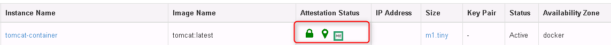

**Figure 9. OpenStack Dashboard Instances Tab**

The first icon refers to the hypervisor platform trust status, the second refers to the Asset Tag policy status, and the third refers to the VM attestation status. In each case:

* Red = Trust or Asset Tags are requires, but the hypervisor is not in compliance (wrong tags, untrusted, etc)
* Green = Trust or Asset Tags are required, and the hypervisor is in compliance
* Gray = No measurement available, or no policy applied

When rebooting an instance or otherwise triggering a new measurement, the VM trust status icon switches to gray until the new attestation quote has been generated. Refreshing the page updates the icons.

>**Note:** If the compute node hosting an instance becomes untrusted (such as a reboot after an attacker compromises a measured file), the instance trust status shows a red untrusted icon as well. This is because the trust attestation of an instance cannot be trusted if the host performing the attestation is itself untrusted.

## 6.9 Workflow Example #1 – VM images
To configure a new VM image for Image Integrity:
1. Browse to the Trust Director portal (**https://TrustDirectorIpOrHostname**) and log on.
2. Select **Images > Add Images to Trust Director**.

    

3. Select the appropriate Image Type and Format for your image. **Image Type** should be **Virtualized Server** and click **Next**.

    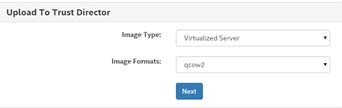

4. Select the image to be uploaded, and click **Upload**. The image is uploaded to the Trust Director.

    

5. Select **Trust Policy** from the top bar, then click the **Virtualized Server** tab to see a list of all images that have been uploaded to the Trust Director. To create a new **Trust Policy** for an image, click the (+) button in the Trust Policy field.

    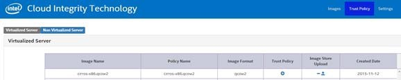

6. Provide a name for the new Trust Policy. Select whether this image uses the **Hash Only** or **Hash and Enforce** launch control policy, and whether the image is encrypted. Click **Next**.

    

7. Browse through the directory tree of the host to select files and folders to be included in the Trust Policy. Any files selected for the Trust Policy are included in later attestations; be sure to select only files that will not change between reboots.

    

8. Folders can be “locked” by clicking the blue lock icon. Locking a folder causes the folder’s exact contents to be measured, not just specific files. This means adding any new file to a locked folder, or removing or changing any file, causes the host to become untrusted on the next boot-time measurement. Regular expressions can be used to specifically include or exclude file types, and the selection can be made recursive, affecting all sub-folders. Use caution when locking folders; only files and folders that will not change between reboots should be selected.

    

9. Once all required files and folders have been defined for the Trust Policy, click **Next**. The Trust Policy is generated. If the encryption option was selected, the image is encrypted using a key from the KMS key broker.
10. Set a name for the image (this is the name that appears in OpenStack), and select whether to upload now or at a later time. Clicking **Upload Now** uploads the image to the OpenStack Glance repository.

    

11. Open a browser window to the OpenStack Horizon dashboard.
12. Select **Admin**, then **Images**.
13. Click **Edit** next to the image uploaded by the Trust Director.

    

    

The **Update Image** screen allows the image to be configured to use the Trust and Asset Tag scheduler filters.

>**Note:** The Asset Tag dropdowns will only contain the list of key/value options representing tags that have actually been pushed to hosts assigned to this OpenStack environment in the Attestation Reporting Hub.

14. Select **Trust only** to require the OpenStack scheduler to only place instances of the image on hosts attested as “trusted” by the Attestation Service (this is selected by default for all images with a Trust Policy). Select **Trust and Location** to require a trusted attestation as well as specific Asset Tag key/value pairs.

When **Trust and Location** is selected, the screen displays a drop-down of tag keys with a second drop-down for all possible values for that tag key. Use the drop-downs to select tags, and use the + button to add additional tag requirements. Instances of this image are only launched or migrated by the OpenStack scheduler to hosts matching the Trust Attestation and Asset Tag requirements.

15. From the OpenStack Horizon Dashboard, browse to **Project** and select **Images**.

    

16. Click **Launch** to launch an instance of the image. Provide an **Instance Name** and other details as normal.

The OpenStack scheduler selects a host for the instance based on the filter requirement. After the instance files are copied but before the instance is powered on, the Trust Agent examines the files in the instance and compares them against the Trust Policy for the image. If the attestation for the instance is successful, the instance is powered on. If the attestation fails (some file in the Trust Policy is different on the instance when compared to the Trust Policy for the source image), images where **Hash and Enforce** was selected during Trust Policy creation are halted and unable to launch. If **Hash Only** was selected for the Trust Policy, the instance launches, but still shows its “untrusted” status on the **Instances** page in OpenStack Horizon.
 
17.  After the image instance is launched, go to the **Project** tab and click **Instances**.

    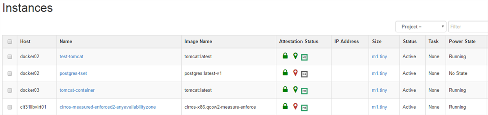

All instances display the attestation status of the host they are running on, the attestation of the Asset Tags for the host they are running on, and the attestation for the instance itself.

## 6.10	Workflow Example #2 – Docker container images (Uploaded Images to Trust Director or Downloaded from Docker hub)
Before creating a Trust Policy for a Docker Container, a Docker image must be uploaded to the Trust Director or downloaded from the Docker Hub.  
>**Note:** At least one External Storage endpoint must be configured before uploading the image and trust policy to OpenStack Glance. Refer to Section 4.5.6 to setup and configure an External Storage.

To configure a new Docker image for Image Integrity:

1. Browse to the Trust Director portal (**https://<TrustDirectorIp_Or_Hostname>**) and log on.
Select **Trust Policy > Docker**.

    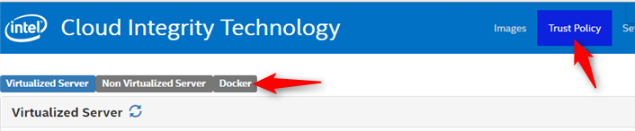

2. The Docker Trust policy page lists the existing Docker container images in a table.

    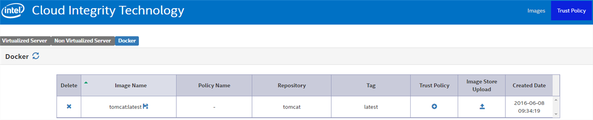

3. To create a new Trust Policy for an image, click the (+) button in the **Trust Policy** field.

    

4. The repo and tag name is retained for the Docker container image. Select whether this image uses the **Hash Only** or **Hash and Enforce** launch control policy. Click **Next**.

    

5. Browse through the directory tree of the host to select files and folders to be included in the Trust Policy. Any files selected for the Trust Policy are included in later attestations; be sure to select only files that will not change between reboots.

    

6. Folders can be “locked” by clicking the blue lock icon. Locking a folder causes the folder’s exact contents to be measured, not just specific files. This means adding any new file to a locked folder, or removing or changing any file, causes the host to become untrusted on the next boot-time measurement. Regular expressions can be used to specifically include or exclude file types, and the selection can be made recursive, affecting all sub-folders. Use caution when locking folders; only files and folders that will not change between reboots should be selected.

    

7. Once all required files and folders have been defined for the Trust Policy, click **Next**. The Trust Policy is generated. 
8. Select the type of Artifact you want to upload to OpenStack Glance. The **Docker Image** will only the image and excludes the Trust policy. This is similar to uploading a Docker container image directly to Glance. Choosing the **Docker Image With Policy** instructs the Trust director to upload the Docker container image with the Trust Policy as a tarball to OpenStack Glance. Select whether to upload now or at a later time. Clicking **Upload Now** uploads the image to the OpenStack Glance repository.

    

9. Select the appropriate external image storage service for the image (ex. OpenStack Glance).

    

10. Once Trust Policy has been uploaded, the status of the upload can be displayed by clicking on the first icon in the Image store upload. See the sample screenshot below

	**Queued** –the upload job has been accepted put into the queue
	**In Progress** –the upload job is being processed
	**Complete** –the Trust Policy was successfully completed

    

11. Open a browser window to the OpenStack Horizon dashboard.
12. Select **Admin**, then **Images**.
13. Click **Edit** next to the image uploaded by the Trust Director.

    

    

The **Update Image** screen allows the image to be configured to use the Trust and Asset Tag scheduler filters.

14. Select **Trust only** to require the OpenStack scheduler to only place instances of the image on hosts attested as “trusted” by the Attestation Service (this is selected by default for all images with a Trust Policy). Select **Trust and Location** to require a trusted attestation as well as specific Asset Tag key/value pairs.

When **Trust and Location** is selected, the screen displays a drop-down of tag keys with a second drop-down for all possible values for that tag key. Use the drop-downs to select tags, and use the + button to add additional tag requirements. Instances of this image are only launched or migrated by the OpenStack scheduler to hosts matching the Trust Attestation and Asset Tag requirements.

15. From the OpenStack Horizon Dashboard, browse to **Project** and select **Images**.

    

16. Click **Launch** to launch an instance of the image. Provide an **Instance Name** and other details as normal.

The OpenStack scheduler selects a host for the instance based on the filter requirement. After the instance files are copied but before the instance is powered on, the Trust Agent examines the files in the instance and compares them against the Trust Policy for the image. If the attestation for the instance is successful, the instance is powered on. If the attestation fails (some file in the Trust Policy is different on the instance when compared to the Trust Policy for the source image), images where **Hash and Enforce** was selected during Trust Policy creation are halted and unable to launch. If **Hash Only** was selected for the Trust Policy, the instance launches, but still shows its “untrusted” status on the **Instances** page in OpenStack Horizon. 

17.  After the image instance is launched, go to the **Project** tab and click **Instances**.

    

All instances display the attestation status of the host they are running on, the attestation of the Asset Tags for the host they are running on, and the attestation for the instance itself.

# 7.0 Image Privacy
This section describes utilizing the Trust Director and Key Management Service to encrypt virtual machine images before they are uploaded to the Cloud. By encrypting the entire VM, unauthorized access to sensitive workloads and data can be prevented. The decryption key is retained by the Key Management Service (KMS), meaning the owner of the KMS (and not the Cloud Service Provider) has ultimate control over whether an instance of the protected image will launch. Decryption permission is tied to the trust attestation of the host requesting the key, and cryptographically secured to the physical Trusted Platform Module of the server, meaning the image may only be decrypted and launched on a host meeting trust requirements with a valid attestation from the Attestation Service.

## 7.1 Required Components
The following prerequisites are required for the Image Privacy use case:

* OpenStack Controller with Intel® Cloud Integrity Technology extensions must be installed and active.
* Attestation Service must be installed and active.
* Attestation Reporting Hub must be installed and active
* Key Management Service must be installed and active.
* KMS Proxy must be installed and active.
* Linux Trust Agent with Image Privacy and Image Integrity must be installed on at least one OpenStack Compute Node.
* Trust Agent Compute Nodes must be registered with the Attestation Service 
* Compute nodes must be assigned to the appropriate tenant in the Attestation Reporting Hub to push attestation details for those hosts to the appropriate OpenStack controller	
* To maintain the Chain of Trust, Trust Agent Compute Nodes must use a Host Trust Policy including the measurement components of the Trust Agent. These files are automatically added to
non-virtualized server Trust Policies by the Trust Director.

>**Note:** Only Linux KVM hosts are currently supported for the Image Privacy use case.

## 7.2 VM Migrations
Virtual Machine migrations (moving an instance from one compute node to another) are not currently supported for Image Integrity or Image Privacy.

## 7.3 VM Snapshots
Virtual Machine snapshots are not currently supported for Image Integrity or Image Privacy.

## 7.4 Shared Storage
Shared storage is not currently supported for Image Integrity or Image Privacy.

## 7.5 Encrypting an Image
Image encryption is handled by the Trust Director application. The Trust Director accepts an existing virtual machine image in one of several formats (qcow2, raw, vhd, ami). When an image is selected for encryption, the Trust Director requests a new key from the Key Management Service and uses it to encrypt the image. The resulting encrypted image includes metadata that points back to the Key Management Service that issued the key; at no point is the decryption key provided to or shared with the Cloud Service Provider. The Trust Director is capable of uploading the encrypted image directly into OpenStack Glance if access is available, or the image can be uploaded manually through the process supported by your Cloud Service Provider.

## 7.6 Launching an Instance of an Encrypted Image
When an instance of an encrypted image is launched, the host detects that the image is encrypted. The host sends a request to the KMS Proxy, including the public Attestation Identity Key (AIK) bound to its TPM, as well as the URL for the KMS that manages the decryption key. The KMS Proxy retrieves an attestation for the host from the Attestation Service (using the AIK as the host identity) and forwards the request, along with the full SAML trust attestation, to the KMS. The KMS verifies the signatures and the trust attestation. If the verification passes, the KMS binds the image decryption key to the host AIK (which was included in the host attestation) and sends the wrapped key back to the KMS Proxy. The KMS Proxy returns the wrapped key to the host, which uses its TPM to unwrap the decryption key, allowing image to be decrypted. Because the image decryption key is cryptographically bound to the physical TPM of a host that passes an attestation check, the instance is only launched on a trusted host.

>**Note:** A key is requested by the host only the first time an instance of a given image is launched on that host, and then again when the host is rebooted.  The wrapped key is stored in memory to mount the encrypted image mount point, meaning the host must request the key again after a reboot to remount the encrypted file system.  If the host is untrusted after a reboot, the key will be denied and any encrypted instances will remain inaccessible.  If the host returns to a trusted state in a subsequent reboot, the key will be provided and instances will become available again.

### 7.6.1 VM Encryption for Microsoft Windows Compute Nodes
VM encryption for Windows compute nodes works largely the same as for Linux compute nodes; however, there are a few key differences.

Images in the Trust Director are still encrypted with individual encryption keys, and no workflow changes are needed on the Trust Director.
As with Linux nodes, a Windows host making a key request will still an attestation through the KMS Proxy, and the KMS will analyze the attestation report and only provide keys to a Trusted host.  The image key is wrapped using a TPM-specific Binding Key.

However, while on Linux each base image will reside in its own dedicated encrypted virtual volume, Windows uses a single BitLocker volume to store all images.  This means that, for Windows hosts, VM images are encrypted using the same BitLocker key in a single volume.  When a Windows host is rebooted, it does not make a new key request to the KMS; instead, BitLocker unlocks the volume without contacting the KMS, regardless of the current trust status of the host.  BitLocker keeps the images encrypted on disk; the major differences between the Windows and Linux functionality are the use of a single key for all images in Windows as opposed to unique keys for individual images in Linux, and that BitLocker will unlock the volume on host reboot without a new trust attestation, while Linux hosts will request keys for each unique base image each time the Linux host reboots, with a new trust attestation required before keys are granted.

## 7.7 Workflow Example for a Virtual Machine 
To configure a new VM Image for Image Privacy:

1. Browse to the Trust Director portal (https://TrustDirectorIpOrHostname) and log on.
2. Select **Images > Upload Images to Trust Director**.

    

3. Select the appropriate Image Format for the image, and click **Next**.

    

4. Select the image to be uploaded, and click **Upload**. The image is uploaded to the Trust Director.

    

5. Select **Trust Policy** from the top bar, then click the **Virtualized Server** tab to see a list of all images that have been uploaded to the Trust Director. To create a new Trust Policy for an image, click the (**+**) button in the **Trust Policy** field.

    

6. Provide a name for the new Trust Policy. Select whether this image uses the **Hash Only** or **Hash and Enforce** launch control policy Select **Encrypt Image** to encrypt the image. Click **Next**.

    

7. Browse through the directory tree of the host to select files and folders to be included in the Trust Policy. Any files selected for the Trust Policy are included in later attestations; be sure to select only files that will not change between reboots.

    

8. Folders can be “locked” by clicking the blue lock icon. Locking a folder causes the folder’s exact contents to be measured, not just specific files. This means adding any new file to a locked folder, or removing or changing any file, causes the host to become untrusted on the next boot-time measurement. Regular expressions can be used to specifically include or exclude file types, and the selection can be made recursive, affecting all sub-folders. Use caution when locking folders; only files and folders that will not change between reboots should be selected.

    

9. Once all required files and folders have been defined for the Trust Policy, click **Next**. The Trust Policy is generated. If the encryption option was selected, the image is encrypted using a key from the KMS key broker.
10. Set a name for the image (this is the name that appears in OpenStack), and select whether to upload now or at a later time. Clicking **Upload Now** uploads the image to the OpenStack Glance repository.

    

11. Open a browser window to the OpenStack Horizon dashboard.
12. Select **Admin**, then **Images**.
13. Click **Edit** next to the image uploaded by the Trust Director.

    

The **Update Image** screen allows the image to be configured to use the Trust and Asset Tag scheduler filters.

14. Select **Trust only** to require the OpenStack scheduler to only place instances of the image on hosts attested as “trusted” by the Attestation Service (this is selected by default for all images with a Trust Policy). Select **Trust and Location** to require a trusted attestation as well as specific Asset Tag key/value pairs.

When **Trust and Location** is selected, the screen displays a drop-down of tag keys with a second drop-down for all possible values for that tag key. Use the drop-downs to select tags, and use the + button to add additional tag requirements. Instances of this image are only launched or migrated by the OpenStack scheduler to hosts matching the Trust Attestation and Asset Tag requirements.

15. From the OpenStack Horizon Dashboard, browse to **Project** and select **Images**.

    

16. Click **Launch** to launch an instance of the image. Provide an **Instance Name** and other details as normal.

The OpenStack scheduler selects a host for the instance based on the filter requirement. After the image has been downloaded to the host, the Trust Agent verifies the signature on the Trust Policy, and detect whether the image is encrypted. If the image is encrypted, the host sends a request for the decryption key to the KMS, which also triggers a trust attestation for the host.

If the KMS determines that the attestation meets the image's policy requirements, it binds the key to the TPM of the host that was attested, and sends the wrapped key back to the host, where the image is decrypted.

After decryption, but before the instance is powered on, the Trust Agent examines the files in the instance and compares them against the Trust Policy for the image. If the attestation for the instance is successful, the instance is powered on. If the attestation fails (some file in the Trust Policy is different on the instance when compared to the Trust Policy for the source image), images where **Hash and Enforce** was selected during Trust Policy creation are halted and unable to launch. If **Hash Only** was selected for the Trust Policy, the instance launches, but still shows its “untrusted” status on the **Instances** page in OpenStack Horizon.

17. After the image instance is launched, go to the **Project** tab and click **Instances**.

    
    
All instances display the attestation status of the host they are running on, the attestation of the Asset Tags for the host they are running on, and the attestation for the instance itself.
 
# 8.0 PCR Definitions
## 8.1 TPM 1.2

| PCR     | Measurement Parameters                                                                    | Description                                                                                                                                                                                                        | Operating System                                                |
|---------|-------------------------------------------------------------------------------------------|--------------------------------------------------------------------------------------------------------------------------------------------------------------------------------------------------------------------|-----------------------------------------------------------------|
| PCR 0   |                                  BIOS ROM and Flash Image                                 | This PCR is based solely on the BIOS version, and remains identical across all hosts using the same BIOS. This PCR is used as the BIOS MLE (PCRs 1-5 can also be used in a BIOS MLE, but this is not recommended). | • All                                                           |
| PCR 12  |                           Data events and highly volatile events                          | This PCR measures some of the modules which has boot counters in it. It changes on every boot and resume (Microsoft Windows ONLY; do not use for attestation as the values change on reboot)                       | • Microsoft Windows Server 2012 • Microsoft HyperV 2012         |
|  PCR 13 |                                    Boot Module Details                                    | This PCR remains static except major changes such as kernel module update, different device driver for different OEM servers, etc. (Microsoft Windows ONLY)                                                        | •Microsoft Windows Server 2012 • Microsoft HyperV 2012          |
|  PCR 14 |                                      Boot Authorities                                     | Used to record the Public keys of authorities that sign OS components. Expected not to change often. (Microsoft Windows ONLY)                                                                                      | • Microsoft Windows Server 2012 • Microsoft HyperV 2012         |
| PCR 17  |                                            ACM                                            | This PCR measures the SINIT ACM, and is hardware platform-specific. This PCR is part of the BIOS MLE.                                                                                                              | • VMware ESXi • Citrix Xen  • Ubuntu • Red Hat Enterprise Linux |
| PCR 18  |                                      MLE [Tboot +VMM]                                     | This PCR measures the tboot and hypervisor version. In ESXi hosts, only the tboot version is measured.                                                                                                             | • VMware ESXi • Citrix Xen  • Ubuntu • Red Hat Enterprise Linux |
| PCR 19  | OS Specific • ESX and Trust Agent — non Kernel modules • Citrix Xen — OS + Init RD + UUID | For ESXi and Trust Agent hosts, this PCR contains individual measurements of all of the non-Kernel modules. For Citrix Xen hosts, this PCR is a measurement of the OS, InitRD, and UUID.                           | • VMware ESXi • Citrix Xen  • Ubuntu • Red Hat Enterprise Linux |
| PCR 20  | For ESXi only.,VM Kernel and VMK Boot                                                     | This PCR is used only by ESXi hosts and is blank for all other host types.                                                                                                                                         | • VMware ESXi                                                   |

## 8.2 TPM 2.0

| PCR     | Measurement Parameters                 | Description                                                                                                                                                                                                                                                                                                         | Operating System                                        |
|---------|----------------------------------------|---------------------------------------------------------------------------------------------------------------------------------------------------------------------------------------------------------------------------------------------------------------------------------------------------------------------|---------------------------------------------------------|
| PCR 0   |        BIOS ROM and Flash Image        | This PCR is based solely on the BIOS version, and remains identical across all hosts using the same BIOS. This PCR is used as the BIOS MLE (PCRs 1-5 can also be used in a BIOS MLE, but this is not recommended).                                                                                                  | • All                                                   |
| PCR 12  | Data events and highly volatile events | This PCR measures some of the modules which has boot counters in it. It changes on every boot and resume (Microsoft Windows ONLY)                                                                                                                                                                                   | • Microsoft Windows Server 2012 • Microsoft HyperV 2012 |
|  PCR 13 |           Boot Module Details          | This PCR remains static except major changes such as kernel module update, different device driver for different OEM servers, etc. (Microsoft Windows ONLY)                                                                                                                                                         | •Microsoft Windows Server 2012 • Microsoft HyperV 2012  |
|  PCR 14 |            Boot Authorities            | Used to record the Public keys of authorities that sign OS components. Expected not to change often. (Microsoft Windows ONLY)                                                                                                                                                                                       | • Microsoft Windows Server 2012 • Microsoft HyperV 2012 |
| PCR 17  |                 Details                | BIOS AC registration info Digest of Processor S-CRTM Digest of Policycontrol  Digest of all matching elements used by the policy Digest of STM Digest of Capability field of OsSinitData Digest of MLE                                                                                                              | • Ubuntu • Red Hat Enterprise Linux                     |
| PCR 18  |               Authorities              | Digest of public key modulus used to verify SINIT signature Digest of Processor S-CRTM Digest of Capability field of OSSinitData table Digest of PolicyControl field of used policy Digest of LCP                                                                                                                   | • Ubuntu • Red Hat Enterprise Linux                     |
| PCR 19  | OS Specific                            | For TA hosts, this PCR is a measurement of the OS, InitRD, and UUID. This changes with every install due to InitRD and UUID change. For hosts with non-virtualized Trust Policies, the measurements defined in the Trust Policy will appear as sub-modules inside of the “tbootxm” module, which is part of initrd. | • Ubuntu • Red Hat Enterprise Linux                     |

## 8.3 MLE Administration
Mt. Wilson automatically generates MLE names based on their classification as VMM or BIOLS MLEs, the specific type of MLE (Global, OEM, or Host), and details captured from the host during the import.
These values include the server platform (Romley, Thurley, etc), the name and version numbers of the OEM, OS, BIOS, and hypervisor as appropriate. For example,
      
    IBM_Thurley_VMware_ESXi_5.1.0-799733
    
is an OEM-level VMM MLE imported from an IBM Thurley server running ESXi version 5.1.0 build 799733. This VMM MLE can be used to attest the OS/hypervisor component of any IBM Thurley-based server running ESXi 5.1.0 build 799733, but cannot be used to attest an HP or Dell host, or any host running a different version of ESXi or a different hypervisor.

Typically, only a single MLE is needed for a given platform and hypervisor or BIOS version. However, there are some use cases where different modules are present in a VMM MLE even though the version remains the same. For example, using the Cisco Nexus 1000 virtual switch adds several module entries for a VMware ESXi host, and yet the version and build number for ESXi does not change. If only some hosts in your data center are using the Cisco Nexus 1000, you would need two separate VMM MLEs to attest those hosts with and without the additional modules. Otherwise, one set of hosts attest as untrusted depending on whether the host used to import the MLE was configured to use the virtual switch. Hosts attest as untrusted if:

* They contain one or more modules that do not exist in the whitelist MLE.
* They do not contain one or more modules that do exist in the whitelist MLE.
* Any hash values for PCRs or modules for the host do not match those values in the MLE.

Non-virtualized server Trust Policies effectively extend the VMM MLE by adding the Trust Policy measurements as modules extended to PCR 19. This means that hosts sharing a VMM MLE must also share the same Host Trust Policy, if any. If the Host Trust Policy measurements differ between two hosts, two VMM MLEs are required even if the hosts are using the same OS/hypervisor versions.
Similarly, the boot loader configuration file (typically in `/boot/grub/grub.cfg`) is measured and extended to PCR18.  If there is a difference in the grub.cfg file between two hosts, they will have different resulting PCR 18 measurements.  

>**Note:** This is particularly relevant when using LVM volumes; the grub typically contains a line defining the LVN name, and default OS installations typically incorporate the hostname into the LVM name (meaning every host would have a different entry, and thus a different grub.cfg and PCR18 measurement).  The same LVM configuration can be used across all similar hosts to prevent this difference.  Otherwise, host-specific VMM MLEs will be needed to ensure all hosts are Trusted.

When importing a new MLE when an existing MLE of the same version info already exists in the database, the Attestation Service automatically checks to see whether any PCRs or modules have changed; if they have, the default behavior is to add a new MLE without overwriting the original, with a numerical tag at the end of the name (001, 002, etc). This can be overridden in the UI by selecting the **Overwrite** option on the Import Whitelist MLE page. This causes the Attestation Service to overwrite the existing MLE regardless of whether any PCRs or modules have changed. Only the MLE of the selected type (VMM or BIOS, and Global, OEM, or Host) and identical versions are overwritten.

In the case of an environment upgrade (for example, upgrading from one ESXi version to another), it is important to import the new whitelist MLE value first, before upgrading the rest of the environment.
After importing the new, updated MLEs, perform the production upgrade and then re-register the hosts. By re-registering the hosts, they are automatically assigned to the correct, updated MLEs.

## 8.4 TLS Policy Overview
The Intel® CIT Attestation Service validates the authenticity of connections through the use of various TLS verification policies.

### 8.4.1 TLS Policy Types
The Intel® CIT Attestation Service uses six types of TLS policies:

| Policy Type             | Behavior                                                                                                                                                                                                                                                                                                                                              | Shared | Per-Host |
|-------------------------|-------------------------------------------------------------------------------------------------------------------------------------------------------------------------------------------------------------------------------------------------------------------------------------------------------------------------------------------------------|--------|----------|
| Certificate             | The certificate policy requires one or more trusted certificates or CA certificates and only connects to a peer whose certificate either is a trusted certificate or is signed by a CA that is trusted. This policy type also performs hostname verification. >**Note:** The remote server's hostname must be resolvable from the Mt. Wilson server). | Yes    | Yes      |
| Certificate Fingerprint |                                                                                                                    This policy stores the SHA256 hash of the certificate for validation rather than the entire certificate itself.                                                                                                                    | Yes    | Yes      |
| Public Key              |                                                 The public key policy requires one public key parameter and only connects to a peer using that key. This is similar to SSH public key authentication of clients and hosts. Hostname verification is NOT performed when using Public Key TLS policies.                                                 | Yes    | Yes      |
| Public Key Fingerprint  |                                                                                                                         This policy stores the SHA256 hash of the public key for validation rather than the public key itself.                                                                                                                        | Yes    | Yes      |
| TRUST_FIRST_CERTIFICATE |                                                      This policy stores the first certificate encountered when connecting to a host, and uses that certificate for all future TLS validation with that host. This was the default TLS policy used in Mt. Wilson 1.x, and is disabled by default.                                                      | Yes    | No       |
| INSECURE                |                                                                                                           This policy disables all TLS validation. All connections are accepted regardless of TLS certificates. This is disabled by default.                                                                                                          | Yes    | No       |
### 8.4.2 Policy Scope
TLS policies can be per-host or shared across multiple hosts.

* **Per-Host** — A per-host TLS policy is an individual, per-host TLS policy. When the host is deleted, its per-host TLS policy is automatically deleted as well. Policies using the Per-Host scope can be created on the individual host registration and whitelisting UI pages, and edited on the Edit Host page for the appropriate host.
* **Shared** — A shared TLS policy may be referenced by multiple host records. When a host that referenced a shared TLS policy is deleted, the shared policy continues to exist regardless if there are any remaining hosts that are referencing it. Shared policies must be explicitly deleted by the user. Shared policies of all types can be created and edited under the Administration tab.

The Attestation Service requires a TLS policy to be defined for any remote host to which it connects. If no TLS policy is defined, or if the TLS information does not match the TLS policy, the connection fails.

### 8.4.3 Default Policy Selection
Any shared-scope policy can be defined as the “default” TLS policy for a given Attestation Service environment. For example, if all TLS certificates for all hosts in the attestation environment have been signed by the same CA certificate, that CA certificate can be used to create a shared-scope certificate policy, and this same policy could be used to validate all TLS connections with all attested hosts. By configuring this policy as the default TLS policy, the Attestation Service uses this specific policy for all hosts unless another policy is specified.

In the Attestation Service UI, this mostly means that the default policy is automatically selected from the drop-down when registering hosts. From an API perspective, it means that, when calling a registration API, if no TLS policy is specifically defined in the call, the default TLS policy is used. Using a shared default policy that is valid across all hosts in the attestation environment can greatly simplify TLS policy and host management.

>**Note:** During installation, the only two shared-scope policies that might be available are TRUST_FIRST_CERTIFICATE and INSECURE, and these only if they have actually been enabled. All other policies must be user-created after installation.
To define a default TLS policy, edit the mtwilson.properties file and set the value of mtwilson.default.tls.policy.id to either the UUID or the name of the shared-scope TLS policy to be set as the default. Restart Mt. Wilson to affect the change.

### 8.4.4 Legacy Behavior
In the 1.x releases of the Attestation Service, only two policies were available to validate the TLS certificates of remote hosts:

* **TRUST_FIRST_CERTIFICATE** — This was default policy, and recorded the first TLS certificate encountered when connecting to a host, and used that certificate to validate future connections.
* **INSECURE** — This policy turned off all TLS certificate validation entirely (all connections were trusted, regardless of TLS certificates).

To configure the Attestation Service to use the same TLS policy behavior as was used in the 1.x Attestation Service, configure the mtwilson.properties file with the following settings:

    mtwilson.tls.policy.allow=TRUST_FIRST_CERTIFICATE 
    mtwilson.default.tls.policy.id=TRUST_FIRST_CERTIFICATE

This can be done automatically during installation by setting the following variables in `mtwilson.env`:

    export MTW_TLS_POLICY_ALLOW= TRUST_FIRST_CERTIFICATE 
    export MTW_DEFAULT_TLS_POLICY_ID=TRUST_FIRST_CERTIFICATE

## 8.5 Asset Tags
The Attestation Service securely writes Administrator-defined descriptors to TPM hardware. These values can be provisioned, validated, and made visible in the data center by using the Intel® CIT Attestation Server, and can then be used to provide workload verification, remediation, reporting, and compliance in both public and private cloud environments.

This section details the requirements, components, and procedures for deploying Asset Tags. It is targeted toward Systems Engineers who are proficient with Linux administration, PXE and related technologies, and the Citrix Xen and/or VMware ESXi hypervisors.

### 8.5.1 Prerequisites
Following are the prerequisites:

* An instance of the Intel® OpenCIT Attestation Service with Asset Tag enabled.
* One or more hosts with Intel® TXT-enabled processors and active Trusted Platform Modules (TPM version 1.2 OR 2.0).
* (Linux servers only) Intel® OpenCIT Trust Agent must be installed.
* (Optional; required for “Pull” provisioning only; required for ESXi servers) Intel® OpenCIT Asset Tag Provisioning image (may be deployed via PXE, iso image, and so on).

### 8.5.2 Asset Tag Provisioning Workflow

**Figure 10. Asset Tag Provisioning Workflow**

### 8.5.3 Asset Tag Provisioning Modes
Asset Tags can be provisioned to assets either by “pushing” the Asset Certificate from the Attestation Service to the asset, or by “pulling” an Asset Certificate to an asset by running a provisioning script on the host (facilitated by a bootable image used for provisioning, called the Intel® Cloud Integrity Technology Asset Tag Provisioning Image). Currently, ESXi hosts can only be provisioned using the pull mode, while Trust Agent and Citrix Xen hosts can be provisioned using either push or pull.

### 8.5.4 Tags and Selections
Tags and Selections represent the core function of the Asset Tag service. A Tag is an arbitrary classification name with one or more potential values. For example, a Tag named “State” might have values like “California” or “New York”, and a tag names “Department” might have values like “Accounting”, “Sales”, and so on. A Selection is a set of one or more Tag name/value pairs that are provisioned to an Asset. For example, you might have a server tagged with a selection like:

State: California; Department: Accounting
    
Creating a Tag involves creating a name for the Tag and its potential values.

1. Open a browser window and point it to the Attestation Service URL. Click on the **Asset Tag Management** tab, and select **Tag Creation**.

    

	The **Create New Tag** page opens:

    

2. Enter a name for the new tag in the **Tag Name** field.
3. Enter a value for the tag in the **Tag Value** field and click **Save**.
4. Repeat **Step 3** to add any additional appropriate potential values for the new Tag.
5. When all desired potential values for the Tag have been created, click the **Save** button to save the Tag.

After Tags have been created, they can be searched using the **Search Tags** function. To list all Tags and their potential values, simply leave all of the fields blank and click the **Search…** button.

Creating a Tag Selection consists of naming the Selection, and adding a set of one or more Tags with appropriate values as name/value pairs.

1. Open a browser window and point it to the Attestation Service URL. Click on the **Asset Tag Management** tab, and select **Tag Creation**.

    

	The **Tag Selection** page opens:

    

2. Enter a name for your selection in the **Name** field.
3. (Optional) Add a **Description** for your selection.
4. To add Tags to the Selection, select a Tag from the drop-down on the left, select a value for the Tag from the drop-down on the right, and click the **Add** button.
5. Repeat **Step 4** until all desired tags have been added to the Selection.
6. Click the Save button to save the Selection.

After Selections have been created, they can be searched using the **Search Selections** function. To list all Selections, simply leave all of the fields blank and click the **Search…** button.

### 8.5.5 Asset Tag Provisioning
There are two methods supported for provisioning Asset Tags to assets.

* **Push method** — Involves creating an Asset Certificate using the asset's UUID and a Tag Selection and “pushing” the certificate from the Asset Tag service to the asset.
* **Pull method** — Involves booting the asset itself to a provisioning image, which requests a new Asset Certificate from the Asset Tag service using a given Selection.

>**Note:** Currently, the push method is only supported for Citrix Xen Server with the Xen Server Measured Boot supplemental pack installed, and Trust Agent hosts. The pull method is supported for Citrix Xen, VMware ESXi, and KVM.

#### 8.5.5.1 Push Provisioning
The push method for Asset Tag provisioning is initiated by the Attestation Service; the administrator creates a new Asset Certificate and provisions the certificate to a provisioning agent running on the asset.

>**Note:** Because the asset must have a provisioning agent running to write the Asset Certificate to the TPM, only Citrix Xen hosts with the Xen Server Measured Boot supplemental pack installed, or open-source Xen or KVM hosts with the Intel® Trust Agent installed can currently be provisioned using the push method. ESXi hosts must be provisioned using the pull method.

**Prerequisites:**

* One or more Citrix Xen or Trust Agent hosts registered in the Attestation Service.
* Appropriate Asset Tags and Asset Selections to provision to the host(s) must have been created.

**Procedure:**

1. Open a browser window and point it to the Attestation Service URL. Click on the **Asset Tag Management** tab and select **Provision Tags**.

	

	The **Asset Tag Provisioning** page opens:

    

2. Double-click on the servers to be provisioned.
3. Click the existing Selection to provision to the chosen server(s).
4. Click **Provision**. This creates a new Asset Certificate (one for each selected server), imports it into the Attestation Service database, and provisions the Asset Certificate to the TPM of the selected server(s). The certificate is matched to the appropriate host for attestation using the host's hardware UUID.
5. Reboot the host to complete the provisioning process (the certificate info written to the TPM is not extended to PCR22 and thus is not available for attestation until the host's next boot cycle).

#### 8.5.5.2 Pull Provisioning
The pull method for Asset Tag provisioning is initiated from the host by an agent installed on the Intel® OpenCIT Asset Tag Provisioning image. The agent sends the Attestation Service the hardware UUID of        the host and the name of the Selection to be provisioned, and requests a new Asset Certificate. The Attestation Service creates the new Asset Certificate and returns it to the agent, which then writes it to the host's TPM.

The pull method requires that the Provisioning Agent take ownership of the server TPM; TPM ownership needs to be in a “cleared” state and the TPM active before beginning. After provisioning, the agent automatically re-clears the TPM ownership. However, before the “normal” Operating System of the server can re-take ownership of the TPM itself, the TPM needs to be re-activated in the BIOS (the act of clearing TPM ownership forces the TPM into a “disabled” state, as per the TCG specification).
 
The Asset Tag Provisioning Agent must be run from an operating system with certain prerequisites installed, and therefore is provided on an ISO-format disk image (`assettag.iso`). This image can be used with iPXE on a provisioning network to remotely boot to the provisioning image.

#### 8.5.5.3 Creating an XML file for Asset Tag Provisioning
Asset Tags can be defined for future provisioning using an XML file provided to the Provisioning Agent script. The determination of which Tags are provisioned to which hosts can be configured in several ways:

* Provide the list of hosts to be provisioned with a set of Tags as a list of one or more hardware UUID values or the IP Address/hostname as it appears in Mt. Wilson (use `<subject><uuid>` to list UUIDs or `<subject><ip>` to list as the host(s) appear in Mt. Wilson)
* Provide a list of the Tags with no `<subject>` to apply the same set of Tags to all hosts. If a `<selection>` block with no `<subject>` list is provided along with one or more other `<selection>` blocks that do include one or more `<subject>` assignments, the `<selection>` block with no `<subject>` listed is used as a default set of Tags to provision to all hosts not explicitly listed.

Tags are listed in the following format:

    <attribute oid="2.5.4.789.1"><text>Name=Value</text></attribute>
    
All Tags listed within a single `<selection></selection>` block are provisioned to the same host(s), according to any listed `<subject>` assignments.

The `oid "2.5.4.789.1"` is required when using the text format `Name=Value` as shown here. Only one value is allowed in the name=value format, but multiple values for the same Tag can be listed in a single Selection (for example, Tenant=Tenant1 and Tenant=Tenant2 can both be applied to the same host by listing both name/value pairs in the same `<selection>` block).

It is possible to create attributes other than name=value pairs by using the `<der>` tag instead of the `<text>` tag. However, `<der>` tags are incompatible with the Mt. Wilson UI. The entire Asset Tag certificate is provided in the SAML assertion, so any provisioned Tags are still obtainable regardless of which format is chosen.

Following is a sample Asset Tag XML file:
 
    <?xml version="1.0" encoding="UTF-8"?>
    <selections xmlns="urn:mtwilson-tag-selection">
        <selection>
            <attribute oid="2.5.4.789.1"><text>Country=US</text></attribute>
            <attribute oid="2.5.4.789.1"><text>State=NY</text></attribute>
            <attribute oid="2.5.4.789.1"><text>City=New York</text></attribute>
        </selection>
        <selection>
            <subject><ip>192.168.1.101</ip></subject>
            <attribute oid="2.5.4.789.1"><text>Country=US</text></attribute>
            <attribute oid="2.5.4.789.1"><text>State=CA</text></attribute>
            <attribute oid="2.5.4.789.1"><text>City=Folsom</text></attribute>
            <attribute oid="2.5.4.789.1"><text>City=Santa Clara</text></attribute>
        </selection>
        <selection>
            <subject><uuid>21c26a6e-5401-41de-a168-d637e1e1b154</uuid></subject>
            <subject><uuid>f98cabf1-6ab1-47c2-8b5c-e3be3d6865ad</uuid></subject>
            <attribute oid="2.5.4.789.1"><text>Country=US</text></attribute>
            <attribute oid="2.5.4.789.1"><text>State=TX</text></attribute>
            <attribute oid="2.5.4.789.1"><text>City=El Paso</text></attribute>
        </selection>
        <selection>
            <subject><ip>192.168.1.103</ip></subject>
            <subject><ip>192.168.1.104</ip></subject>
            <subject><ip>192.168.1.105</ip></subject>
            <attribute oid="2.5.4.789.1"><text>Country=MX</text></attribute>
            <attribute oid="2.5.4.789.1"><text>City=Mexico City</text></attribute>
            <attribute oid="2.5.4.789.1"><text>Dept=Finance</text></attribute>
        </selection>
    </selections>

It is possible to have an existing valid certificate in the database containing Tags that do not correspond to those defined in the XML. The determination of whether the most recent valid certificate for a host or the Tags explicitly defined in the XML are provisioned in this case is handled by the value of the *TAG_PROVISION_NOCACHE* variable set during installation of the Attestation Service.

If Tags and Selections are defined in the XML that do not exist in the Asset Tag database, the Asset Certificate is still created using the Tags specified in the XML, but the Asset Tag UI does not actually create new Tag or Selection entries. The correct Tags according to the XML are still shown in the SAML assertion (since the SAML displays the entire certificate).

#### 8.5.5.4 Encrypting the Asset Tag XML
When automating the provisioning of Asset Tags, there may be situations where the selection of attributes is determined in advance by one person and is provisioned by another person who has access to the hosts for provisioning, but is not authorized to change the attribute selections.

This section describes how to create encrypted selection files that can be used in place of plain-text selection files to protect the integrity of the pre-determined selections.

**Pre-Provisioning Setup:**

The following are required to create an encrypted selection file:

* Encryption password from mtwilson.properties.
* Selection XML file.
* OpenSSL command-line tools, with optional openssl.org patch #3254.
* The `encrypt.sh` script provided with the Asset Tag service.

The Asset Tag service automatically generates a file encryption password during installation and stores it in the Mt. Wilson configuration file `mtwilson.properties`. This password is used to encrypt and decrypt the selection XML file.

The Asset Tag provisioning service allows exporting a selection file in XML format. Support for exporting the selection file already encrypted is planned for a later release. Alternatively, users may create selection XML files using another process. An XSD for the selection XML files is available.

The OpenSSL command-line tools include the **enc** command (used to encrypt files) and the **dgst** command (used to provide an integrity digest for the selection). OpenSSL patch #3254 provides command-line support for PBKDF2 algorithm and setting the iteration count for both the older password algorithm and the new PBKDF2 algorithm. The patch was prepared against openssl-1.0.1f.

**Encrypting the Selection XML File:**

It is assumed that `openssl` and `encrypt.sh` are in the `$PATH`, and that the Asset Tag attribute selection file is in the current directory in a file named `selection.xml`. It is also assumed that the encryption password is known, and is represented as the word “password” in the following example.

The following commands generate an encrypted file using the chosen password:

    export PASSWORD=password
    encrypt.sh -p PASSWORD selection.xml.enc selection.xml

If you are using OpenSSL without patch #3254, add the `--nopbkdf2` option:
   
    encrypt.sh --nopbkdf2 -p PASSWORD selection.xml.enc selection.xml
    
The content of the output file `selection.xml.enc` looks like this:

    Content-Type: encrypted/openssl; alg="aes-256-ofb"; digest-alg="sha256"; enclosed="application/zip" Date: Fri Feb 7 12:16:30 PST 2014

    U2FsdGVkX1+/wg16dCIvM5w7fyBcXvTmtIBsvB5NqsyHMqVR2lqCaNbQGaVW42WE yn46ncwOqccL1OlB5BtECB9I5WCl8Qb8OQzrMTZ+Wxwy4R28/1tzSMOEyOBbXMCY
    /ltf+qlVdNUqU/tSSZusSWCPnxclcF9v8O0vodmrcas+5d9QU2Z4yJH2ZuknP/Ji 8yYIRxge8UzsoG+AVwmoBk4ZWhzH6A5Lc/T1o0/uIw4M//2+cDCnGduuSLFrL1+q mO1xb/hP7Zgjk+9wRLPGYpjM2h58Vqf8WWD/DqMwGE07mlN8lS4gnkn6OmWj2dq5 nyHUrueiWaz81cbx4PTdcPCnzHryYBsW1YXDCru8JHba67owoYNx8CXalNkDfAu+ CnvitWqmSPJPvFHr6QbBzE/ziPRIzzYoRFksOmzkMjfsugdy8015PI9h36SUQc9Q y85ujORHb1yTt3hAYM0tpc3eYOF/rqEID4lwuzNvlbPyTV6tZO18/kxiejNMKqFd Nbx2Tn+fopG1tIujUPhneBqK7DHMDSGvgWcVl6CCgA0bPm6hcZ8MoDywHcJK86yg 55cJwRwMEHt/PtV94JU//c+Nckq3nltuQTe17+bUTHTgmY1rvone93HV7R1jV5c3 sVPXglBsFyhUax4l2YFXuXKSiiPXacUvWBg6oY7NCYhXcI4U+GSWJ65ADYSoxlcj EtdiG33kOS3L5vYUBJMHzmZVaqIR3iw2Za35cT5g+iagThudKcI=

#### 8.5.5.5 Decrypting and Verifying the Selection XML File

This step is performed by the Asset Tag Provisioning Service upon receiving an encrypted selection file. You can perform the same step to decrypt a previously-encrypted Selection XML file.

In this section, it is assumed that `openssl` and `decrypt.sh` are in the `$PATH`, and that the encrypted Asset Tag attribute selection file is in the current directory in a file named `selection.xml.enc`. It is also assumed that the encryption password is known, and is represented as the word “password” in the following example.

The following commands generate an encrypted file using the chosen password:

    export PASSWORD=password
    decrypt.sh -p PASSWORD selection.xml.enc ls selection.xml.enc.d

The decryption script does not need a --nopbkdf2 option because it automatically determines from the encrypted file whether PBKDF2 should be used.

The decryption script creates a directory named `selection.xml.enc.d` into which it extracts the original selection file selection.xml. You may also see other files adjacent to `selection.xml` with `.sig` and `.sig.doc` extensions. These are used for the integrity check.
If the decrypted file fails the integrity check, the decryption script prints a message like the following:

    Message failed verification: selection.xml.enc.d/selection.xml

#### 8.5.5.6 Provisioning Usage

When deploying asset tags using the provisioning agent, select the encrypted selection file instead of a plain-text selection file. The provisioning service automatically recognizes that it is encrypted and attempts to decrypt it using the password in `mtwilson.properties`.

## 8.6 Database Configuration for Remote Database Servers
While by default the Attestation Service deploys its own database on the local machine, it is also possible to use a remote database server. If using an external server is required, the remote database must be configured to accept remote connections.

For Postgres, edit the `/etc/postgresql/9.3/main/pg_hba.conf` file and add the following line:

     host    all    all    <IP RANGE>/<SUBNET>   password

Using a remote Postgres database also requires modifying the `postgresql.conf` file (in the same folder as `pg_hba.conf`) to include the Attestation Service server in the listen_addresses setting, which is commented out by default.

    # - Connection Settings - 
    listen_addresses = '*'

Setting this value to `'*'` enables connections from all addresses. This can be restricted to only the Attestation Service server(s), or to a specific IP range that includes the Attestation Service server(s).

Prior to running the Attestation Service installation, the Attestation Service user (root by default) and the database schema (mw_as by default) must be created on the remote database server, and full rights over the database must be given to the user. These steps are not required if the database resides on the same machine as the Attestation Service services.

## 8.7 Password Guidelines

### 8.7.1 Changing the Database Password
The Attestation Service includes a command-line utility to automatically change the Attestation Service database password and update all related Attestation Service properties files (no other Intel® CIT components are affected). The command is:

    $ mtwilson change-db-pass

This utility prompts for the new password, and automatically updates the database password in PostgreSQL as well as all of the Attestation Service `.properties` files. If the `.properties` files are encrypted, the command automatically handles decryption and re-encryption as long as the appropriate encryption password variable (`$MTWILSON_PASSWORD`) has been set (see [Section 8.7](#87-password-guidelines) for details). The encryption password is only required if encryption is being used.
 
## 8.8 Trust Policies
A Trust Policy is a list of files and directories to be measured with good-known measurements for comparison, digitally signed by the Attestation Service. Trust Policies are created for both bare-metal servers and for virtual machines, but function in the same way. Effectively, attestation for both bare-metal servers and virtual machines works by taking a hash measurement of a selected file or the cumulative hash of an entire folder, and comparing that hash against a known value.

### 8.8.1 Choosing Files for Measurement
It is extremely important to select only files and folders that do not change between reboots of the measured device. The Trust Policy is the set of good-known values against which actual boot-time measurements are compared; any deviation from the expected measurements results in an untrusted state for the bare-metal server or virtual machine. Deviations can include adding, removing, renaming, or editing a file in a measured directory, or removing, renaming, or editing a specifically-measured file.

Trust Policies are composed of a selection of one or more explicit files, and may also include one or more general rules applied to a folder through include/exclude regular expressions.

Select explicit files and folders by putting a check in the check-box. If an individual file is selected, that specific file is added to the Trust Policy. If a directory is selected, that directory and all files and directories contained in the selected directory are added explicitly to the Trust Policy.

Explicitly-added files are always included in the attestation of the machine governed by the Policy, but new files may be added without changing the resulting Trust Status.

The `lock` icon next to each directory allows general rules to be applied to the folder using regular expressions. These rules control what files are measured n a directory, even if they are added later. For example, by locking a folder with the include expression `“*”`, all files in the folder are measured, including files added later. Creating a new file in this folder results in the protected host becoming untrusted after its next reboot.

Adding an exclude filter excludes any files matching the exclude expression. Exclude filters are applied after include filters, meaning a folder with an include filter of `“*”` and an exclude filter of `*.txt` measures all files in the folder, with the exception of any files whose names contain the string `“*.txt”`.

Folder lock rules can be applied to an individual folder, or can be applied recursively to all sub-folders as well.

Any combination of explicitly selected files and directory *lock filters* can be used, including within the same folder.
Explicitly-selected files are measured separately from lock filters. If a file is selected explicitly in a locked folder, and the lock filters would normally not include the explicitly selected file in the attestation measurement, the file is still measured and attested.

>**Important:** Ensure that files are measured only if they are not expected to change between reboots or, in the case of VM Trust Policies, that the files will not change between the source image and any instances. As an example, for a database workload, select the database executables, libraries, and configuration files, but do not select the actual database contents.

### 8.8.2 Creating a Trust Policy

#### 8.8.2.1 Creating a Trust Policy for a Virtual Machine Image

1. To create a Trust Policy, browse to the Trust Director portal (https://TrustDirectorIpOrHostname) and log on.
2. Select **Images > Upload Images to Trust Director**.

	

3. Select the appropriate Image Format for your image, and click **Next**. 

	

4. Select the image to be uploaded, and click **Upload**. The image is uploaded to the Trust Director.

	
 
5. Select **Trust Policy** from the top bar, then click the **Virtualized Server** tab to see a list of all images that have been uploaded to the Trust Director. To create a new Trust Policy for an image, click the (**+**) button in the **Trust Policy** field.

6. Provide a name for the new Trust Policy. Select whether this image uses the **Hash Only** or **Hash and Enforce **launch control policy. Select **Encrypt Image** to encrypt the image. Click **Next**.

	

7. Browse through the directory tree of the host to select files and folders to be included in the Trust Policy. Any files selected for the Trust Policy are included in later attestations. Be sure to select only files that will not change between reboots.

	

8. Folders can be “locked” by clicking the blue lock icon. Locking a folder causes the folder’s exact contents to be measured, not just specific files. This means adding any new file to a locked folder, or removing or changing any file, causes the host to become untrusted on the next boot-time measurement. Regular expressions can be used to specifically include or exclude file types, and the selection can be made recursive, affecting all sub-folders. Use caution when locking folders; only files and folders that will not change between reboots should be selected.

	

9. Once all required files and folders have been defined for the Trust Policy, click **Next**. The Trust Policy is generated. If the encryption option was selected, the image is encrypted using a key from the KMS key broker.
10. Set a name for the image (this is the name that appears in OpenStack), and select whether to upload now or at a later time. Clicking **Upload Now** uploads the image to the OpenStack Glance repository.

	

#### 8.8.2.2 Creating a Trust Policy for a Docker container Images

1. To create a Trust Policy, browse to the Trust Director portal (https://TrustDirectorIpOrHostname) and log on.

2. Before creating a Trust Policy for Docker, Make sure you have an image uploaded to the Trust Director or have downloaded a Docker image from Docker Hub (registry). Refer to the [Section 8.9.3](#883-downloading-a-docker-image-from-docker-hub-using-trust-director) or [Section 8.9.4](#884-uploading-a-docker-image-to-trust-director--manual-upload) for instructions on how to download or upload a Docker container. Come back to this section if you have completed downloading or uploading a Docker image to Trust director. 

3. Once you have completed the uploading or downloading of Docker image, Navigate to the Trust Policy and Proceed to the Docker page 

	

4. Choose the Docker image that you want to create a trust Policy from the table  by clicking on the “+” icon in the Trust Policy column. 

	

5. Provide a name for the new Trust Policy. Select whether this image uses the **Hash Only** or **Hash and Enforce** launch control policy. Click **Next**.

	

6. Browse through the directory tree of the host to select files and folders to be included in the Trust Policy. Any files selected for the Trust Policy are included in later attestations. Be sure to select only files that will not change between reboots.

	

7. Folders can be “locked” by clicking the blue lock icon. Locking a folder causes the folder’s exact contents to be measured, not just specific files. This means adding any new file to a locked folder, or removing or changing any file, causes the host to become untrusted on the next boot-time measurement. Regular expressions can be used to specifically include or exclude file types, and the selection can be made recursive, affecting all sub-folders. Use caution when locking folders; only files and folders that will not change between reboots should be selected.

	

8. Once all required files and folders have been defined for the Trust Policy, click **Next**. The Trust Policy is generated.

9. The name for the docker image will be composed by the repository name of the image and the tag name using a ":" as delimiter, the image name will be displayed on the Policy Name field, for Upload Artifact field you must select Docker Image with Policy otherwise you will only upload the image without a policy atached. Clicking **Upload Now** uploads the image to the OpenStack Glance repository.

	

### 8.8.3 Downloading a Docker image from Docker Hub using Trust Director

To download a Docker image from Docker hub, browse to the Trust Director portal and logon. 

1. Select **Images** then **Add Images to the Trust Director**.
	
    

2. Select the appropriate image type: **Docker** then click **Add**.
	
    

3. Select **Pull from Hub**, then supply the repository name and tag name of the Docker image you wish to download. Make sure the repo and tags are correct and has not been previously downloaded. Then press the Download button as show in the example below.
	
    

4. Once the container is downloaded **Trust Policy Page** will be displayed and enabled. Click on the button and you will be redirected to the **Trust Policy Page**.

	

5. The Trust Policy Page contains all the Docker Images that you have downloaded from Docker Hub or uploaded to the trust Director. From this page, you can delete the Docker image with the Trust Policy by clicking on the (**x**) button on the **Delete** column. You can also download the Docker image as a tarball. 

	This is also the place where you can start creating the trust Policy of a Docker image. See screenshot below. Once you see a Docker image in the Trust policy page, you can now start creating the trust policy for Docker images. Proceed to [Section 8.8.2.2](#8822-creating-a-trust-policy-for-a-docker-container-images) to create a Trust Policy for Docker images.

	

### 8.8.4 Uploading a Docker image to Trust Director – Manual Upload

To  upload a Docker image to Docker hub, browse to the Trust Director portal and logon. 

1. Select Images then **Add Images to the Trust Director**.

	

2. Select the appropriate image type: **Docker** then click **Add**.

	

3. Select Manual Upload. Browse through your disk or network shared folder to find the Docker image that you have downloaded and saved previously using “Docker save”. Select the Docker image and Supply repository name and tag name of the Docker image you want to upload. Make sure the repo and tags are correct. Then press the Upload button as show in the example below.

	

	A progress bar and porcentage will be displayed at the bottom of the page showing the progress of the upload process
    
    
    
    once completed a message will appear at the bottom of the page indicating the image was succesfully uploaded.

	

4. Once the uploading process was completed you can close the pop window and then proceed to the Trust policy page by clicking on the Trust Policy page button.

	

5. You will be taken to the Trust policy page which contains all the Docker Images that you have downloaded from Docker Hub or uploaded to the trust Director. From this page, you can delete the Docker image with the Trust Policy by clicking on the (**x**) button on the **Delete** column. You can also download the Docker image as a tarball. 

	This is also the place where you can start creating the trust Policy of a Docker image. Once you confirm the Docker images in the Trust policy page, you can now start creating the trust policy for Docker images by clicking on the (**+**) icon. See screenshot below.

6. Proceed to the [Section 8.8.2.2 Creating Trust Policy for Docker Images](#8822-creating-a-trust-policy-for-a-docker-container-images) to create the trust policy for Docker images.

	

### 8.8.5 Uploading Image to Trust Director – Remote File Upload

To upload an image directly from the host were TD is installed you need to use the option "Remote File Upload".

1. Select Images then **Add Images to the Trust Director**.
	

2. Select the appropriate image type: **Docker** then click **Add**.

	

3. Select Remote File Upload and enter the information required as the Absolute Image Location, Repository Name of the image and Tag Name for the docker image. Optionally you can set another name for the image.

	

4. Once the uploading process was completed you can close the pop window and then proceed to the Trust policy page by clicking on the Trust Policy page button.

	

5. You will be taken to the Trust policy page which contains all the Docker Images that you have downloaded from Docker Hub or uploaded to the trust Director. From this page, you can delete the Docker image with the Trust Policy by clicking on the (**x**) button on the **Delete** column. You can also download the Docker image as a tarball.

	This is also the place where you can start creating the trust Policy of a Docker image. Once you confirm the Docker images in the Trust policy page, you can now start creating the trust policy for Docker images by clicking on the (**+**) icon. See screenshot below.

6. Proceed to the [Section 8.8.2.2 Creating Trust Policy for Docker Images](#8822-creating-a-trust-policy-for-a-docker-container-images) to create the trust policy for Docker images.

	

### 8.8.6 Creating a Trust Policy for a Non-Virtualized Server

Browse to the Trust Director (https://TrustDirectorIpOrHostname) to create the non-virtualized server Trust Policy

1. Select **Trust Policy**, then select **Non-Virtualized Server** and click **Add New Policy**.

    

2. Provide a name for the new Trust Policy, as well as SSH details for the host that is used to generate the Policy (root permissions are needed to browse the full file structure of the remote host).

    

3. Browse through the directory tree of the host to select files and folders to be included in the Trust Policy. Any files selected for the Trust Policy are included in later attestations. Be sure to select only files that will not change between reboots. Files related to the Trust Agent are automatically selected for measurement on non-virtualized hosts; this is mandatory to preserve the Chain of Trust.

    

4. Folders can be “locked” by clicking the blue lock icon. Locking a folder causes the folder’s exact contents to be measured, not just specific files. This means adding any new file to a locked folder, or removing or changing any file, causes the host to become untrusted on the next boot-time measurement. Regular expressions can be used to specifically include or exclude file types, and the selection can be made recursive, affecting all sub-folders. Use caution when locking folders; only files and folders that will not change between reboots should be selected.

    

5. Once all required files and folders have been defined for the Trust Policy, click **Next**.

	The Trust Policy (`trustpolicy.xml` and `manifest.xml`) are created and placed in the `/boot/trust` directory on the host.

    

To deploy the same Trust Policy to other hosts, click the provided **Download** link. The `trustpolicy.xml` and `manifest.xml` files are downloaded in a tgz archive, and can be provisioned to all hosts that will have identical measured files to the source host.

>**Note:** When using the same Trust Policy on multiple servers, remember that Trust Policy measurements are not performed until rebooting the host after the Trust Policy has been deployed. It is suggested to either copy the Trust Policy immediately before installing the Trust Agent (and rebooting afterward), or (if the Trust Agent has already been installed) reboot the host after copying the Trust Policy. Any time the Trust Policy is modified, be sure to repeat the whitelisting and registration steps to update all hosts to use the new whitelisted measurements.

6. A new GRUB boot option is created by the Trust Agent installer whose label begins with “TCB Protection”. Update the default boot option (typically in `/etc/default/grub`) to use the TCB Protection option, and run update-grub so the change takes effect.
7. Reboot the server so that the Trust Policy is included in the server attestation measurements. This causes the new Trust Policy measurements to be calculated and extended to PCR 19 in the TPM. 

# 9.0 Whitelisting Guidelines

White-listing consists of extracting known-good MLE values to use for later attestation. While a known-good host is used to provide these values, the MLEs are stored in the Attestation Service database and are only changed when deleted or overwritten by user action. If the known-good host
changes for any reason, the MLEs already captured are not updated unless a user with the appropriate roles repeats the white-listing procedure and overwrites the MLEs with new, updated values.
Registration of the known-good host for attestation is optional.

MLEs are divided into two types: BIOS and VMM. To register a given host, MLEs appropriate for that host's BIOS and OS/hypervisor configuration must already exist in the Mt Wilson database.

>**Note:** Beginning in Intel® Cloud Integrity Technology 3.0, the VMM MLE also includes the Host Trust Policy extended to PCR 19. If all measured files in the Host Trust Policy are identical across all hosts the VMM MLE may still be shared (using a Global or OEM MLE). However, if the Host Trust Policy for two hosts are different (even if the same files are measured, if the files themselves are different, the measurement is different), they each require a different VMM MLE, even if the OS and (optional) hypervisor version are identical. In these cases the Host VMM MLE type may be used.

## 9.1 For BIOS MLEs:

* Select the OEM option to provide whitelist for each OEM type and BIOS version. All the hosts of a given OEM type & BIOS version are verified with this whitelist.
* Select the HOST option to provide whitelist by specific host and BIOS version (for example, for HP Servers, by design PCR0 changes for every host).

## 9.2	For VMM/OS MLEs:

* Select the OEM option to provide whitelist for each OEM type and VMM/OS version. All the hosts of a given OEM type platform, & VMM/OS version are verified with this whitelist.
* Select the HOST option to provide whitelist by host and VMM/OS version. This whitelist is used to verify ONLY the specified host.
* Select the GLOBAL option to provide the whitelist for each VMM/OS version and number. All the servers/hosts across all OEM types using the same platform run this specified VMM/OS version and build are verified with this whitelist.

>**Note:** OEM and Global VMM MLEs are specific to server platform (for example, Thurley vs Romley).
If your data center consists of a single OS/hypervisor version but has both Romley- and Thurley-platform-based servers for example, a separate VMM MLE is required for each of the two platforms even though the OS/hypervisor configuration is otherwise uniform.

## 9.3	Encrypted Images 

Image encryption allows an enterprise to control whether or not instances of a given image may be launched on a given platform, by providing access to keys only to a successfully attested host, and by cryptographically binding the image decryption key to the hardware Trusted Platform Module of the attested host.

When the first instance of an encrypted image is landed on a compute node by the OpenStack Nova scheduler, the Trust Agent intercepts the VM launch command and analyzes the Trust Policy for the VM. If the Trust Policy shows that the VM is an instance of an encrypted image, the Agent uses the key transfer URL found in the Policy to request the decryption key. This request is routed through the KMS Proxy (the URL for the KMS Proxy is defined for the Trust Agent installation), which requests a new trust attestation from the Attestation Service for the compute node (this attestation is performed using the Attestation Identity Key of the host to ensure that the resulting attestation is securely tied to the returned binding key). The KMS Proxy forwards the attestation to the key transfer URL for the image decryption key on the KMS. The KMS then analyzes the host attestation, ensuring the attestation is properly signed by an Attestation Service whose SAML and PrivacyCA keys are known (configured during KMS setup), and verifying that the attestation result was “trusted”. So long as the request meets these requirements, the KMS retrieves the image decryption key from the key store (typically Barbican or a KMIP-compliant key management service) and encrypts the decryption key using the binding key of the host that was attested.

The host's binding key is the public half of an asymmetric key pair generated by the host's TPM at the time of Trust Agent installation. By sealing the decryption key using the public binding key, successful decryption of the image can only happen on a host with access to the TPM containing the private half of the binding key. The public binding key is included as part of the host trust attestation from the Attestation Service.

Upon receipt, the Trust Agent then asks the host TPM to unwrap the decryption key; the decryption key is never stored on disk.  If the host is rebooted, the key must be requested (with the associated new attestation) again.  This happens automatically.

The decryption key is then used to fully decrypt the image on the host, and also to mount an encrypted virtual disk on the host file system, where the decrypted image is placed. Effectively, so long as the host can access the decryption key, it is able to mount the encrypted virtual disk at boot and access instances of the image.

In the event of a host reboot, the host automatically issues any needed key requests.  If the host is still trusted after the reboot, the key will be provided, and again unwrapped into memory using the host TPM.  The **cryptfs** mount is remounted, restoring access to the encrypted instances.  If the host is untrusted after the reboot, the key will be denied, and any encrypted instances will remain inaccessible.  

A CLI command can also be used to issue all needed key requests to remount the encrypted disks for all images running on a host:

    policyagent remount

Scenarios where the wrapped key would be inaccessible include re-installing the Trust Agent (this replaces the Binding Key, and so keys wrapped using an old Binding Key can no longer be unwrapped and are therefore inaccessible), or temporary network unavailability.

Rebuilding the instance from the Horizon dashboard re-downloads the decryption key and restores functionality, but all data separate from the base image is lost (rebuilding the instance essentially re-instantiates the instance from the base image, discarding any virtual disk change file, but preserving the instance ID, name, IP, and so on).

# 10 OpenStack Controller Changes
The following modifications to the OpenStack controller are made by the Intel® Cloud Integrity Technology OpenStack Controller patch installer. This information is provided for integrators to use as a reference, and for informative purposes. Using a default, base OpenStack installation for a supported version, these changes are performed automatically by the Intel® CIT-provided installer binary, and no additional configuration is needed. The plugin installer requires that all OpenStack controller services modified (Nova, Horizon) be located on the same local machine, and assume default file paths as installed on Ubuntu 16.04 directly from the Ubuntu repositories.  Specific file paths may vary between OpenStack versions.  If the version of OpenStack being used is not the default version from the Ubuntu repositories installed in the default location, or to support new versions of OpenStack, the patch will require modification by the user.  The specific changes made by the installer are listed below in part to facilitate such changes.

## 10.1 Horizon Changes
	
### 10.1.1 Library and Configuration Changes

| File                                                                                         | Changes and Other Notes                                                                                                                                                                                                                                                                                                                                                                                                                                                                                                                                                                                                                                                                                        |
|----------------------------------------------------------------------------------------------|----------------------------------------------------------------------------------------------------------------------------------------------------------------------------------------------------------------------------------------------------------------------------------------------------------------------------------------------------------------------------------------------------------------------------------------------------------------------------------------------------------------------------------------------------------------------------------------------------------------------------------------------------------------------------------------------------------------|
| *distribution-location/python2.7/ cit_horizon_plugin.py*                                     | Custom module written for enabling Trust and Geo-tag columns in Instances/Images/Hypervisors view of the Horizon dashboard. This module extends the views in images, instances and hypervisors view to add a column with Geo-tag and Trust icons. For the instances view, along with Trust and Geo-tag, the column also contains the VM attestation policy and status.                                                                                                                                                                                                                                                                                                                                         |
| *distribution-location/python2.7/horizon_utils.py*                                           | Utility class which is consumed by the above module. This utility class contains helper methods to call into CIT to retrieve the available asset tags, Hypervisor and VM attestation reports.                                                                                                                                                                                                                                                                                                                                                                                                                                                                                                                  |
| *distribution-location/openstack-dashboard/ openstack_dashboard/settings.py*                 | Need to add the CIT Attestation Service access details and credentials in the setttings.py configuration file. This is used by the helper methods in horizon_utils.py for calling into CIT. All the required configuration changes should be under the ASSET_TAG_SERVICE section. Example:      ASSET_TAG_SERVICE = {                'IP': 'xxx.xxx.xxx.xxx',                 'port': '8443',                'certificate_url': '/certificate-requests',                   'auth_blob': 'username:password',                'api_url': '/mtwilson/v2/host-attestations',                 'host_url': '/mtwilson/v2/hosts',                'tags_url': '/mtwilson/v2/tag-kv-attributes.json?filter=false'     } |
| *distribution-location/openstack-dashboard/ openstack_dashboard/local/local_settings.py*     | This settings file has to be modified to enable the horizon_geo_tag override module to let Horizon pick the custom modules to render the Images/Instances/Hypervisor views. The following line has to be added in the *HORIZON_CONFIG* section.                              'customization_module': 'horizon_geo_tag.overrides'                                                                                                                                                                                                                                                                                                                                                                               |
| *distribution-location/python2.7/dist-packages/horizon/static/ horizon/js/horizon.geotag.js* | The required javascript changes for the UI changes made on horizon. This has to be added to the list of js files to be loaded. File to be modified:                           /usr/lib/python2.7/distpackages/horizon/templates/horizon/_scripts.html                                                                                                                                                                                                                                                                                                                                                                                                                                                          |
| *horizon_geotag.less*                                                                        | Required CSS changes to show the appropriate icons for Trust/Geo-tag column in the views on the dashboard. This CSS has to be appended to the appropriate CSS files relevant to the distribution/version of OpenStack being used.                                                                                                                                                                                                                                                                                                                                                                                                                                                                              |

### 10.1.2 Instance View Changes

| File                                                                                     | Changes and Other Notes                                                         |
|------------------------------------------------------------------------------------------|---------------------------------------------------------------------------------|
| *distribution-location/python2.7/dist-packages/nova/api/ openstack/compute/views/server* | Changes made to pass the Trust and Asset Tag values to the view override method |
| *distribution-location/openstack-dashboard/ openstack_dashboard/api/nova.py*             | Changes made to add the Asset Tag properties to the instance details response.  |

### 10.1.3 Images Dashboard Changes

| File                                                                                                                      | Changes and Other Notes                                                                                                                                                                                                                                                |
|---------------------------------------------------------------------------------------------------------------------------|------------------------------------------------------------------------------------------------------------------------------------------------------------------------------------------------------------------------------------------------------------------------|
| *distribution-location/openstack-dashboard/ openstack_dashboard/dashboards/project/ images/images/forms.py*               | Modified the **Create Image** and **Edit Image** forms to support add/edit/get the “Trust Policies” when creating/updating an image. The form now contains a drop-down so that the admin can pick up the selection that has to be verified before launching the Image. |
| *distribution-location/openstack-dashboard/ openstack_dashboard/dashboards/project/ images_and_snapshots/images/views.py* | Modified to update the above created column of the table with the appropriate Policy value of the image.                                                                                                                                                               |
### 10.1.4 Attestation Service

| Application                                                                      | Configuration Files                                     |
|----------------------------------------------------------------------------------|---------------------------------------------------------|
| Overall Intel® Open Cloud Integrity Technology Attestation Service Configuration | *mtwilson.properties*                                   |
| Attestation Service                                                              | *attestation-service.properties SAML.jks* (signing key) |
| Whitelist Manager Service                                                        | *wlm-service.properties*                                |
| Management Service                                                               | *management-service.properties SAML.crt* (certificate)  |
| Privacy CA                                                                       | *privacyca.properties*                                  |
| Management Console                                                               | *management-console.properties*                         |
| Whitelist Portal                                                                 | *whitelist-portal.properties*                           |
| Trust Dashboard                                                                  | *trust-dashboard.properties*                            |
| Security Framework                                                               | *shiro.ini*                                             |

    Application:   /opt/mtwilson
    Configuration: /etc/intel/cloudsecurity/
                   /opt/mtwilson/configuration
    Data:	   PostgreSQL database
    Logs:	   /opt/mtwilson/share/apache-tomcat-7.0.34/logs/catalina.out

### 10.1.5 Trust Agent

| Item                                                                       | Default Value                                                                                                     | Notes                                                                                                                                                                 |
|----------------------------------------------------------------------------|-------------------------------------------------------------------------------------------------------------------|-----------------------------------------------------------------------------------------------------------------------------------------------------------------------|
| Application home directory                                                 | */opt/trustagent*                                                                                                 |                                                                                                                                                                       |
| Policy Agent home directory (Image Privacy and Integrity Trust Agent ONLY) | */opt/policyagent*                                                                                                | The Policy Agent is used only with OpenStack deployments, and analyzes VM Trust Policies.                                                                             |
| Tbootxm home directory                                                     | */opt/tbootxm*                                                                                                    | Tbootxm is an extension of tboot that measures files and directories specified in a non-virtualized server Trust Policy during system launch for extension to PCR 19. |
| Vrtm home directory  (Image Privacy and Integrity Trust Agent ONLY)        | *opt/vrtm*                                                                                                        | VRTM is a component of the Trust Agent used only with OpenStack deployments. This is the agent that directs the VM measurement and attestation functions.             |
| Configuration directories                                                  | */opt/trustagent/configuration /opt/policyagent/configuration /opt/tbootxm/configuration /opt/vrtm/configuration* |                                                                                                                                                                       |
| Command-line tools                                                         | */opt/trustagent/bin /opt/policyagent/bin /opt/tbootxm/bin /opt/vrtm/bin*                                         |                                                                                                                                                                       |
| Java components                                                            | */opt/trustagent/java*                                                                                            |                                                                                                                                                                       |

| Item                                                             | Default Value                                                                                                                                                                  | Notes |
|------------------------------------------------------------------|--------------------------------------------------------------------------------------------------------------------------------------------------------------------------------|-------|
| Trust Agent logs                                                 | */var/log/trustagent/trustagent.log* Tentative: */opt/trustagent/log* (may be linked to */var/ log/trustagent*) */var/log/policyagent/policyagent.log  /var/log/vrtm/vrtm.log* |       |
| Policy Agent logs (Image Privacy and Integrity Trust Agent ONLY) | */opt/policyagent/logs*                                                                                                                                                        |       |
| Tbootxm logs                                                     | */opt/tbootxm/logs*                                                                                                                                                            |       |
| Vrtm logs (Image Privacy and Integrity Trust Agent ONLY)         | */opt/vrtm/logs*                                                                                                                                                               |       |
| Temporary files                                                  | */opt/trustagent/var* (may be linked to */var/ trustagent*)                                                                                                                    |       |
### 10.1.6 Trust Director

    Application:   /opt/director
    Configuration: /opt/director/configuration, /opt/director/env
    Data:	   /opt/director/repository
    Logs:      	   /opt/director/logs
    Java:	   /opt/director/java

### 10.1.7 Attestation Reporting Hub

    Application:   /opt/attestation-hub
    Configuration: /opt/attestation-hub/configuration, /opt/attestation-hub/env
    Data:	   /opt/attestation-hub/repository
    Logs:	   /opt/attestation-hub/logs
    Java:	   /opt/attestation-hub/java

### 10.1.8 Key Management Service
#### 10.1.8.1 Check Server Version
The following command displays the server version:
     
    # kms version 
    Version: 1.0 
    Branch: release-1.0
    Timestamp: 2014-12-16T15:37:28.702-0700

#### 10.1.8.2 Check Server Status
To check the server status:

    # kms status
Output indicates if KMS is running or not running. For example:

    KMS is running
Or, if the service is not running, this displays instead:

    KMS is not running

#### 10.1.8.3 Start and Stop the Server
To start the key server:

    # kms start
    Started KMS
To stop the key server:

    # kms stop
    Stopped KMS
To restart the key server:

    # kms restart 
    Stopped KMS Started KMS

 #### 10.1.8.4 Add, edit, or Remove User Permissions
The administrator can use the **password** command to add, edit, or remove user permissions for password-based login to the key server. Note that password-based access is only available with Transport Layer Security. New users should be provided their passwords along with the key server's TLS certificate; they must install the server TLS certificate (add it to their trusted server certificate list) to secure their login to the key server.

To add a new user:

    kms password <username> <password> --permissions <permission1,permission2,...>
The permissions are comma-separated list of permissions. Each permission has the format `domain:action`, and a single wildcard character is allowed on each side to indicate “any domain” or “any action”. The double-wildcard `*:*` means “any domain, any action”, which is the administrator or *superuser* permission.
 
To change a user's password, repeat the command to add the user and supply the new password. You can omit the permissions if they do not need to change:

	kms password <username> <new-password>
To edit user permissions, repeat the command to add the user and supply the current password (or a new password) and new permissions. The new permissions overwrite the existing permissions.

To list the current permissions for a user, use the following command:

	kms password <username> --list

#### 10.1.8.5 List Users
The administrator can use the **password** command to list existing users.

	kms password --list
Output is one username per line.

#### 10.1.8.6 Execute All Setup Tasks
The setup tasks are documented in [Section 10.1.8.6](#10186-execute-all-setup-tasks). The following command executes all setup tasks, in order:

	kms setup
Any environment variables needed by the setup tasks should be set before running the command. When all the setup tasks complete successfully, there is no output on the screen. Errors and warnings are shown on the screen. More detailed information is written to the KMS log.

#### 10.1.8.7 Execute Specific Setup Tasks
If you need to execute a specific setup task, you can name one or more tasks to execute in order on the command line. The following example executes two tasks:

	kms setup task1 task2

#### 10.1.8.8 Validate a Setup Task Without Executing It
If you need to check that a setup task has completed successfully but do not want to execute it (validation or dry run), you can use the **--noexec** option. The following example validates that an endorsement certificate has been requested, but does not actually request it:

	kms setup <tasks...> --no-exec

#### 10.1.8.9 Force Execution of a Setup Task Even if It is Already Validated
Normally, if a setup task has already been successfully completed, its execution is skipped. If you want to force that task to run again, you can use the **--force** option. The following example requests a new endorsement certificate even if a one has already been requested:

	kms setup <tasks...> --force

#### 10.1.8.10 Continue Executing Subsequent Setup Tasks Even if One Fails
Normally, if a setup task fails to complete, subsequent tasks are skipped. If you want to try running subsequent tasks anyway, you can use the **--continue** option. The following example attempts to take ownership and then requests a new AIK even if taking ownership fails:

	kms setup <tasks...> --continue
	
#### 10.1.8.11 Setup Task Reference
**filesystem**
   
Ensures that configuration, features, and repository directories are created.

**update-extensions-cache-file**

Scans the installed application for available extensions and automatically register them in the `extensions.cache` file in the configuration folder. Should be executed after any update to the application software.
   
**password-vault**

Creates a file to store all other passwords needed by the server. The file is password-protected using the master password in `KMS_PASSWORD`.

**jetty-ports**

Configures default values for HTTP and HTTPS ports in `kms.conf`.

**jetty-tls-keystore**

Randomly-generates Jetty keystore password. Creates password-protected keystore file. Generates TLS keypair.

**notary-key**

Creates a key used to generate integrity signatures on key metadata.

**envelope-key**

Creates a key used by clients to wrap keys that should be registered with the key server.

**storage-key**

Creates a key used to encrypt user keys before storing them, for example before sending them to any back-end KMIP or Barbican server.

**saml-certificates**

Ensures there is a SAML certificates file present with trusted SAML certificates.

**tpm-identity-certificates**

Ensures there is a file present with trusted Privacy CA certificates.

#### 10.1.8.12 Uninstall
The **uninstall** command removes the KMS files but keeps the configuration, keys, and any credentials for remote services. To completely remove the KMS and its data, use the **--purge** argument.

      # kms uninstall --purge
        Stopped KMS

#### 10.1.8.13 Help
The help command shows all available commands.

>**Note:** The setup command takes additional options and arguments, so it is described separately from the other commands.

    # kms help
    Usage: /usr/local/bin/kms start|stop|restart|status|version|zeroize|uninstall|help Usage: /usr/local/bin/kms setup [--force|--noexec] [task1 task2 ...]
    Available setup tasks: password-vault
    jetty
    jetty-tls-keystore notary-key envelope-key storage-key
    saml-certificates
    tpm-identity-certificates

### 10.1.9 KMS Proxy

#### 10.1.9.1 Check Server Version
The following command displays the server version:

    # kmsproxy version 
      Version: 1.0 Branch: release-1.0
      Timestamp: 2014-12-16T15:37:28.702-0700

#### 10.1.9.2 Check Server Status
To check the server status:

     # kmsproxy status
Output indicates if the service is running or not running. For example:

    KMSPROXY is running

Or, if the service is not running, This displays instead:

    KMSPROXY is not running

#### 10.1.9.3 Start and Stop the Server
To start the key server proxy:

    # kmsproxy start
      Started KMSPROXY
To stop the key server proxy:

    # kmsproxy stop
      Stopped KMSPROXY
To restart the key server proxy:

    # kmsproxy restart 
      Stopped KMSPROXY 
      Started KMSPROXY

#### 10.1.9.4 Execute All Setup Tasks
The setup tasks are documented in [Section 10.1.8.6](#10186-execute-all-setup-tasks). The following command executes all setup tasks, in order:

    kmsproxy setup

Any environment variables needed by the setup tasks should be set before running the command. When all the setup tasks complete successfully, there is no output on the screen. Errors and warnings are shown on the screen. More detailed information is written to the KMSPROXY log.

#### 10.1.9.5 Execute Specific Setup Tasks
If you need to execute a specific setup task, you can name one or more tasks to execute in order on the command line. The following example executes two tasks:

    kmsproxy setup task1 task2

#### 10.1.9.6 Validate a Setup Task Without Executing It
If you need to check that a setup task has completed successfully, but do not want to execute it (validation or dry run), you can use the **--noexec** option. The following example validates that an endorsement certificate has been requested, but does not actually request it:

    kmsproxy setup <tasks...> --no-exec

#### 10.1.9.7 Force Execution of a Setup Task Even if It is Already Validated
Normally, if a setup task has already been successfully completed, its execution is skipped. If you want to force that task to run again, you can use the **--force** option. The following example requests a new endorsement certificate even if a one has already been requested:

    kmsproxy setup <tasks...> --force

#### 10.1.9.8 Continue Executing Subsequent Setup Tasks Even if One Fails
Normally, if a setup task fails to complete, subsequent tasks are skipped. If you want to try running subsequent tasks anyway, you can use the **--continue** option. The following example attempts to take ownership and then requests a new AIK even if taking ownership fails:

    kmsproxy setup <tasks...> --continue

#### 10.1.9.9 Setup Task Reference

**filesystem**

Ensures that configuration, features, and repository directories are created.

**update-extensions-cache-file**

Scans the installed application for available extensions and automatically register them in the `extensions.cache` file in the configuration folder. Should be executed after any update to the application software.

**password-vault**

Creates a file to store all other passwords needed by the server. The file is password-protected using the master password in *KMS_PASSWORD*.

**jetty-ports**

Configures default values for HTTP and HTTPS ports in `kms.conf`.

**jetty-tls-keystore**

Randomly-generates Jetty keystore password. Creates password-protected keystore file. Generates TLS keypair and self-signed certificate, which can be customized by setting `KMSPROXY_TLS_CERT_DN` (`kmsproxy.tls.cert.dn`), `KMSPROXY_TLS_CERT_IP` (`kmsproxy.tls.cert.ip`), and `KMSPROXY_TLS_CERT_DNS` (`kmsproxy.tls.cert.dns`).

**mtwilson**

Registers a client with Mt. Wilson and requests the **Attestation** and **Challenger** roles.

#### 10.1.9.10 Uninstall
The **uninstall** command removes the KMS proxy files but keeps the configuration, keys, and any credentials for remote services. To completely remove the KMS proxy and its data, use the **--purge** argument.
    
    # kmsproxy uninstall --purge
      Stopped KMSPROXY

#### 10.1.9.11 Help
The help command shows all available commands.

>**Note:** The **setup** command takes additional options and arguments, so it is described separately from the other commands.

	# kmsproxy help
	  Usage: /usr/local/bin/kms start|stop|restart|status|version|zeroize|uninstall|help Usage: /usr/local/bin/kms setup [--force|--noexec] [task1 task2 ...]
	  Available setup tasks: password-vault
   	  jetty
	  jetty-tls-keystore mtwilson
The **help** command can also show more detailed information about specific commands:

	kmsproxy help <command>

### 10.1.10 Attestation Service

#### 10.1.10.1 Check Server Version
The following command displays the server version:

    # mtwilson version 
      MtWilson Linux Utility 
      Version 3.0-SNAPSHOT
      Build <date> (<source branch>)

#### 10.1.10.2 Check Server Status
To check the server status:

    # mtwilson status
      Checking Tomcat process... Running (pid <pid>)
      Checking if mtwilson is deployed on webserver...Deployed 
      Checking if mtwilson-portal is deployed on webserver... Deployed

#### 10.1.10.3 Start and Stop the Server
To start the Attestation Server:

    # mtwilson start
To stop the Attestation Server:

    # mtwilson stop
To restart the Attestation Server:
     
    # mtwilson restart

#### 10.1.10.4 Change the Database Password and Update Configuration Files
This change the current database password and updates the relevant Attestation Service configuration files with the new password.

    # mtwilson change-db-pass

#### 10.1.10.5 Output Attestation Service SSH Key and SAML Certificate Fingerprints

    # mtwilson fingerprint
    
    == SSH HOST KEYS == 98:07:72:61:42:54:86:96:11:c0:07:9b:ac:8d:c8:67 (ECDSA-256)
    98:de:31:42:80:e0:61:ae:db:ab:9d:df:09:e3:45:f8 (DSA-1024)
    22:95:2a:72:e2:41:94:f2:08:20:0e:76:fd:39:00:da (RSA-2048)
    88:bf:60:02:05:d5:26:62:03:79:09:e7:96:26:b5:83 (ED25519-256)
    == MT WILSON SAML CERTIFICATE ==
    Owner: CN=mtwilson, OU=Mt Wilson, O=Intel, L=Folsom, ST=CA, C=US
    Valid from: Fri Aug 21 13:01:28 PDT 2015 until: Mon Aug 18 13:01:28 PDT 2025 
            MD5:  36:9D:B2:D2:12:6B:12:4C:9D:51:C5:00:38:0D:31:F4
            SHA1: 07:88:E6:41:32:CE:D9:6E:A0:94:0E:17:D2:2F:4E:89:1C:32:51:98

#### 10.1.10.6 Detect and Output Currently-Installed Version of and Installation Location Java
This command is used for troubleshooting. If the Attestation Service cannot detect a valid version of Java, installation and functionality fail. The Java version must be equal or greater than the specified minimum Java version in the installation answer file.

    # mtwilson java-detect 
      JAVA_HOME=/usr/share/jdk1.7.0_51 
      java_bindir= 
      java=/usr/share/jdk1.7.0_51/bin/java

#### 10.1.10.7 Detect and Output Currently-Installed Version and Installation Location of MySQL

    # mtwilson mysql-detect
      mysql=<path>

#### 10.1.10.8 Create a New MySQL SSL Certificate Authority
    
    # mtwilson mysql-sslcert
      Creating MySQL Certificate Authority... Generating RSA private key, 2048 bit long modulus
      ....................................................+++
      ....................................................................................
      ................+++ 
      e is 65537 (0x10001)
      Creating MySQL SSL Certificate... 
      Generating a 1024 bit RSA private key…

#### 10.1.10.9 Detect and Output Currently Installed Version and installation location of Tomcat

    # mtwilson tomcat-detect
      TOMCAT_HOME=/usr/share/apache-tomcat-7.0.34 
      tomcat_bin=/usr/share/apache-tomcat-7.0.34/bin/catalina.sh
      tomcat="env PATH=/usr/share/jdk1.7.0_51/bin:/usr/local/sbin:/usr/local/bin:/usr sbin:/usr/bin:/sbin:/bin:/usr/games:/usr/local/games JAVA_HOME=/usr/share/jdk1.7.0_51 CATALINA_HOME=/usr/share/apache-tomcat-7.0.34 CATALINA_BASE=/usr/share/apache-tomcat
      7.0.34 CATALINA_CONF=/usr/share/apache-tomcat-7.0.34/conf /usr/share/apache-tomcat 7.0.34/bin/catalina.sh"

#### 10.1.10.10 Generate a New Tomcat SSL Certificate
    
    # mtwilson tomcat-sslcert

#### 10.1.10.11 Check the Status of the Tomcat Web Server
This command also outputs the Tomcat TLS certificate fingerprint information.

    # mtwilson tomcat-status
      Checking Tomcat process... Running (pid 31418)
      Owner: CN=10.1.71.130, CN=127.0.0.1, OU=Mt Wilson, O=Trusted Data Center, C=US 
      Valid from: Fri Aug 21 13:01:18 PDT 2015 until: Mon Aug 18 13:01:18 PDT 2025
      MD5:  DF:AE:44:60:12:10:5D:2B:04:CE:BE:0A:AE:D6:45:39
      SHA1: C5:B8:5D:90:E1:3D:42:58:F0:13:02:38:54:C9:66:4C:0D:C3:27:AF
      
#### 10.1.10.12 Backup and Restore All Keys, Certificates, and Secrets Used by the Attestation Service
These commands backup and restore all Attestation Service keys, certificates, and secrets to/from an encrypted blob file. These can be used to back up and restore keys when performing Attestation Service re-installations, and to restore functionality and access to data in the event of an accidental deletion.

An encryption password must be set before running these commands. This password is used to encrypt or decrypt the secrets to/from the encrypted blob file. To set the encryption password, export the `MTWILSON_PASSWORD` variable with a password value.

	# export MTWILSON_PASSWORD=<password> mtwilson key-backup
    	  Keys backed up to: /var/mtwilson/key-backup/mtwilson-keys_2015-09-03.135329.enc
	  
	  mtwilson key-restore <path_to_file>
	  mtwilson key-restore /var/mtwilson/key-backup/mtwilson-keys_2015-09-03.135329.enc 
	  Keys restored from: /var/mtwilson/key-backup/mtwilson-keys_2015-09-03.135329.enc

#### 10.1.10.13 Execute All Setup Tasks
The setup tasks are documented in the next section. The following command executes all setup tasks, in order:

	# mtwilson setup
Any environment variables needed by the setup tasks should be set before running the command. When all the setup tasks complete successfully, there is no output on the screen. Errors and warnings are shown on the screen.

#### 10.1.10.14 Execute Specific Setup Tasks
If you need to execute a specific setup task, you can name one or more tasks to execute in order on the command line. The following example executes two tasks:

	# mtwilson setup task1 task2

#### 10.1.10.15 Validate a Setup Task Without Executing It
If you need to check that a setup task has completed successfully, but do not want to execute it (validation or dry run), you can use the **--noexec** option.

	# mtwilson setup <tasks...> --no-exec

#### 10.1.10.16 Force Execution of a Setup Task Even if It is Already Validated
Normally, if a setup task has already been successfully completed, its execution is skipped. If you want to force that task to run again, you can use the **--force** option.

	# mtwilson setup <tasks...> --force

#### 10.1.10.17 Continue Executing Subsequent Setup Tasks Even if One Fails
Normally, if a setup task fails to complete, subsequent tasks are skipped. If you want to try running subsequent tasks anyway, you can use the **--continue** option.

	# mtwilson setup <tasks...> --continue
	
#### 10.1.10.18 Uninstall
The uninstall command removes the Attestation Server files but keeps the configuration, keys, and any credentials for remote services. To completely remove the Attestation Service and its data, use the **zeroize**, **erase-data**, and **erase-users -all** commands first, because as they are not available after uninstall.
	
	# mtwilson uninstall

To erase all data (excluding user information) from the Attestation Service database:

	# mtwilson erase-data

To erase user data from the Attestation Service database:

	# mtwilson erase-users < --all >

By default, **erase-users** deletes all users except those with the word “admin” in their names. To delete all users including administrative users, use the **-all** switch. Note that this terminates all access to the Attestation Service, but the data remains in the database.

To immediately delete all certificates and cryptographic keys from the Attestation Service and the database:

	# mtwilson zeroize

#### 10.1.10.19 Help
Displays basic command options.

	# mtwilson help
	  Usage: mtwilson {change-db-pass|erase-data|erase-users|fingerprint|help| glassfish-detect|glassfish-enable-logging|glassfish-sslcert| glassfish-status|java-detect|mysql-detect|mysql-sslcert| tomcat-detect|tomcat-sslcert|tomcat-status|key-backup|
  	  key-restore|restart|setup|start|status|stop|uninstall|version| zeroize}

### 10.1.11 Trust Agent

#### 10.1.11.1 Start

	# tagent start
	  Started trust agent

#### 10.1.11.2 Stop
	# tagent stop
	  Stopped trust agent

#### 10.1.11.3 Restart

	# tagent restart 
	  Stopped trust agent 
	  Started trust agent

#### 10.1.11.4 Status

	# tagent status
	  Trust agent is running

Or, if the service is not running, this displays instead:

	  Trust agent is not running

#### 10.1.11.5 Version

	# tagent version trustagent
	  Version 2.0-SNAPSHOT
	  Build release-2.0 at 2014-07-16T15:37:28.702-0700

#### 10.1.11.6 Authorize
This command forces the Trust Agent to re-establish all certificates and authentication with the Attestation Server. This can be used if, for example, the Attestation Server has been re-installed and now uses new certificates.

	# tagent authorize 
	  Stopped trust agent 
	  Started trust agent

#### 10.1.11.7 Setup
This command is fully described in the Trust Agent subsection of the Installation and Configuration Options section of this guide.

	# tagent setup

#### 10.1.11.8 Uninstall
This command uninstalls the Trust Agent, but does not remove any other component (vrtm, tbootxm, policyagent). These components need to be uninstalled separately. If the Trust Agent is uninstalled and then re-installed, the host record in the Attestation Service is not automatically removed. After re-installing the Trust Agent, the host should be re-registered in the Attestation Server.

	# tagent uninstall --purge 
	  Stopped trust agent 
	  Stopping Monit service...

#### 10.1.11.9 Help

	# tagent help
	  Usage: /usr/local/bin/tagent start|stop|authorize|start-http-server|version Usage: /usr/local/bin/tagent setup [--force|--noexec] [task1 task2 ...] 
	  Available setup tasks:
	  configure-from-environment 
	  create-keystore-password 
	  create-tls-keypair
	  create-admin-user 
	  create-tpm-owner-secret 
	  create-tpm-srk-secret 
	  create-aik-secret
	  take-ownership
  	  download-mtwilson-tls-certificate 
	  download-mtwilson-privacy-ca-certificate 
	  request-endorsement-certificate
	  request-aik-certificate register-tpm-password

### 10.1.12 Trust Director

#### 10.1.12.1 Start
	
	# director start

#### 10.1.12.2 Stop

	# director stop

#### 10.1.12.3 Restart
	
	# director restart

#### 10.1.12.4 password-vault
	
	# director setup password-vault

#### 10.1.12.5 director-envelope-key

	# director setup director-envelope-key

#### 10.1.12.6 director-envelope-key-registrationStart

	# director setup director-envelope-key-registrationStart

#### 10.1.12.7 Uninstall

	# director uninstall <--purge>

#### 10.1.12.8 Help

	# director help
	  Usage: /usr/local/bin/director start|stop|uninstall|version
	  Usage: /usr/local/bin/director setup [--force|--noexec] [task1 task2 ...] 
	  Available setup tasks:
	  password-vault 
	  director-envelope-key
	  director-envelope-key-registrationStart

#### 10.1.13 Attestation Reporting Hub

#### 10.1.13.1 Start

	# attestation-hub start

#### 10.1.13.2 Stop
	
	# attestation-hub stop

#### 10.1.13.3 Restart

	# attestation-hub restart

#### 10.1.13.4 password-vault

	# attestation-hub setup password-vault

#### 10.1.13.5 Uninstall

	# attestation-hub uninstall <--purge>

## 10.2 Installation and Configuration Options

### 10.2.1 Attestation Service
The Attestation Service can be configured during installation using an answer file. If an answer file is not provided or a required option is missing, the installer prompts the user for the required information. The answer file must be named `mtwilson.env` and should be placed in the same directory as the installer, or in the `/root/` directory.

After installation, configuration is managed by several `.properties` files located in the `/etc/intel/cloudsecurity/` directory. These files are encrypted by default. Use caution when modifying these files, as incorrect configuration can cause the Attestation Service to stop functioning.

#### 10.2.1.1 Installation Options

**Table 2. Installation Options (set in *mtwilson.env*)**

<table>
  <tr>
    <th>Environment Variable</th>
    <th>Default Value or Example</th>
    <th>Notes</th>
  </tr>
  <tr>
    <td>ADD_POSTGRESQL_REPO</td>
    <td>yes</td>
    <td>Required to download and install PostgreSQL 9.3 if installing on Ubuntu,12.04. Unnecessary if PostgreSQL 9.3 has already been downloaded.</td>
  </tr>
  <tr>
    <td>DATABASE_HOSTNAME</td>
    <td>127.0.0.1</td>
    <td>The IP Address or hostname of the database server. This can be the local machine (default) if the database  resides on the Attestation Service VM, or can be set to a remote server's IP Address or hostname if the  database is set up elsewhere. See the configuration instructions for remote databases in Section 8.7.</td>
  </tr>
  <tr>
    <td>DATABASE_PASSWORD</td>
    <td rowspan="2">mypassword</td>
    <td rowspan="2">The password for the Attestation Service database.</td>
  </tr>
  <tr>
    <td>mtwilson.db.password</td>
  </tr>
  <tr>
    <td>DATABASE_PORTNUM</td>
    <td>5432</td>
    <td>The port number of the database server. By default, use 5432 for PostgreSQL.</td>
  </tr>
  <tr>
    <td>DATABASE_SCHEMA</td>
    <td>mw_as</td>
    <td>The schema name for the Attestation Service database. The default is “mw_as”. If a schema name other than the default is desired, it must be manually created on the database server,  along with a user with full privileges over the schema, before the Attestation Service installation is performed. The installer only creates a database schema named “mw_as”, but can use a pre-existing schema of any name</td>
  </tr>
  <tr>
    <td>DATABASE_USERNAME</td>
    <td rowspan="2">  root</td>
    <td rowspan="2">The user name for the Attestation Service database.</td>
  </tr>
  <tr>
    <td>mtwilson.db.user</td>
  </tr>
  <tr>
    <td>DATABASE_VENDOR</td>
    <td>postgres</td>
    <td>The database vendor. Currently the only accepted value is &lt;b&gt;postgres.&lt;b&gt;</td>
  </tr>
  <tr>
    <td>INSTALL_LOG_FILE</td>
    <td>/tmp/mtwilson-install.log</td>
    <td>Sets the path for the installation log.</td>
  </tr>
  <tr>
    <td>INSTALL_PKGS</td>
    <td>"postgres java tomcat logrotate privacyca SERVICES PORTALS"</td>
    <td>Tells the installer which packages to be installed as a space-separated list. It takes the following possible options: • postgres (Installs the postgresql database server) • java (Installs Java 7u51 SDK) • tomcat (Installs the tomcat web server) • privacyca (Installs the Attestation Service certificate authority) • SERVICES (Installs the non- portal Attestation Service services) • PORTALS (Installs the Attestation Service UI portal) • monit (Installs the monit process monitor for process availability) • &lt;b&gt;logrotate&lt;/b&gt; (installs the logrotate log management service)</td>
  </tr>
  <tr>
    <td>INSTALLED_MARKER_FILE</td>
    <td>/var/opt/intel/.mtwilsonInstalled</td>
    <td>Creates an installation flag in the designated location that can be used by ISVs to confirm whether the Attestation Service installation has been completed.</td>
  </tr>
  <tr>
    <td>JAVA_REQUIRED_VERSION</td>
    <td>1.7.0_51</td>
    <td>The minimum required Java version. The value shown is the default.</td>
  </tr>
  <tr>
    <td>LOG_COMPRESS</td>
    <td>compress</td>
    <td>Compresses old rotated logs in .zip,format. This setting used is only if &lt;b&gt;Logrotate&lt;/b&gt; is installed.</td>
  </tr>
  <tr>
    <td>LOG_COPYTRUNCATE</td>
    <td>copytruncate</td>
    <td>Truncate the original log file in place after creating a copy, instead of moving the old log file and optionally creating a new one. This setting used is only if &lt;b&gt;Logrotate&lt;/b&gt; is installed.</td>
  </tr>
  <tr>
    <td>LOG_DELAYCOMPRESS</td>
    <td>delaycompress</td>
    <td>Postpones compression of older rotated log files until the next log rotation. This setting used is only if &lt;b&gt;Logrotate&lt;/b&gt; is installed.</td>
  </tr>
  <tr>
    <td>LOG_OLD</td>
    <td>2</td>
    <td>Sets the number of log rotations to retain.  This setting used is only if &lt;b&gt;Logrotate&lt;/b&gt; is installed.</td>
  </tr>
  <tr>
    <td>LOG_ROTATION_PERIOD</td>
    <td>daily</td>
    <td>Sets the time period used for log rotation. Acceptable values can include daily, hourly, weekly, monthly, and yearly. This setting used is only if &lt;b&gt;Logrotate&lt;/b&gt; is installed.</td>
  </tr>
  <tr>
    <td>LOG_SIZE</td>
    <td>100M</td>
    <td>Creates a new log file and rotates at this size threshold.  This setting used is only if &lt;b&gt;Logrotate&lt;/b&gt; is installed.</td>
  </tr>
  <tr>
    <td>MC_FIRST_PASSWORD</td>
    <td>mypasword</td>
    <td>The password for the administrative user defined in  &lt;i&gt;MC_FIRST_USERNAME&lt;/i&gt;.</td>
  </tr>
  <tr>
    <td>MC_FIRST_USERNAME</td>
    <td>admin</td>
    <td>The username that is used for the initial default administrative user. This user account is used to approve any additional users created through the &lt;b&gt;Registration&lt;/b&gt; link on the logon page of the portal.</td>
  </tr>
  <tr>
    <td>MTWILSON_API_BASEURL</td>
    <td>https://$[MTWILSON_SERVER]:8443/ mtwilson/v1</td>
    <td>The Base URL for Mt. Wilson v1 APIs. This value should be set to: &lt;i&gt;"https://$[MTWILSON_SERVER]:/mtwilson/v1"&lt;/i&gt; Replace with the port for the web server that is used (8443 for Tomcat by default).</td>
  </tr>
  <tr>
    <td>MTWILSON_OWNER</td>
    <td>root</td>
    <td>Sets the user that owns the Mt. Wilson installation (root by default).This user is created if it does not already exist.</td>
  </tr>
  <tr>
    <td>MTWILSON_OWNER_PASSWORD</td>
    <td>mypasword</td>
    <td>Sets the password for the Mt. Wilson owner user specified above if it does not already exist. Not used if the user already exists (does not change existing passwords).</td>
  </tr>
  <tr>
    <td>MTWILSON_SERVER</td>
    <td>Myserver.mydomain.com</td>
    <td>The IP Address or hostname of the Attestation Service server.</td>
  </tr>
  <tr>
    <td>MTWILSON_TAG_ADMIN_PASSWORD</td>
    <td>mypassword</td>
    <td>Password for the account that is used for pull tag provisioning.</td>
  </tr>
  <tr>
    <td>MTWILSON_TAG_ADMIN_USERNAME</td>
    <td>tagadmin</td>
    <td>Username for the account that is used for pull tag provisioning.</td>
  </tr>
  <tr>
    <td>MTWILSON_TAG_CERT_IMPORT_AUTO</td>
    <td>TRUE</td>
    <td>If set to &lt;b&gt;TRUE&lt;/b&gt; (default), all asset tag certificates are automatically imported to be matched to an appropriate host for tag attestation.  If set to &lt;b&gt;FALSE&lt;/b&gt;, the certificates are not imported automatically.  Attestation of asset tag information depends on the certificate being imported, so it is recommended that this be set to &lt;b&gt;TRUE&lt;/b&gt; for most deployments.</td>
  </tr>
  <tr>
    <td>MTWILSON_TAG_HTML5_DIR</td>
    <td>/usr/share/apache-tomcat-7.0.34/ webapps/mtwilson-portal/tag</td>
    <td>The path to the asset tag HTML5 information. This path can change if the web service has been installed in a directory other than the path used by default.</td>
  </tr>
  <tr>
    <td>MTWILSON_TAG_KEY_PASS</td>
    <td>mypassword</td>
    <td>Mt. Wilson tag key password.</td>
  </tr>
  <tr>
    <td>MTWILSON_TAG_KEYSTORE</td>
    <td>/opt/mtwilson/configuration/ serverAtag.jks</td>
    <td>Mt. Wilson tag keystore path</td>
  </tr>
  <tr>
    <td>MTWILSON_TAG_KEYSTORE_PASS</td>
    <td>mypassword</td>
    <td>Mt. Wilson tag keystore password.</td>
  </tr>
  <tr>
    <td>MTWILSON_TAG_SERVER_PRIVATE</td>
    <td>192.168.1.1</td>
    <td>The IP Address for the adapter on the private PXE network used for pull provisioning. Not required if pull provisioning is not used.</td>
  </tr>
  <tr>
    <td>NO_POSTGRES_MONIT</td>
    <td>FALSE</td>
    <td>Do not install PostgreSQL configuration for &lt;b&gt;monit&lt;/b&gt;.</td>
  </tr>
  <tr>
    <td>NO_TOMCAT_MONIT</td>
    <td>FALSE</td>
    <td>Do not install Tomcat configuration for &lt;b&gt;monit&lt;/b&gt;.</td>
  </tr>
  <tr>
    <td>POSTGRES_DATABASE</td>
    <td>$[DATABASE_SCHEMA]</td>
    <td>The schema name for the Attestation Service database. This should not be changed, as it is set by the &lt;i&gt;DATABASE_SCHEMA&lt;/i&gt; variable</td>
  </tr>
  <tr>
    <td>POSTGRES_HOSTNAME</td>
    <td>$[DATABASE_HOSTNAME]</td>
    <td>The IP Address or hostname of the database server. This should not be changed, as it is set by the &lt;i&gt;DATABASE_HOSTNAME&lt;/i&gt; variable.</td>
  </tr>
  <tr>
    <td>POSTGRES_PASSWORD</td>
    <td>$[DATABASE_PASSWORD]</td>
    <td>The password for the Mt. Wilson database. This should not be changed, as it is set by the &lt;i&gt;DATABASE_PASSWORD&lt;/i&gt; variable.</td>
  </tr>
  <tr>
    <td>POSTGRES_PORTNUM</td>
    <td>$[DATABASE_PORTNUM]</td>
    <td>The port number for the Postgres server.</td>
  </tr>
  <tr>
    <td>POSTGRES_REQUIRED_VERSION</td>
    <td>9.3</td>
    <td>The minimum required Postgres version. The value shown is the default.</td>
  </tr>
  <tr>
    <td>POSTGRES_USERNAME</td>
    <td>$[DATABASE_USERNAME]</td>
    <td>The user name for the Attestation Service database. This should not be changed, as it is set by the &lt;i&gt;DATABASE_USERNAME&lt;/i&gt; variable.</td>
  </tr>
  <tr>
    <td>PRIVACYCA_DOWNLOAD_PASSWORD</td>
    <td></td>
    <td>The password for the PrivacyCA user defined in  &lt;i&gt;PRIVACYCA_DOWNLOAD_USERNAME&lt;/i&gt;.</td>
  </tr>
  <tr>
    <td>PRIVACYCA_DOWNLOAD_USERNAME</td>
    <td></td>
    <td>The username used for authenticating Trust Agent hosts. This username and its associated password are entered when installing the Trust Agent on a host so that the Trust Agent can download required certificate information from the Attestation Service server.</td>
  </tr>
  <tr>
    <td>TAG_ISSUER_DN</td>
    <td>“CN=mtwilson-tag-ca”</td>
    <td>Tag issuer distinguished name.</td>
  </tr>
  <tr>
    <td>TAG_PROVISION_EXTERNAL</td>
    <td>FALSE</td>
    <td>If set to &lt;b&gt;FALSE&lt;/b&gt; (default), the built-in certificate authority is used to sign certificate requests. If set to &lt;b&gt;TRUE&lt;/b&gt;, certificate requests are not signed automatically, so that the external certificate authority can sign them instead.</td>
  </tr>
  <tr>
    <td>TAG_PROVISION_NOCACHE</td>
    <td>TRUE</td>
    <td>If this is set to &lt;b&gt;TRUE&lt;/b&gt;, tag provisioning request ignores any existing valid certificates for the specified host and creates a new certificate with the specified selection. If set to &lt;b&gt;FALSE&lt;/b&gt;, the most recent existing valid certificate is provisioned, and a new certificate is only created if there is no existing valid certificate for the specified host.</td>
  </tr>
  <tr>
    <td>TAG_PROVISION_XML_ENCRYPTION_REQUIRED</td>
    <td>FALSE</td>
    <td>Determines whether XML encryption is required. If this is set to &lt;b&gt;FALSE&lt;/b&gt;, asset tag provisioning requests using an XML of tag selections can be used without being encrypted. If this value is set to &lt;b&gt;TRUE&lt;/b&gt;, only encrypted XMLs are accepted.</td>
  </tr>
  <tr>
    <td>TAG_PROVISION_XML_PASSWORD</td>
    <td>mypassword</td>
    <td>XML encryption password.</td>
  </tr>
  <tr>
    <td>TAG_VALIDITY_SECONDS</td>
    <td>31536000</td>
    <td>Tag certificate validity duration in seconds.</td>
  </tr>
  <tr>
    <td>TOMCAT_CREATE_SSL_CERT</td>
    <td>yes</td>
    <td>A &lt;b&gt;yes&lt;/b&gt; value tells the installer to create a new SSL certificate. A &lt;b&gt;no&lt;/b&gt; skips the SSL certificate creation. An SSL certificate then needs to be provided.</td>
  </tr>
  <tr>
    <td>TOMCAT_REQUIRED_VERSION</td>
    <td>7</td>
    <td>The minimum required Tomcat version.</td>
  </tr>
  <tr>
    <td>TOMCAT_SSL_CERT_CN</td>
    <td>$[MTWILSON_SERVER]</td>
    <td>The Common Name (CN) of the SSL certificate MUST contain the IP Address or the hostname of the Mt. Wilson server. Use comma-separated values for multiple CN entries (hostname, IP, etc.). This needs to include the IP Addresses for ALL adapters that communicate with Mt. Wilson. Using the value of $[MTWILSON_SERVER], 127.0.0.1,,and the IP Address for the PXE network for Pull asset tag provisioning (if Pull provisioning is used) is recommended.</td>
  </tr>
  <tr>
    <td>WEBSERVER_VENDOR</td>
    <td>tomcat</td>
    <td>The application server to be used. Currently the only accepted value is &lt;b&gt;tomcat&lt;/b&gt;.</td>
  </tr>
</table>

Several users are created during the Attestation Service installation. Each of these users is created with different roles and permissions for different purposes:

* *MC_FIRST_USERNAME*
This user is created with full Administrator rights. This user can be used to approve new users, as well as any other task with the Attestation Service. Use this user sparingly.

* *PRIVACYCA_DOWNLOAD_USERNAME*
This user is created with permissions to create and retrieve TPM passwords, to download the PrivacyCA certificate from the Attestation Service, and to create VM attestations. This user is intended for use when installing the Trust Agent.

* *MTWILSON_TAG_ADMIN_USERNAME*
This user is created with permissions to create host attestations, as well as all permissions for Asset Tagging. This user is recommended for use with the OpenStack Controller for OpenStack deployments, as it has all required permissions for the OpenStack scheduler plugins and other tasks required for integration.

#### 10.2.1.2 Configuration Options
These configuration settings are saved in .properties files in `/etc/intel/cloudsecurity/`. These files are encrypted by default after installation. These properties can be viewed using the following command:

    # mtwilson export-config --in=<path_to_properties_file> --stdout
If no specific .properties file is specified, mtwilson.properties is used.

To change the value of any configuratiofn setting in mtwilson.properties, use the following command:

    # mtwilson config <key> <value>

To change the value of any property not in mtwilson.properties, decrypt the needed properties file, change the property, and then re-encrypt the file:

    # mtwilson export-config --in=<path_to_encrypted_file> --out=<temporary_filename>

Make changes in the temporary file:

    # mtwilson import-config --in=<temporary_filename> --out=<path_to_encrypted_file>

>**Note:** The `mtwilson.properties` file is a **master** configuration file. When Attestation Service components start up, properties configured in this file take precedence.

**Table 3. *mtwilson.properties***
<table>
  <tr>
    <th>Configuration Key</th>
    <th>Default Value or Example</th>
    <th>Notes</th>
  </tr>
  <tr>
    <td>dbcp.validation.on.borrow=</td>
    <td>true</td>10.3.3 Attestation Servic
    <td></td>
  </tr>
  <tr>
    <td>dbcp.validation.on.return=</td>
    <td>false</td>
    <td></td>
  </tr>
  <tr>
    <td>dbcp.validation.query=</td>
    <td>select 1</td>
    <td>.</td>
  </tr>
  <tr>
    <td>mtwilson.api.tls.policy.certificate.sha1=</td>
    <td>sha1 of the Attestation Service TLS certificate</td>
    <td>sha1 of the Attestation ServiceTLS certificate.</td>
  </tr>
  <tr>
    <td>mtwilson.api.url=</td>
    <td>https\://{AttestationService IP or Hostname}\:8443/mtwilson/v1</td>
    <td>Base URL for v1 APIs.</td>
  </tr>
  <tr>
    <td>mtwilson.as.autoUpdateHost=</td>
    <td>false</td>
    <td>This setting is for a futurefeature of the Attestation Service.This setting must be set to false</td>
  </tr>
  <tr>
    <td>mtwilson.as.dek=</td>
    <td>Randomly-generated password</td>
    <td>Decryption key used by the Attestation Service to encrypt sensitive connectivity details in the database, such as vCenter administrator passwords.</td>
  </tr>
  <tr>
    <td>mtwilson.privacyca.aik.p12.password=</td>
    <td>Randomly-generated password</td>
    <td>Password for the PrivacyCA Attestation Identity Key (AIK).</td>
  </tr>
  <tr>
    <td>mtwilson.privacyca.ek.p12.password=</td>
    <td>Randomly-generated password</td>
    <td>Password for the Privacy CA Endorsement Key (EK).</td>
  </tr>
  <tr>
    <td>mtwilson.tls.keystore.password=</td>
    <td>Randomly-generated password</td>
    <td>Password to the Attestation Service TLS keystore.</td>
  </tr>
  <tr>
    <td colspan="3">Web Service Settings</td>
  </tr>
  <tr>
    <td>mtwilson.webserver.vendor=</td>
    <td>tomcat</td>
    <td>Defines the web service application being used.</td>
  </tr>
  <tr>
    <td>tomcat.admin.password=</td>
    <td>Randomly-generated password</td>
    <td>Randomly-generated password for the web service account.</td>
  </tr>
  <tr>
    <td>tomcat.admin.username=</td>
    <td>admin</td>
    <td>Defines the username for a web service account that is used to run Attestation Service components instead of root.</td>
  </tr>
  <tr>
    <td colspan="3">Database Configuration</td>
  </tr>
  <tr>
    <td>mtwilson.db.driver=</td>
    <td>org.postgresql.Driver</td>
    <td>The database connection driver to be used.</td>
  </tr>
  <tr>
    <td>mtwilson.db.host=</td>
    <td>127.0.0.1</td>
    <td>IP Address or hostname of the database server.</td>
  </tr>
  <tr>
    <td>mtwilson.db.password=</td>
    <td>password</td>
    <td>Database password.</td>
  </tr>
  <tr>
    <td>mtwilson.db.port=</td>
    <td>5432</td>
    <td>Database server port.</td>
  </tr>
  <tr>
    <td>mtwilson.db.schema=</td>
    <td>mw_as</td>
    <td>Database schema name (mw_as by default).</td>
  </tr>
  <tr>
    <td>mtwilson.db.user=</td>
    <td>root</td>
    <td>Database username.</td>
  </tr>
  <tr>
    <td colspan="3">Asset Tag Configuration</td>
  </tr>
  <tr>
    <td>mtwilson.atag.html5.dir=</td>
    <td>/usr/share/apache-tomcat-7.0.34/ webapps/mtwilson-portal/tag</td>
    <td>The path to the asset tag HTML5 information. By default this is: &lt;i&gt;/usr/share/apache-tomcat-7.0.34/ webapps/ mtwilson-portal/tag&lt;/i&gt;</td>
  </tr>
  <tr>
    <td>mtwilson.atag.mtwilson.baseurl=</td>
    <td>https\://[AttestationService Ip or Hostname]\:8443/mtwilson/v1/ AttestationService/resources/ assetTagCert</td>
    <td>he base URL for Asset Tag APIs. This appears in the following format: &lt;i&gt;https\://[MtWilson IP or Hostname]\:[MtWilson Port]/mtwilson/ v1/ AttestationService/resources/assetTagCert&lt;/i&gt;</td>
  </tr>
  <tr>
    <td>mtwilson.atag.url=</td>
    <td>https\://[AttestationService IP or Hostname]\:8443/mtwilson/v2</td>
    <td>The base URL for Asset Tag API resources. The default value is: https\://[AttestationService IP or Hostname]\:8443/mtwilson/v2.</td>
  </tr>
  <tr>
    <td>mtwilson.locales=</td>
    <td>en-US</td>
    <td>Defines the locale for the Attestation Service language settings. Currently only en-US is supported.</td>
  </tr>
  <tr>
    <td>mtwilson.tag.api.password=</td>
    <td>Randomly-generated password</td>
    <td>Credentials for a background user used by the Asset Tag service.</td>
  </tr>
  <tr>
    <td>mtwilson.tag.api.username=</td>
    <td>tagservice</td>
    <td>Credentials for a background user used by the Asset Tag service.</td>
  </tr>
  <tr>
    <td>tag.issuer.dn=</td>
    <td>CN\=mtwilson-tag-ca</td>
    <td>Distinguished Name to be used in Asset Tag certificates created by the Attestation Service.</td>
  </tr>
  <tr>
    <td>tag.provision.autoimport=</td>
    <td>true</td>
    <td>If set to true (default), all asset tag certificates are automatically imported to be matched to an appropriate host for tag attestation. If set to &lt;b&gt;false&lt;/b&gt;, the certificates are not imported automatically. Attestation of asset tag information depends on the certificate being imported, so Intel recommends that this be set to &lt;b&gt;true&lt;/b&gt; for must deployments.</td>
  </tr>
  <tr>
    <td>tag.provision.external=</td>
    <td>false</td>
    <td>Use external CA instead of the built-in CA. If set to &lt;b&gt;true&lt;/b&gt;, certificates are not automatically signed by the Attestation Service CA, and all certificates need to be signed by the external authority instead. Set to &lt;b&gt;false&lt;/b&gt; by default.</td>
  </tr>
  <tr>
    <td>tag.provision.xml.encryption.password=</td>
    <td>password</td>
    <td>Password to decrypt encrypted XML files.</td>
  </tr>
  <tr>
    <td>tag.provision.xml.encryption.required=</td>
    <td>false</td>
    <td>Determines whether the Attestation Service accepts Asset Tags selections unencrypted. Set to &lt;b&gt;false&lt;/b&gt; by default, which enables plain- text XML to be used when generating selections or certificates. If set to &lt;b&gt;true&lt;/b&gt;, only properly encrypted XML input is allowed.</td>
  </tr>
  <tr>
    <td>tag.validity.seconds=</td>
    <td>31536000</td>
    <td>This defines the validity duration for Asset Tag certificates in seconds.</td>
  </tr>
  <tr>
    <td colspan="3">TLS Policy Configuration</td>
  </tr>
  <tr>
    <td>mtwilson.default.tls.policy.id=</td>
    <td>TRUST_FIRST_CERTIFICATE</td>
    <td>Sets the default TLS policy. Can be the name or Universally Unique Identifier (UUID) of a specific shared policy. This policy is used for all APIs that do not specify another TLS policy.</td>
  </tr>
  <tr>
    <td>mtwilson.tls.policy.allow=</td>
    <td>certificate,certificate-digest, public-key,public-key-digest, TRUST_FIRST_CERTIFICATE, INSECURE</td>
    <td>Comma-separated list of allowed TLS policy types. Possible values are: • certificate • certificate-digest • public-key  • public-key-digest • TRUST_FIRST_CERTIFICATE •INSECURE</td>
  </tr>
</table>

**Table 4. audit-handler.properties**

| Configuration Key                       | Default Value or Example | Notes                                                                               |
|-----------------------------------------|--------------------------|-------------------------------------------------------------------------------------|
| *mountwilson.audit.async*               | true                     | Defines whether to do the auditing in a synchronous manner, or not.                 |
| *mountwilson.audit.db.driver*           | *org.postgresql.Driver*  | JDBC connection driver.                                                             |
| *mountwilson.audit.db.host=*            | 127.0.0.1                | IP Address or hostname of the database server.                                      |
| *mountwilson.audit.db.password=*        | password                 | Database password.                                                                  |
| *mountwilson.audit.db.port=*            | 5432                     | Database port                                                                       |
| *mountwilson.audit.db.schema=*          | mw_as                    | Database schema name.                                                               |
| *mountwilson.audit.db.user=*            | root                     | Database username.                                                                  |
| *mountwilson.audit.enabled=*            | true                     | Enables or disables auditing.                                                       |
| *mountwilson.audit.logunchangedcolumns* | false                    | Defines whether to log all the columns or just the changed columns for any updates. |

**Table 5. attestation-service.properties**
<table>
  <tr>
    <th>Configuration Key</th>
    <th>Default Value or Example</th>
    <th>Notes</th>
  </tr>
  <tr>
    <td colspan="3">Database Configuration</td>
  </tr>
  <tr>
    <td>mountwilson.as.db.driver=</td>
    <td>org.postgresql.Driver</td>
    <td>These settings are used by the attestation service to verify Attestation Identification Key (AIK) quotes. &lt;b&gt;Do not change these settings&lt;/b&gt;.</td>
  </tr>
  <tr>
    <td>untwilson.as.db.host=</td>
    <td>127.0.0.1</td>
    <td>IP Address or hostname of the database server.</td>
  </tr>
  <tr>
    <td>mountwilson.as.db.password=</td>
    <td>password</td>
    <td>The database connection driver to be used.</td>
  </tr>
  <tr>
    <td>mountwilson.as.db.port=</td>
    <td>5432</td>
    <td>Database schema name (mw_as by default).</td>
  </tr>
  <tr>
    <td>mountwilson.as.db.schema=</td>
    <td>mw_as</td>
    <td>Database username.</td>
  </tr>
  <tr>
    <td>mountwilson.as.db.user=</td>
    <td>root</td>
    <td>Database password</td>
  </tr>
  <tr>
    <td colspan="3">Trust Agent Quote Verification</td>
  </tr>
  <tr>
    <td>com.intel.mountwilson.as.aikqverify.cmd=</td>
    <td>aikqverify</td>
    <td></td>
  </tr>
  <tr>
    <td>com.intel.mountwilson.as.home=</td>
    <td>/var/opt/intel/aikverifyhome</td>
    <td></td>
  </tr>
  <tr>
    <td>com.intel.mountwilson.as.openssl.cmd=</td>
    <td>openssl.sh</td>
    <td></td>
  </tr>
  <tr>
    <td colspan="3">SAML Configuration</td>
  </tr>
  <tr>
    <td>saml.key.alias=</td>
    <td>samlkey1</td>
    <td>Alias of the SAML certificate in the SAML keystore.</td>
  </tr>
  <tr>
    <td>saml.key.password=</td>
    <td>Randomly-generated password</td>
    <td>Password for the SAML certificate in the SAML keystore.</td>
  </tr>
  <tr>
    <td>saml.keystore.file=</td>
    <td>/etc/intel/cloudsecurity/SAML.jks</td>
    <td>The path to the SAML keystore in .jks,format.</td>
  </tr>
  <tr>
    <td>saml.keystore.password=</td>
    <td>Randomly-generated password</td>
    <td>Password to the SAML keystore.</td>
  </tr>
  <tr>
    <td>saml.validity.seconds=</td>
    <td>3600</td>
    <td>The length of time, in seconds, that a SAML assertion is considered valid.</td>
  </tr>
  <tr>
    <td colspan="3">Performance</td>
  </tr>
  <tr>
    <td>mtwilson.bulktrust.threads.max=</td>
    <td>32</td>
    <td>Bulk trust APIs can get attestation reports from multiple hosts simultaneously. This setting controls the maximum number of concurrent threads that the Attestation Service uses. This value is set at 32 threads by default.</td>
  </tr>
  <tr>
    <td colspan="3">Miscellaneous</td>
  </tr>
  <tr>
    <td>com.intel.mountwilson.as.trustagent.timeout</td>
    <td>600</td>
    <td>Number of seconds that Attestation Service should wait for a response from a trust agent.</td>
  </tr>
  <tr>
    <td>mtwilson.api.url=</td>
    <td>https\://[AttestationService IP or Hostname]\:8443 /mtwilson/v1</td>
    <td>The base URL for the v1 APIs.</td>
  </tr>
  <tr>
    <td>mtwilson.as.dek</td>
    <td>Randomly-generated password</td>
    <td>The base64 encoded form of the data encryption key. This key is used to encrypt credentials stored in the database that are used to access vCenter and Citrix Xen APIs.</td>
  </tr>
  <tr>
    <td>privacyca.server</td>
    <td>Hostname or IP Address</td>
    <td>Set the local host's external IP Address or hostname.</td>
  </tr>
</table>

**Table 6. wlm-service.properties**
<table>
  <tr>
    <th>Configuration Key</th>
    <th>Default Value or Example</th>
    <th>Notes</th>
  </tr>
  <tr>
    <td colspan="3">Database Connection</td>
  </tr>
  <tr>
    <td>mountwilson.as.db.driver=</td>
    <td>org.postgresql.Driver</td>
    <td>The database connection driver to be used.</td>
  </tr>
  <tr>
    <td>mountwilson.as.db.host=</td>
    <td>127.0.0.1</td>
    <td>IP Address or hostname of the database server.</td>
  </tr>
  <tr>
    <td>mountwilson.as.db.password=</td>
    <td>password</td>
    <td>Database password.</td>
  </tr>
  <tr>
    <td>mountwilson.as.db.port=</td>
    <td>5432</td>
    <td>Database server port.</td>
  </tr>
  <tr>
    <td>mountwilson.as.db.schema=</td>
    <td>mw_as</td>
    <td>Database schema name (mw_as by default).</td>
  </tr>
  <tr>
    <td>mountwilson.as.db.user=</td>
    <td>root</td>
    <td>Database username.</td>
  </tr>
</table>

**Table 7. management-service.properties**

<table>
  <tr>
    <th>Configuration Key</th>
    <th>Default Value or Example</th>
    <th>Notes</th>
  </tr>
  <tr>
    <td>mtwilson.api.baseurl</td>
    <td>https://attestation.servername:8443/ mtwilson/v1</td>
    <td></td>
  </tr>
  <tr>
    <td colspan="3">Database</td>
  </tr>
  <tr>
    <td>mountwilson.ms.db.driver=</td>
    <td>org.postgresql.Driver</td>
    <td>The database connection driver to be used.</td>
  </tr>
  <tr>
    <td>mountwilson.ms.db.host=</td>
    <td>127.0.0.1</td>
    <td>IP Address or hostname of the database server.</td>
  </tr>
  <tr>
    <td>mountwilson.ms.db.password=</td>
    <td>password</td>
    <td>Database password.</td>
  </tr>
  <tr>
    <td>mountwilson.ms.db.port=</td>
    <td>5432</td>
    <td>Database server port.</td>
  </tr>
  <tr>
    <td>mountwilson.ms.db.schema=</td>
    <td>mw_as</td>
    <td>Database schema name (mw_as by default).</td>
  </tr>
  <tr>
    <td>mountwilson.ms.db.user=</td>
    <td>root</td>
    <td>Database username.</td>
  </tr>
  <tr>
    <td>mtwilson.api.baseurl=</td>
    <td>https://10.1.71.130:8443/mtwilson/v1</td>
    <td>Base URL for the v1 APIs.</td>
  </tr>
  <tr>
    <td>mtwilson.api.ssl.policy</td>
    <td>TRUST_FIRST_CERTIFICATE</td>
    <td></td>
  </tr>
  <tr>
    <td>mtwilson.ms.biosPCRs=</td>
    <td>0;17</td>
    <td>Configures the default PCRs to be used for a future Attestation Service feature. &lt;b&gt;DO NOT CHANGE&lt;/b&gt;</td>
  </tr>
  <tr>
    <td>mtwilson.ms.bulkmgmt.threads.max</td>
    <td>32</td>
    <td></td>
  </tr>
  <tr>
    <td>mtwilson.ms.registration.hostTimeout</td>
    <td>600</td>
    <td>Timeout value for bulk host registration in seconds.</td>
  </tr>
  <tr>
    <td>mtwilson.ms.vmmPCRs=</td>
    <td>18;19;20</td>
    <td>Configures the defaultPCRs to be used for a future Attestation Service feature. &lt;b&gt;DO NOT CHANGE&lt;/b&gt;.</td>
  </tr>
  <tr>
    <td>mtwilson.privacyca.certificate.file=</td>
    <td>PrivacyCA.p12.pem</td>
    <td>Filename of the Attestation Service Privacy CA certificate in &lt;i&gt;.pem&lt;/i&gt; format.</td>
  </tr>
  <tr>
    <td>mtwilson.rootca.certificate.file=</td>
    <td>MtWilsonRootCA.crt.pem</td>
    <td>Filename of the Attestation Service Root CA certificate in &lt;i&gt;.pem&lt;/i&gt; format.</td>
  </tr>
  <tr>
    <td>mtwilson.saml.certificate.file=</td>
    <td>saml.crt.pem</td>
    <td>Filename of the Attestation Service SAML certificate in &lt;i&gt;.pem&lt;/i&gt; format.</td>
  </tr>
  <tr>
    <td>mtwilson.ssl.required</td>
    <td>true</td>
    <td></td>
  </tr>
  <tr>
    <td>mtwilson.tls.certificate.file=</td>
    <td>ssl.crt.pem</td>
    <td>Filename of the Attestation Service TLS certificate in &lt;i&gt;.pem&lt;/i&gt; format.</td>
  </tr>
</table>

**Table 8. mtwilson-portal.properties**
<table>
  <tr>
    <th>Configuration Key</th>
    <th>Default Value or Example </th>
    <th>Notes</th>
  </tr>
  <tr>
    <td>mtwilson.api.baseurl=</td>
    <td>https://[AttestationService IP or Hostname]:8443/mtwilson/v1</td>
    <td>The base URL for the v1 APIs.</td>
  </tr>
  <tr>
    <td>mtwilson.api.ssl.policy=</td>
    <td>TRUST_FIRST_CERTIFICATE</td>
    <td>Name or UUID of the default TLS Policy to be used when a TLS policy is not specified.</td>
  </tr>
  <tr>
    <td colspan="3">Management Console properties</td>
  </tr>
  <tr>
    <td>mtwilson.mc.keystore.dir=</td>
    <td>/var/opt/intel/management-console/ users</td>
    <td>Path to users folder for management console user keystores. This property is no longer used as user keystores are now located in the database.</td>
  </tr>
  <tr>
    <td colspan="3">Portal Icon Configuration</td>
  </tr>
  <tr>
    <td>imagesRootPath=</td>
    <td>images/</td>
    <td>Root path for portal icons.</td>
  </tr>
  <tr>
    <td>kvm=</td>
    <td>images/kvm.png</td>
    <td>Path to the icon to display for KVM hosts</td>
  </tr>
  <tr>
    <td>suse=</td>
    <td>images/suse.png</td>
    <td>Path to the icon to display for SuSe hosts.</td>
  </tr>
  <tr>
    <td>trustFalse=</td>
    <td>images/Untrusted.png</td>
    <td>Path to the icon to display for untrusted attestations</td>
  </tr>
  <tr>
    <td>trustTrue=</td>
    <td>images/Trusted.png</td>
    <td>Path to the icon to display for trusted attestations.</td>
  </tr>
  <tr>
    <td>trustUnknown=</td>
    <td>images/Unknown.png</td>
    <td>Path to the icon to display for unknown attestations.</td>
  </tr>
  <tr>
    <td>ubuntu=</td>
    <td>images/ubuntu.png</td>
    <td>Path for the icon to display for Ubuntu hosts.</td>
  </tr>
  <tr>
    <td>vmware=</td>
    <td>images/vmware.png</td>
    <td>Path to the icon to display for VMware hosts.</td>
  </tr>
  <tr>
    <td>xen=</td>
    <td>images/xen.png</td>
    <td>Path to the icon to display for Xen hosts.</td>
  </tr>
  <tr>
    <td colspan="3">Session Timeout Settings</td>
  </tr>
  <tr>
    <td>mtwilson.tdbp.sessionTimeOut=</td>
    <td>1800</td>
    <td>Duration in seconds for the portal login session to time out and require a new login.</td>
  </tr>
  <tr>
    <td colspan="3">Page Formatting</td>
  </tr>
  <tr>
    <td>mtwilson.tdbp.paginationRowCount=</td>
    <td>10</td>
    <td>Number of results to display per page.</td>
  </tr>
  <tr>
    <td colspan="3">Trust Dashboard Users Configuration</td>
  </tr>
  <tr>
    <td>mtwilson.tdbp.keystore.dir=</td>
    <td>/var/opt/intel/trust-dashboard/users</td>
    <td>Path to users folder for Trust Dashboard user keystores. This property is no longer used as user keystores are now located in the database.</td>
  </tr>
  <tr>
    <td colspan="3">Whitelist Portal Properties</td>
  </tr>
  <tr>
    <td>mtwilson.wlmp.keyStoreFileName=</td>
    <td>/etc/intel/cloudsecurity/mw.jks</td>
    <td>Deprecated and no longer used.</td>
  </tr>
  <tr>
    <td>mtwilson.wlmp.moduleAttestation=</td>
    <td>VMWARE</td>
    <td></td>
  </tr>
  <tr>
    <td>mtwilson.wlmp.moduleAttestationVersion=</td>
    <td>5.1</td>
    <td></td>
  </tr>
  <tr>
    <td>mtwilson.wlmp.openSourceHypervisors=</td>
    <td>KVM:Xen</td>
    <td></td>
  </tr>
  <tr>
    <td>mtwilson.wlmp.pagingSize=</td>
    <td>8</td>
    <td>Number of results to display per page.</td>
  </tr>
  <tr>
    <td>mtwilson.wlmp.sessionTimeOut=</td>
    <td>1800</td>
    <td>Duration in seconds for the portal login session to time out and require a new login.</td>
  </tr>
  <tr>
    <td>mtwilson.wlmp.vmwareHypersior=</td>
    <td>ESXi</td>
    <td></td>
  </tr>
  <tr>
    <td colspan="3">Database Configuration</td>
  </tr>
  <tr>
    <td>mountwilson.as.db.driver=</td>
    <td>org.postgresql.Driver</td>
    <td>The database connection driver to be used.</td>
  </tr>
  <tr>
    <td>mountwilson.as.db.host=</td>
    <td>127.0.0.1</td>
    <td>IP Address or hostname of the database server.</td>
  </tr>
  <tr>
    <td>mountwilson.as.db.password=</td>
    <td>password</td>
    <td>Database password.</td>
  </tr>
  <tr>
    <td>mountwilson.as.db.port=</td>
    <td>5432</td>
    <td>Database server port.</td>
  </tr>
  <tr>
    <td>mountwilson.as.db.schema=</td>
    <td>mw_as</td>
    <td>Database schema name (mw_as by default).</td>
  </tr>
  <tr>
    <td>mountwilson.as.db.user=</td>
    <td>root</td>
    <td>Database username.</td>
  </tr>
  <tr>
    <td>mountwilson.mc.db.driver=</td>
    <td>org.postgresql.Driver</td>
    <td>The database connection driver to be used.</td>
  </tr>
  <tr>
    <td>mountwilson.mc.db.host=</td>
    <td>127.0.0.1</td>
    <td>IP Address or hostname of the database server.</td>
  </tr>
  <tr>
    <td>mountwilson.mc.db.password=</td>
    <td>password</td>
    <td>Database password</td>
  </tr>
  <tr>
    <td>mountwilson.mc.db.port=</td>
    <td>5432</td>
    <td>Database server port.</td>
  </tr>
  <tr>
    <td>mountwilson.mc.db.schema=</td>
    <td>mw_as</td>
    <td>Database schema name (mw_as by default).</td>
  </tr>
  <tr>
    <td>mountwilson.mc.db.user=</td>
    <td>root</td>
    <td>Database username.</td>
  </tr>
  <tr>
    <td>mountwilson.mcp.db.host=</td>
    <td>127.0.0.1</td>
    <td>IP Address or hostname of the database server.</td>
  </tr>
  <tr>
    <td>mountwilson.mcp.db.port=</td>
    <td>5432</td>
    <td>Database server port.</td>
  </tr>
  <tr>
    <td>mountwilson.mcp.db.schema=</td>
    <td>mw_as</td>
    <td>Database schema name (mw_as by default).</td>
  </tr>
  <tr>
    <td>mountwilson.mcp.db.user=</td>
    <td>root</td>
    <td>Database username.</td>
  </tr>
  <tr>
    <td>mountwilson.ms.db.driver=</td>
    <td>org.postgresql.Driver</td>
    <td>The database connection driver to be used.</td>
  </tr>
  <tr>
    <td>mountwilson.ms.db.host=</td>
    <td>127.0.0.1</td>
    <td>IP Address or hostname of the database server.</td>
  </tr>
  <tr>
    <td>mountwilson.ms.db.password=</td>
    <td>password</td>
    <td>Database password</td>
  </tr>
  <tr>
    <td>mountwilson.ms.db.port=</td>
    <td>5432</td>
    <td>Database server port.</td>
  </tr>
  <tr>
    <td>mountwilson.ms.db.schema=</td>
    <td>mw_as</td>
    <td>Database schema name (mw_as by default).</td>
  </tr>
  <tr>
    <td>mountwilson.ms.db.user=</td>
    <td>root</td>
    <td>Database username.</td>
  </tr>
  <tr>
    <td>mountwilson.tdbp.db.driver=</td>
    <td>org.postgresql.Driver</td>
    <td>The database connection driver to be used.</td>
  </tr>
  <tr>
    <td>mountwilson.tdbp.db.host=</td>
    <td>127.0.0.1</td>
    <td>IP Address or hostname of the database server.</td>
  </tr>
  <tr>
    <td>mountwilson.tdbp.db.password=</td>
    <td>password</td>
    <td>Database password</td>
  </tr>
  <tr>
    <td>mountwilson.tdbp.db.port=</td>
    <td>5432</td>
    <td>Database server port.</td>
  </tr>
  <tr>
    <td>mountwilson.tdbp.db.schema=</td>
    <td>mw_as</td>
    <td>Database schema name (mw_as by default).</td>
  </tr>
  <tr>
    <td>mountwilson.tdbp.db.user=</td>
    <td>root</td>
    <td>Database username.</td>
  </tr>
  <tr>
    <td>mountwilson.wlmp.db.driver=</td>
    <td>org.postgresql.Driver</td>
    <td>The database connection driver to be used.</td>
  </tr>
  <tr>
    <td>mountwilson.wlmp.db.host=</td>
    <td>127.0.0.1</td>
    <td>IP Address or hostname of the database server.</td>
  </tr>
  <tr>
    <td>mountwilson.wlmp.db.password=</td>
    <td>password</td>
    <td> Database password</td>
  </tr>
  <tr>
    <td>mountwilson.wlmp.db.port=</td>
    <td>5432</td>
    <td>Database server port.</td>
  </tr>
  <tr>
    <td>mountwilson.wlmp.db.schema=</td>
    <td>mw_as</td>
    <td>Database schema name (mw_as by default).</td>
  </tr>
  <tr>
    <td>mountwilson.wlmp.db.user=</td>
    <td>root</td>
    <td>Database username.</td>
  </tr>
</table>

#### 10.2.1.3 Security Configuration
The Attestation Service uses the Apache Shiro access control framework. Background information on Apache Shiro can be found on the project website (https://shiro.apache.org/web.html). This section describes how Apache Shiro is used in the Attestation Service and how to configure authentication and authorization.

Authentication and authorization in the Attestation Service are configured in the shiro.ini file, located in
`/etc/intel/cloudsecurity`. The default shiro.ini configuration, shown below, defines a series of realms and authentication filters, and then applies the filters to various URL patterns. A realm is the source of authentication information, for example the hashed password table. An authentication filter examines each incoming request and determines if it knows how to parse it to obtain the client's credentials and pass them on to the corresponding realm to obtain the authentication information corresponding to the client's credentials. The credentials (authorization token) are evaluated against the authentication information to determine if the password is correct, or if the request signature was can be verified with a known X059 certificate.

Every authentication filter has a chance to look at the request. If no credentials are provided that the filter recognizes, the filter ignores that request and the next filter is checked. However, if credentials are provided that are recognized by the filter but the credentials cannot be validated, the filter rejects the request. This means that when configuring trusted IP Addresses for clients to connect without authentication, if the clients provide incorrect HTTP BASIC or HTTP X509 Authorization credentials, their request is rejected even though it is coming from a trusted IP Address.

>**Note:** All requests from a hostname or IP Address listed in `iniHostRealm.allow` are allowed without any authentication or user role application. This option is commented out by default. Use only with caution.

Following is a sample of `shiro.ini` as configured in the Attestation Service:

    # shiro configuration
    # Reference: https://shiro.apache.org/authentication.html [main]
    ssl.enabled = true ssl.port = 8443

    jdbcDataSource=com.intel.mtwilson.shiro.jdbi.JdbcDataSource

    jdbcPasswordRealm=com.intel.mtwilson.shiro.jdbi.JdbcPasswordRealm passwordMatcher=com.intel.mtwilson.shiro.authc.password.PasswordCredentialsMatcher jdbcPasswordRealm.credentialsMatcher=$passwordMatcher

    jdbcCertificateRealm=com.intel.mtwilson.shiro.jdbi.JdbcCertificateRealm certificateMatcher=com.intel.mtwilson.shiro.authc.x509.X509CredentialsMatcher jdbcCertificateRealm.credentialsMatcher=$certificateMatcher

    iniHostRealm=com.intel.mtwilson.shiro.authc.host.IniHostRealm
    #iniHostRealm.allow=127.0.0.1 hostMatcher=com.intel.mtwilson.shiro.authc.host.HostCredentialsMatcher iniHostRealm.credentialsMatcher=$hostMatcher

    authcStrategy = com.intel.mtwilson.shiro.LoggingAtLeastOneSuccessfulStrategy

    securityManager.realms = $iniHostRealm, $jdbcCertificateRealm, $jdbcPasswordRealm securityManager.authenticator.authenticationStrategy = $authcStrategy

    authcPassword=com.intel.mtwilson.shiro.authc.password.HttpBasicAuthenticationFilter authcPassword.applicationName=Mt Wilson
    authcPassword.authcScheme=Basic authcPassword.authzScheme=Basic

    authcX509=com.intel.mtwilson.shiro.authc.x509.X509AuthenticationFilter authcX509.applicationName=Mt Wilson

    # this host filter is an including filter - if any host matches this list it
    # will be granted access, but if it doesn't match this list it will be ignored
    # and have an opportunity to authenticate with x509 or password hostAllow=com.intel.mtwilson.shiro.authc.host.HostAuthenticationFilter

    [urls]
    # the first match wins so order is important
    # /path/* will match /path/a and /path/b but not /path/c/d
    # /path/** will match /path/a and /path/b and also /path/c/d
    # /v2/login is a real resource in mtwilson-shiro-ws-v2 but /v2/logout is a
    # virtual resource handled by shiro's logout filter
    /v2/login = anon
    /v2/logout = logout
    /v1/ManagementService/resources/ca/** = ssl
    /v1/ManagementService/resources/apiclient/register = ssl
    /v1/ManagementService/resources/i18n/locales = ssl
    /v2/version = ssl
    /v2/rpc/register-user-with-certificate = ssl
    /v2/ca-certificates/root = ssl
    /v2/ca-certificates/saml = ssl
    /v2/ca-certificates/privacy = ssl
    /v1/** = ssl, hostAllow, authcX509, authcPassword, perms
    /v2/** = ssl, hostAllow, authcX509, authcPassword, perms
    /static/** = anon

#### 10.2.1.4 Encrypting Configuration Files
The Attestation Service configuration files are encrypted by default. The following commands can be used to decrypt or re-encrypt the files.

1. (Optional) Set the configuration file password (MTWILSON_PASSWORD).
	
		# export MTWILSON_PASSWORD="password"
	
This step is optional. By default, this password is randomly generated and configured during the Attestation Service installation. The password is automatically imported when executing Attestation Service commands using either the **root** or **mtwilson** OS user accounts.

2. Ensure that all changes to be made to the `.properties` files in `/etc/intel/cloudsecurity` have already been made before proceeding.
3. Encrypt the files (each `.properties` file must be encrypted and decrypted individually).
		
		# mtwilson import-config --in=/etc/intel/cloudsecurity/attestation- service.properties	--out==/etc/intel/cloudsecurity/attestation- service.properties
4. To edit the `.properties` files again later, decrypt them using the following command:

		# mtwilson export-config --in=/etc/intel/cloudsecurity/attestation- service.properties	--out==/etc/intel/cloudsecurity/attestation- service.properties
The files can now be edited normally, and **Step 1** through **Step 3** can be repeated to re-encrypt the files. The ImportConfig and ExportConfig commands have the following additional options:

* To see/export the contents of the encrypted configuration file without replacing it, use the **--stdout** option:

		# mtwilson export-config --in=/etc/intel/cloudsecurity/mtwilson.properties
		  --stdout
* To export the contents of the encrypted configuration file to another file, use the **--out** option:
	
		# mtwilson export-config --in=/etc/intel/cloudsecurity/mtwilson.properties
		 --out=outputfilename.properties.
		 
* To import/encrypt a configuration file from another source like a pipe, use the **--stdin** option:

		# cat editable.properties | mtwilson export-config --out=/etc/intel/cloudsecurity/ mtwilson.properties --stdin.

* To import/encrypt a configuration file from another file, use the **--in** option:

		# mtwilson import-config --in=inputfilename.properties --out=/etc/intel/ cloudsecurity/mtwilson.properties --in=inputfilename.properties.

* (Optional) By default, the `MTWILSON_PASSWORD` variable is used, and this variable is stored in `/opt/mtwilson/configuration/.mtwilson_password`. The password is randomly generated during installation, and it is not recommended to change the password. However, if a variable other than MTWILSON_PASSWORD is used, users can specify the name of that variable with the `--env-password` option like this:

		--env-password=MY_OTHER_VARIABLE

and this can be done for both import and export. Note that the value you supply here is the name of the variable, not the password itself. For example:

	export OTHER_PASSWORD=changeit

	mtwilson import-config --in=/etc/intel/cloudsecurity/mtwilson.properties
	--out=/etc/intel/cloudsecurity/mtwilson.properties --env-password=OTHER_PASSWORD

	mtwilson export-config --in=/etc/intel/cloudsecurity/mtwilson.properties
	--out=/etc/intel/cloudsecurity/mtwilson.properties --env-password=OTHER_PASSWORD

* If users do not provide the **--env-password** parameter, the default environment variable `MTWILSON_PASSWORD` is used. If users specify a variable but it is empty, or if users do not specify **-- env-password** and `MTWILSON_PASSWORD` is not set, users are prompted for the password.

		mtwilson setup ImportConfig /etc/intel/cloudsecurity/mtwilson.properties

>**Note:** The Attestation Service Java process needs the encryption password variable resident in memory before the JVM loads. This is handled by default for the `MTWILSON_PASSWORD` variable stored in `/opt/mtwilson/configuration/.mtwilson_password`. Custom  configuration is needed to ensure any other variable is loaded before the JVM starts on system boot. Otherwise, the variable needs to be manually set before starting the Attestation Service services. Using an alternate variable is supported but strongly not recommended.

* Cannot get password from environment variable 'OTHER_PASSWORD' specified by option **env- password**

		You must protect the Mt Wilson Encrypted Configuration File with a password. 
		Password: Password (again):
		
This means that the value of `MTWILSON_PASSWORD` or its substitute MUST be set before the JVM loads, including at system startup. If this environment variable is not set at system boot before the JVM is started, the Attestation Service services do not start unless manually restarted using the **mtwilson restart** command and the user on the Attestation Service console then is prompted for the password as follows:

	Cannot get password from environment variable 'OTHER_PASSWORD' specified by option 'env-password'
	A password is required to unlock the Mt Wilson Encrypted Configuration File. 
	Password

#### 10.2.1.5 Changing the Database Password
The Attestation Service includes a command-line utility to automatically change the database password and update all related Attestation Service properties files. The command is:

	mtwilson change-db-pass
	
This utility prompts for the new password, and automatically updates the database password in PostgreSQL as well as all of the .properties files. If the .properties files have been encrypted, the command automatically handles decryption and re-encryption as long as the appropriate encryption password variable (*$MTWILSON_PASSWORD* by default) has been set. The encryption password is only required if encryption is being used.

### 10.2.2 Trust Agent
By default, the Trust Agent configuration `.properties` files are encrypted during installation. To view the contents of any Trust Agent `.properties` file, use the following commands:

**View only:**

	tagent export-config --stdout
**Decrypt:**

	tagent export-config --in=<path_to_encrypted_file> --out=<path_to_temp_file>
**Encrypt:**

	tagent import-config --in=<path_to_temp_file> --out=<path_to_encrypted_file>

#### 10.2.2.1 Trust Agent without OpenStack
The settings listed in **Table 9** can be declared in trustagent.env before setup, or edited in `trustagent.properties` (default location is `/opt/trustagent/configuration/trustagent.properties`) after setup, with the exception of `TRUSTAGENT_PASSWORD`, which is only available as an environment variable.

**Table 9. *trustagent.env***

| Environment Variable           | Default Value or Example                                                                                                                                           | Notes                                                                                                                                                                                                                                                                                                                                                                                                                                                  |
|--------------------------------|--------------------------------------------------------------------------------------------------------------------------------------------------------------------|--------------------------------------------------------------------------------------------------------------------------------------------------------------------------------------------------------------------------------------------------------------------------------------------------------------------------------------------------------------------------------------------------------------------------------------------------------|
| *AIK_INDEX*                    | Default value is 1. Example:1                                                                                                                                      |                                                                                                                                                                                                                                                                                                                                                                                                                                                        |
| *AIK_SECRET*                   | Generated automatically.  Example: 024c03d1a2cb95b17a491caf480526f7 01fc61c7                                                                                       | 20 hex-encoded bytes.                                                                                                                                                                                                                                                                                                                                                                                                                                  |
| *JAVA_REQUIRED_VERSION*        | Default: 1.7,Possible values: Java version number in the format “major.minor.patch.update”,Example: 1.7.0_51                                                       | Trust Agent for Intel® CIT uses features introduced in Java 7, so the minimum value for this setting is 1.7                                                                                                                                                                                                                                                                                                                                            |
| *MTWILSON_API_PASSWORD*        | Example: 94i3kPN7bObnJ5Qo                                                                                                                                          | Password corresponding to mtwilson.api.username.                                                                                                                                                                                                                                                                                                                                                                                                       |
| *MTWILSON_API_URL*             | Example:  *https://10.1.71.56:8443/mtwilson/v2*                                                                                                                    | The URL is for v2 APIs directly, because the 2.0 trust agent does not use v1 APIs.                                                                                                                                                                                                                                                                                                                                                                     |
| *MTWILSON_API_USERNAME*        | Example: admin                                                                                                                                                     | Obtain this from the Intel® CIT Attestation Service server; this must be a valid Intel® Cloud Integrity Technology username with TPM enrollment permission.                                                                                                                                                                                                                                                                                            |
| *MTWILSON_TLS_CERT_SHA1*       | No default value.                                                                                                                                                  | 20 hex-encoded bytes. Obtain this from the Intel® CIT Attestation Service server: *sha1sum /etc/intel/cloudsecurity/ssl.crt*                                                                                                                                                                                                                                                                                                                           |
| *TPM_OWNER_SECRET*             |                                                                                                                                                                    | 20 hex-encoded bytes. This can be used to preserve the TPM Owner Secret between installations so that TPM ownership does not need to be reset for a re-installation. **Note:** If the OS is re-installed, the file */var/lib/tpm/system.data* contains sealed persistent TPM secrets unique to the TPM owner and needs to be preserved from just before the old OS is wiped and replaced immediately after **trousers** is re-installed in the new OS. |
| *TPM_QUOTE_IPV4*               | Default: true                                                                                                                                                      | When enabled (not set or set to **true**) causes the challenger's nonce to be extended with the IP Address of the trusted host for quoting to prevent quote relay attacks. This is a new feature in Intel® Cloud Integrity Technology 2.0; the Intel® Cloud Integrity Technology 1.x equivalent is for this setting to be disabled (set to **false**).                                                                                                 |
| *TPM_SRK_SECRET*               | Constant value. Example: 00000000000000000000                                                                                                                      | Many tools assume this well-known SRK comprised of 20 zero bytes.                                                                                                                                                                                                                                                                                                                                                                                      |
| *TRUSTAGENT_KEYSTORE_PASSWORD* | Generated automatically. Example: 9JF7+HhpMUM_                                                                                                                     | The password used to access the *trustagent.jks* file with the keytool.                                                                                                                                                                                                                                                                                                                                                                                |
| *TRUSTAGENT_LOGIN_PASSWORD*    | User-specified                                                                                                                                                     | By default, the Trust Agent credentials are randomly generated automatically during installation. This optional property allows the administrator to define their own username/ password                                                                                                                                                                                                                                                               |
| *TRUSTAGENT_LOGIN_REGISTER*    | true                                                                                                                                                               | The Trust Agent requires authentication for API access. Setting this option to **true** causes the Trust Agent, during installation, to pre-register its authentication credentials with the Attestation Service. By pre-registering the credentials, no credentials need to be provided by the user when whitelisting or registering the host.                                                                                                        |
| *TRUSTAGENT_LOGIN_USERNAME*    | User-specified                                                                                                                                                     | By default, the Trust Agent credentials are randomly generated automatically during installation. This optional property allows the administrator to define their own username/ password.                                                                                                                                                                                                                                                              |
| *TRUSTAGENT_PASSWORD*          | No default value. Possible values: Any combination of printable characters.                                                                                        | The password used to encrypt and decrypt the *trustagent.properties* file. This password must be exported in an environment variable for the Trust Agent to use it.                                                                                                                                                                                                                                                                                    |
| *TRUSTAGENT_TLS_CERT_DN*       | Possible values: Valid X509 distinguished name with commas separating the parts. For example. *CN=trustagent,OU=DCG,O=Intel, L=Folsom,C=US Default: CN=trustagent* | Determines the subject name of the trust agent's TLS certificate.                                                                                                                                                                                                                                                                                                                                                                                      |
| *TRUSTAGENT_TLS_CERT_DNS*      | Generated automatically. Comma- separated list of all IP Addresses used by the host.                                                                               | These names are added as subject alternative names on the Trust Agent's TLS certificate. By default, all names in */etc/hosts* corresponding to local IP Addresses are used. If not specified, the installer performs a reverse DNS lookup for all IP Addresses found in the *ifconfig* output. In some environments this can cause a delay during installation. Manually specifying the subject names can eliminate this delay.                       |
| *TRUSTAGENT_TLS_CERT_IP*       | Generated automatically. Possible values: Comma-separated list of IP Addresses.                                                                                    | These addresses are added as subject alternative names on the Trust Agent's TLS certificate. By default, all IP Addresses shown in the ifconfig output are used.                                                                                                                                                                                                                                                                                       |

**Table 10.  */opt/trustagent/configuration/trustagent.properties***

|                                 |                                                                                  |                                                                                                                                                                                                                                                                                                                                                                                                                                                        |
|---------------------------------|----------------------------------------------------------------------------------|--------------------------------------------------------------------------------------------------------------------------------------------------------------------------------------------------------------------------------------------------------------------------------------------------------------------------------------------------------------------------------------------------------------------------------------------------------|
| Configuration Key               | Default Value or Example                                                         | Notes                                                                                                                                                                                                                                                                                                                                                                                                                                                  |
| *aik.secret=*                   | Generated automatically. Example: 024c03d1a2cb95b17a491caf480526f7 01fc61c7      | 20 hex-encoded bytes.                                                                                                                                                                                                                                                                                                                                                                                                                                  |
| *binding.key.secret=*           | dcb272b851a853a0f51d085fb0640a156 8af2fe7                                        |                                                                                                                                                                                                                                                                                                                                                                                                                                                        |
| *hardware.uuid=*                | 00886B98-994D-E411-906E-,0017A4403562                                            | Host hardware UUID.  **Do not change this value**.                                                                                                                                                                                                                                                                                                                                                                                                     |
| *mtwilson.api.password=*        | password                                                                         | Password corresponding to *mtwilson.api.username*.                                                                                                                                                                                                                                                                                                                                                                                                     |
| *mtwilson.api.url=*             | *https\://[Attestation Service IP or Hostname]\:8443/mtwilson/v2*                | The URL is for v2 APIs directly because the 2.0 trust agent does not use v1 APIs.                                                                                                                                                                                                                                                                                                                                                                      |
| *mtwilson.api.username=*        | Example: admin                                                                   | Obtain this from the Intel® CIT Attestation Service server. This must be a valid username with TPM enrollment permission.                                                                                                                                                                                                                                                                                                                              |
| *mtwilson.tls.cert.sha1=*       | c5b85d90e13d4258f013023854c9664c0,dc327af                                        | 20 hex-encoded bytes. Obtain this from the Attestation Service server: *sha1sum /etc/intel/cloudsecurity/ssl.crt*                                                                                                                                                                                                                                                                                                                                      |
| *signing.key.secret=*           | 68a426fd332058a21189944220da540b,1fbc5710                                        |                                                                                                                                                                                                                                                                                                                                                                                                                                                        |
| *tpm.owner.secret=*             | 424c6f724ac9d23f52cb97ef63ec12e62c 893c30                                        | 20 hex-encoded bytes. This can be used to preserve the TPM Owner Secret between installations so that TPM ownership does not need to be reset for a re- installation. **Note:**If the OS is re-installed, the file */var/lib/tpm/system.data* contains sealed persistent TPM secrets unique to the TPM owner and needs to be preserved from just before the old OS is wiped and replaced immediately after **trousers** is re-installed in the new OS. |
| *tpm.srk.secret=*               | 00000000000000000000                                                             | Many tools assume this well-known SRK comprised of 20 zero bytes.                                                                                                                                                                                                                                                                                                                                                                                      |
| *trustagent.keystore.password=* | Generated automatically. Example: 9JF7+HhpMUM_                                   | The password used to access the *trustagent.jks* file with the keytool.                                                                                                                                                                                                                                                                                                                                                                                |
| *trustagent.tls.cert.dn=*       | CN\=trustagent                                                                   | This setting determines the subject name of the Trust Agent's TLS certificate.                                                                                                                                                                                                                                                                                                                                                                         |
| *trustagent.tls.cert.dns=*      | Generated automatically Comma- separated list of all hostnames used by the host. | These names are added as subject alternative names on the Trust Agent's TLS certificate. By default, all names in */etc/hosts* corresponding to local IP Addresses are used. If not specified, the installer performs a reverse DNS lookup for all IP Addresses found in the *ifconfig* output. In some environments this can cause a delay during installation. Manually specifying the subject names can eliminate this delay.                       |
| *trustagent.tls.cert.ip=*       | Generated automatically. Possible values: Comma-separated list of IP Addresses.  | These addresses are added as subject alternative names on the Trust Agent's TLS certificate. By default, all IP Addresses shown in the ifconfig output are used.                                                                                                                                                                                                                                                                                       |

#### 10.2.2.2 Trust Agent for OpenStack Compute Node
The settings listed in **Table 11** can be declared in *mtwilson-openstack.env* before setup or edited in the following configuration files (default locations provided):

**Table 11.  mtwilson-openstack.env**

| Environment Variable            | Deefault Value or Example                                                                                                                                         | Notes                                                                                                                                                                                                                                                                                                                                                                                                                                              |
|---------------------------------|-------------------------------------------------------------------------------------------------------------------------------------------------------------------|----------------------------------------------------------------------------------------------------------------------------------------------------------------------------------------------------------------------------------------------------------------------------------------------------------------------------------------------------------------------------------------------------------------------------------------------------|
| *AIK_INDEX*                     | Default value is 1. Example: 1                                                                                                                                    |                                                                                                                                                                                                                                                                                                                                                                                                                                                    |
| *AIK_SECRET*                    | Generated automatically.  Example: 024c03d1a2cb95b17a491caf480526f7 01fc61c7                                                                                      | 20 hex-encoded bytes.                                                                                                                                                                                                                                                                                                                                                                                                                              |
| *DISTRIBUTION_LOCATION*         | Default:* /usr/lib/python2.7/dist- package*                                                                                                                       | (Optional) Python distribution location. If python distribution location is at customized path (not at default path), only this value needs to be added.                                                                                                                                                                                                                                                                                           |
| *DEPLOYMENT_TYPE*               | *Docker*                                                                                                                                                          | (Optional) This variable is required when you install the trust agent on a Docker container host                                                                                                                                                                                                                                                                                                                                                   |
| *GRUB_FILE*                     | No default value. Example: */boot/grub/grub.cfg*                                                                                                                  | Tbootxm requires grub file to update it with TCB Protection menu entry.                                                                                                                                                                                                                                                                                                                                                                            |
| *JAVA_REQUIRED_VERSION*         | Default: 1.7 Possible values: Java version number in the format “major.minor.patch.update” Example: 1.7.0_51                                                      | Trust Agent for Intel® CIT uses features introduced in Java 7 so the minimum value for this setting is 1.7.                                                                                                                                                                                                                                                                                                                                        |
| *KMSPROXY_SERVER*               | *KmsProxyIpAddress*                                                                                                                                               | KMSPROXY Server IP Address is used for communication with other Intel® CIT components.                                                                                                                                                                                                                                                                                                                                                             |
| *KMSPROXY_SERVER_PORT*          | 8080                                                                                                                                                              | KMSPROXY Server communicates on port 8080.                                                                                                                                                                                                                                                                                                                                                                                                         |
| *MANIFEST_PATH*                 | No default value. Example: */root/manifest.xml*                                                                                                                   | Tboot-xm requires *manifest.xml* file that contains list of files/directories for measurement of host. Path of manifest.xml is not fixed. Tboot-xm installer picks file from mentioned path from *tbotxm.env* and copies it to */boot/trust/manifest.xml*.                                                                                                                                                                                         |
| *MTWILSON_API_PASSWORD*         | Example: 94i3kPN7bObnJ5Qo                                                                                                                                         | Password corresponding to *mtwilson.api.username*.                                                                                                                                                                                                                                                                                                                                                                                                 |
| *MTWILSON_API_URL*              | Example: *ttps://10.1.71.56:8443/mtwilson/v2/*                                                                                                                    | The URL is for v2 APIs directly because the,2.0 trust agent does not use v1 APIs.                                                                                                                                                                                                                                                                                                                                                                  |
| *MTWILSON_API_USERNAME*         | Example: admin                                                                                                                                                    | Obtain this from the Intel® CIT Attestation Service server. This must be a valid username with TPM enrollment permission.                                                                                                                                                                                                                                                                                                                          |
| *MTWILSON_TLS_CERT_SHA1*        | No default value                                                                                                                                                  | 20 hex-encoded bytes. Obtain this from the Intel® CIT Attestation Service server:  *sha1sum /etc/intel/cloudsecurity/ssl.crt.*                                                                                                                                                                                                                                                                                                                     |
| *NOVA_CONFIG_DIR_LOCATION_PATH* | Default: */etc/nova/*                                                                                                                                             | (Optional) Location path of nova configuration files. If nova configuration files are at different location (not at default path), only this value needs to be added.                                                                                                                                                                                                                                                                              |
| *TPM_OWNER_SECRET*              |                                                                                                                                                                   | 20 hex-encoded bytes. This can be used to preserve the TPM Owner Secret between installations so that TPM ownership does not need to be reset for a re-installation.  **Note:**If the OS is re-installed, the */var/lib/tpm/system.data* file contains sealed persistent TPM secrets unique to the TPM owner and needs to be preserved from just before the old OS is wiped and replaced immediately after trousers is re-installed in the new OS. |
| *TPM_QUOTE_IPV4*                | Default: true                                                                                                                                                     | When enabled (not set or set to **true**) causes the challenger's nonce to be extended with the IP Address of the trusted host for quoting to prevent quote relay attacks. This is a new,feature in Intel® Cloud Integrity Technology 2.0; the Intel® Cloud Integrity Technology,1.x equivalent is for this setting to be disabled (set to **false**).                                                                                             |
| *TPM_SRK_SECRET*                | Constant value.,Example: 00000000000000000000                                                                                                                     | Many tools assume this well-known SRK comprised of 20 zero bytes.                                                                                                                                                                                                                                                                                                                                                                                  |
| *TRUSTAGENT_KEYSTORE_PASSWORD*  | Generated automatically. Example: 9JF7+HhpMUM_                                                                                                                    | The password used to access the *trustagent.jks* file with the keytool.                                                                                                                                                                                                                                                                                                                                                                            |
| *TRUSTAGENT_LOGIN_PASSWORD*     | User-specified                                                                                                                                                    | By default, the Trust Agent credentials are randomly generated automatically during installation. This optional property allows the administrator to define their own username/ password.                                                                                                                                                                                                                                                          |
| *TRUSTAGENT_LOGIN_USERNAME*     | User-specified                                                                                                                                                    | By default, the Trust Agent credentials are randomly generated automatically during installation. This optional property allows the administrator to define their own username/ password.                                                                                                                                                                                                                                                          |
| *TRUSTAGENT_PASSWORD*           | No default value. Possible values: Any combination of printable characters.                                                                                       | The password used to encrypt and decrypt the *trustagent.properties* file. This password must be exported in an environment variable for the Trust Agent to use it.                                                                                                                                                                                                                                                                                |
| *TRUSTAGENT_TLS_CERT_DN*        | Possible values: Valid X509 distinguished name with commas separating the parts. For example. CN=trustagent,OU=DCG,O=Intel,L=F olsom,,C=US,Default: CN=trustagent | Determines the subject name of the Trust Agent's TLS certificate.                                                                                                                                                                                                                                                                                                                                                                                  |
| *TRUSTAGENT_TLS_CERT_DNS*       | Generated automatically. Comma- separated list of all IP Addresses used by the host.                                                                              | These names are added as subject alternative names on the Trust Agent's TLS certificate. By default, all names in */etc/hosts* corresponding to local IP Addresses are used. If not specified, the installer performs a reverse DNS lookup for all IP Addresses found in the *ifconfig* output. In some environments this can cause a delay during installation. Manually specifying the subject names can eliminate this delay.                   |
| *TRUSTAGENT_TLS_CERT_IP*        | Generated automatically. Possible values: Comma-separated list of IP Addresses.                                                                                   | These addresses are added as subject alternative names on the Trust Agent's TLS certificate. By default, all IP Addresses shown in the *ifconfig* output are used.                                                                                                                                                                                  |

**Table 12.  */opt/trustagent/configuration/trustagent.properties***

| Configuration Key               | Default Value or Example                                                          | Notes                                                                                                                                                                                                                                                                                                                                                                                                                                                  |
|---------------------------------|-----------------------------------------------------------------------------------|--------------------------------------------------------------------------------------------------------------------------------------------------------------------------------------------------------------------------------------------------------------------------------------------------------------------------------------------------------------------------------------------------------------------------------------------------------|
| *aik.secret=*                   | Generated automatically. Example: 024c03d1a2cb95b17a491caf480526f7 01fc61c7       | 20 hex-encoded bytes.                                                                                                                                                                                                                                                                                                                                                                                                                                  |
| *binding.key.secret=*           | dcb272b851a853a0f51d085fb0640a156 8af2fe7                                         | Generated automatically. It is the authorization data (password) to retrieve the binding key. Binding key certificate is used to wrap the decryption key for the VM.                                                                                                                                                                                                                                                                                   |
| *hardware.uuid=*                | Example: 00886B98-994D-E411-906E-,0017A4403562                                    | Host hardware UUID. **Do not change this value**.                                                                                                                                                                                                                                                                                                                                                                                                      |
| *mtwilson.api.password=*        | password                                                                          | Password corresponding to *mtwilson.api.username.*                                                                                                                                                                                                                                                                                                                                                                                                     |
| *mtwilson.api.url=*             | https\://[Attestation Service IP or Hostname]\:8443/mtwilson/v2                   | The URL is for v2 APIs directly because the 2.0 trust agent does not use v1 APIs.                                                                                                                                                                                                                                                                                                                                                                      |
| *mtwilson.api.username=*        | Example: admin                                                                    | Obtain this from the Intel® CIT Attestation Service server. This must be a valid username with TPM enrollment permission.                                                                                                                                                                                                                                                                                                                              |
| *mtwilson.tls.cert.sha1=*       | c5b85d90e13d4258f013023854c9664c0,dc327af                                         | 20 hex-encoded bytes. Obtain this from the Attestation Service server:  *sha1sum /etc/intel/cloudsecurity/ssl.crt*                                                                                                                                                                                                                                                                                                                                     |
| *signing.key.secret=*           | 68a426fd332058a21189944220da540b,1fbc5710                                         | Generated automatically. It is the authorization data (password) to retrieve the signing key. Signing key certificate is used to sign the VM attestation report.                                                                                                                                                                                                                                                                                       |
| *tpm.owner.secret=*             | 424c6f724ac9d23f52cb97ef63ec12e62c 893c30                                         | 20 hex-encoded bytes.  This can be used to preserve the TPM Owner Secret between installations so that TPM ownership does not need to be reset for a re- installation **Note:** If the OS is re-installed, the file */var/lib/tpm/system.data* contains sealed persistent TPM secrets unique to the TPM owner and needs to be preserved from just before the old OS is wiped and replaced immediately after **trousers** is re-installed in the new OS |
| *tpm.srk.secret=*               | 00000000000000000000                                                              | Many tools assume this well-known SRK comprised of 20 zero bytes.                                                                                                                                                                                                                                                                                                                                                                                      |
| *trustagent.keystore.password=* | Generated automatically.  Example: 9JF7+HhpMUM_                                   | The password used to access the *trustagent.jks* file with the keytool.                                                                                                                                                                                                                                                                                                                                                                                |
| *trustagent.tls.cert.dn=*       | CN\=trustagent                                                                    | This setting determines the subject name of the Trust Agent's TLS certificate.                                                                                                                                                                                                                                                                                                                                                                         |
| *trustagent.tls.cert.dns=*      | Generated automatically. Comma- separated list of all hostnames used by the host. | These names are added as subject alternative names on the Trust Agent's TLS certificate. By default, all names in */etc/hosts* corresponding to local IP Addresses are used. If not specified, the installer performs a reverse DNS lookup for all IP Addresses found in the *ifconfig* output. In some environments this can cause a delay during installation. Manually specifying the subject names can eliminate this delay.                       |
| *trustagent.tls.cert.ip=*       | Generated automatically. Possible values: Comma-separated list of IP Addresses.   | These addresses are added as subject alternative names on the Trust Agent's TLS certificate. By default, all IP Addresses shown in the ifconfig output are used.                                                                                                                                                                                                                                                                                       |

**Table 13. */tbootxm.conf***

| Configuration File | Default Value or Example                                  | Notes                                                                                                                                 |
|--------------------|-----------------------------------------------------------|---------------------------------------------------------------------------------------------------------------------------------------|
| *MANIFEST_PATH*    | Default: */boot/trust/manifest.xm*                        | Tboot-xm requires *manifest.xml* file that contains list of files/directories for measurement of host. This is the Host Trust Policy. |
| *PARTITION_INFO*   | Example: {/dev/mapper/intelmh--vg-root:/,/dev/sda2:/boot} | Tboot-xm requires list of partitions on host to mount before measuring the host.                                                      |

**Table 14. */opt/policyagent/configuration/policyagent.properties***

| Configuration Key      | Default Value or Example | Notes                                                                                                                                                     |
|------------------------|--------------------------|-----------------------------------------------------------------------------------------------------------------------------------------------------------|
| *kmsproxy.server*      | 192.168.1.2              | IP Address or hostname for KMS Proxy service                                                                                                              |
| *kmsproxy.server.port* | 8080                     | Default HTTP port for KMS Proxy service endpoint.                                                                                                         |
| *sparsefile.size*      |                          | Size in kilobytes for cryptfs sparse file. This setting should not be used, as the Agent determines the appropriate size automatically for a given image. |

**Table 15.  */opt/vrtm/configuration/vRTM.cfg***

| Configuration File       | Default Value or Example               | Notes                                                                                                                                         |
|--------------------------|----------------------------------------|-----------------------------------------------------------------------------------------------------------------------------------------------|
| *cancelled_vm_max_age*   | Example: 120                           | Time (in seconds) after which vRTM's remove canceled (failed) VM entries from its internal data structure and trust reports related to those. |
| *entry_cleanup_interval* | Example: 30                            | Time interval (in seconds) after which vRTM's clean up thread finds and removes canceled VM entries in its table.                             |
| *max_thread_limit*       | Default: 63                            | Maximum number of threads vRTM can start to process requests.                                                                                 |
| *rpcore_ip*              | Default: 127.0.0.1                     | This value is fixed. No need to change this unless vRTM needs to be accessed remotely by some application.                                    |
| *rpcore_port*            | Default: 16005                         | The port on which vRTM service listens.                                                                                                       |
| *trust_report_dir*       | Default: */var/lib/nova/trustreports/* | Location of the trust report directory where vRTM stores trust reports.                                                                       |
| *vrtm_root=../*          | Default: *../*                         | Root directory of vRTM installation.                                                                                                          |
#### 10.2.2.3 OpenStack Compute Changes
**Table 16**, **Table 17**, and **Table 18** list the changes made to OpenStack and hypervisor components by the Trust Agent installer (OpenStack deployments only).

**Table 16.  Nova Configuration Changes**

| File                                  | Changes                                                                                      |
|---------------------------------------|----------------------------------------------------------------------------------------------|
| */etc/nova/rootwrap.d/compute.filter* | Added a command filter to ensure that the call to policyagent script is done as root user. |

**Table 17.  Libvirt Driver Changes**

| File                                                           | Changes                                                                                                                                                                                                                                                                            |
|----------------------------------------------------------------|------------------------------------------------------------------------------------------------------------------------------------------------------------------------------------------------------------------------------------------------------------------------------------|
| */usr/lib/python2.7/dist-packages/nova/virt/libvirt/driver.py* | Changes to call the policyagent script during launch and delete VM instance.  In VM launch flow, the download image from Glance and call to policyagent steps are combined in a synchronized block to avoid nova and policyagent trying to access the base image at the same time. |

**Table 18.  Nova Compute Changes**

| File                                                                | Changes                                                                                                                                  |
|---------------------------------------------------------------------|------------------------------------------------------------------------------------------------------------------------------------------|
| */usr/lib/python2.7/dist-packages/nova/compute/manager.py*          | Changes to add two additional properties related to VM measurement in instance metadata on the life cycle events of the VM.              |
| */usr/lib/python2.7/dist-packages/nova/compute/resource_tracker.py* | Changes to call Attestation Service to retrieve the trust status of the VM while updating resources of the compute node in the database. |
| */usr/lib/python2.7/distpackages/nova/exception.py*                 | Introduced a new custom exception for VM measurement.                                                                                    |

#### 10.2.2.4 Command-Line Options
**Encrypting the Trust Agent Configuration Files**
By
default, the Trust Agent configuration .properties files are encrypted during installation. To view, decrypt, or encrypt the contents of any Trust Agent `.properties` file, use the following commands:

**View only:**

	# tagent export-config --stdout
**Decrypt:**

	# tagent export-config --in=<path_to_encrypted_file> --out=<path_to_temp_file>
**Encrypt:**

	# tagent import-config --in=<path_to_temp_file> --out=<path_to_encrypted_file>
**Execute All Setup Tasks**

The setup tasks are documented below. The following command executes all setup tasks, in order:

	# tagent setup
Any environment variables needed by setup tasks should be set before running the command. When all setup tasks complete successfully, there is no output on the screen. Errors and warnings are shown on the screen. More detailed information is written to the trust agent log.

**Setup**

The setup tasks complete the following steps:
1. Copy environment variables defined in `trustagent.env` to `trustagent.properties`, automatically converting names. For example `MTWILSON_TLS_CERT_SHA1` becomes `mtwilson.tls.cert.sha1`.

		# tagent setup configure-from-environment
	
2. Create a Trust Agent keystore password, randomly generated and stored in trustagent.properties.

		# tagent setup create-keystore-password
	
3. Create a trust agent SSL key pair.

		# tagent setup create-tls-keypair

>**Note:** The default distinguished name CN=trustagent can be customized by setting `TRUSTAGENT_TLS_CERT_DN` (trustagent.tls.cert.dn), `TRUSTAGENT_TLS_CERT_IP` (trustagent.tls.cert.ip), and `TRUSTAGENT_TLS_CERT_DNS` (trustagent.tls.cert.dns).

4. Create a Trust Agent administrator account.

		# tagent setup create-admin-user

If the variables `TRUSTAGENT_ADMIN_USERNAME` and `TRUSTAGENT_ADMIN_PASSWORD` are set, those values are used. If in an interactive installation, the administrator is prompted for the information. Otherwise, the default username is admin and the password is stored in
`/opt/trustagent/configuration/private/admin.txt` for the administrator to read and then delete. The administrator account can also be reset at any time via the command line:

	# tagent password admin [--permissions key:value]
The trust agent stores its authorized users credentials in a salted and hashed password file

`/opt/trustagent/configuration/users.txt` and permissions file
`/opt/trustagent/configuration/permissions.txt`.
5. Generate TPM ownership secret, Storage Root Key (SRK) secret, and Identity Key Certificate (AIK) secret if they have not yet been generated.

		# tagent setup create-tpm-owner-secret create-tpm-srk-secret create-aik-secret
6. Take ownership of the TPM and generate a random owner secret.

		# tagent setup take-ownership
7. Connect to the Intel® CIT Attestation Service to download its SSL certificate. It uses the `MTWILSON_API_URL` (copied to `trustagent.properties` as mtwilson.api.url). If the `MTWILSON_TLS_CERT_SHA1` variable is set, its content (in hex) is used to validate the Intel® CIT SSL certificate to prevent MITM attacks. If` MTWILSON_TLS_CERT_SHA1` is not set, the administrator is prompted to verify the SSL certificate fingerprint in an interactive install; otherwise, a non-interactive install fails.

		# tagent setup download-mtwilson-tls-certificate
8. Connect to the Intel® CIT Attestation Service to download its Privacy CA certificate. It uses `MTWILSON_API_URL`, `MTWILSON_API_USERNAME`, and `MTWILSON_API_PASSWORD`.

		# tagent setup download-mtwilson-privacy-ca-certificate
9. Request an Endorsement Certificate (EC) from the Intel® CIT Attestation Service Privacy CA. It uses `MTWILSON_API_URL`, `MTWILSON_API_USERNAME`, and `MTWILSON_API_PASSWORD` during installation (these are copied to `trustagent.properties`, `mtwilson.api.username`, and `mtwilson.api.password`, respectively).

		# tagent setup request-endorsement-certificate
10. Request an attestation AIK certificate from the Intel® CIT Attestation Service Privacy CA.

		# tagent setup request-aik-certificate
11. Optional. Register the TPM owner secret with Intel® CIT Attestation Service to use it when pull- provisioning asset tags, which decreases the number of reboots required. This is not necessary when using push-provisioning.

		# tagent setup register-tpm-password
### 10.2.3 Key Management Service

#### 10.2.3.1 Installation Options

**Table 19. KMS Installation Options**

| Environment Variable | Default Value | Notes                                                                                                                                           |
|----------------------|---------------|-------------------------------------------------------------------------------------------------------------------------------------------------|
| *JETTY_PORT*         | 80            |                                                                                                                                                 |
| *JETTY_SECURE_PORT*  | 443           |                                                                                                                                                 |
| *KMS_HOME*           | */opt/kms*    | Application home directory.                                                                                                                     |
| *KMS_LAYOUT*         | linux         | Possible values are **linux** and **home**, and they affect the default installation directory layout.                                          |
| *KMS_PASSWORD*       | None          | The master password protects the configuration file and the password vault. It must be set before installing and before starting the KMS PROXY. |
| *KMS_USERNAME*       | KMS           | Non-root user to run KMS.                                                                                                                       |
#### 10.2.5.2 Configuration
**Table 20** lists the settings that may be edited in kms.properties after setup. A restart is required for a new setting to take effect.

**Table 20.  KMS Configuration**

| Configuration Key           | Default Value or Example                             | Notes                                              |
|-----------------------------|------------------------------------------------------|----------------------------------------------------|
| *endpoint.key.transfer.url* | http://[KMS IP or hostname]/v1/keys/{keyID}/transfer | URL template used to generate a key transfer link. |
| *endpoint.url*              | http://[KMS IP or hostname]                          | Base URL for Key Management Service resources.     |
| *jetty.port*                | 80                                                   | Port for HTTP connections.                         |
| *jetty.secure.port*         | 443                                                  | Port for HTTPS connections.                        |

The files in **Table 21** are located in the KMS configuration folder (`/opt/kms/configuration` by default). Their names and locations are not configurable other than changing the location of the configuration folder itself.

**Table 21.  Additional KMS Files**

| File Name          | Description                                                                                                                                                                           |
|--------------------|---------------------------------------------------------------------------------------------------------------------------------------------------------------------------------------|
| *logback.xml*      | Configures the logging system used by KMS. For details, see: http://logback.qos.ch/manual/configuration.html,The log file location `/var/log/kms/kms.log` is configured in this file. |
| *shiro.ini*        | The authentication and authorization settings for the key server.                                                                                                                     |
| *extensions.cache* | List of KMS extensions that should be loaded, one per line. Each extension is a fully qualified Java class name. Example line: `com.intel.mtwilson.kms.cmd.Start`                     |

The `https.properties` file is not configurable. It is automatically generated to facilitate integration with other software by providing the TLS certificate fingerprints.

#### 10.2.3.3 Configuring the KMS to use an External Barbican or KMIP-Compliant Key Vault
The KMS can use its own local key vault system (by default), but can also use an existing external Barbican or KMIP-compliant service for key creation and vaulting services. To configure these options, use the `kms config <key> <value>` commands on the command line, and restart the KMS services afterward.

**Table 22.  Settings for Barbican configuration in KMS**

| Configuration Key       | Default Value or Example                         | Notes                                                                                                                                                                  |
|-------------------------|--------------------------------------------------|------------------------------------------------------------------------------------------------------------------------------------------------------------------------|
| *barbican.endpoint.url* | *http://[host_name]:9311/*                       | The URL of the Barbican server. The default installation of Barbican starts a server at http://[host_name]:9311/.  Depending on the port and host, configure this URL. |
| *barbican.project.id*   | 12345                                            | The ID of the bucket where all the secrets are created.                                                                                                                |
| *key.manager.provider*  | com.intel.kms.barbican.client.BarbicanKeyManager | Selects client for Barbican server                                                                                                                                     |
**Table 23.  Settings for Barbican configuration in KMS**

| Configuration Key      | Default Value or Example                                  | Notes                                                                                                                                                                             |
|------------------------|-----------------------------------------------------------|-----------------------------------------------------------------------------------------------------------------------------------------------------------------------------------|
| *key.manager.provider* | com.intel.kms.kmip.client.KMIPKeyManager                  | Selects client for KMIP Server.                                                                                                                                                   |
| *kmip.decoder*         | ch.ntb.inf.kmip.process.decoder.KMIPDecoder               |                                                                                                                                                                                   |
| *kmip.encoder*         | ch.ntb.inf.kmip.process.encoder.KMIPEncoder               | Depending on the underlying KLMS, an encoder that converts the user data to a TTLV Message.                                                                                       |
| *kmip.targetHostname*  | http://[host_name]:8090/KMIPWebAppServer/KMIPServlet      | Link to KMIP Server.                                                                                                                                                              |
| *kmip.transportLayer*  | ch.ntb.inf.kmip.stub.transport.KMIPStubTransportLayerHTTP | The default implementation for HTTP is: “ch.ntb.inf.kmip.stub.transport. KMIPStubTransportLayerHTTP” and for HTTPS: “ch.ntb.inf.kmip.stub.transport. KMIPStubTransportLayerHTTPS” |

#### 10.2.3.4 Command-Line Options
**Export Configuration**
The KMS configuration is encrypted. The KMS encryption password is by default generated randomly at installation time and stored in `/opt/kms/configuration/.kms_password`, and the user is not prompted for the password when executing any commands. If the password is instead manually specified by exporting the `KMS_PASSWORD` environment variable during installation, the password is required to execute these commands.

**To view the configuration in the console:**

	# kms export-config --stdout [--env-password=KMS_PASSWORD]

**To export the configuration to a file:**

	# kms export-config <filename> [--env-password=KMS_PASSWORD]

If you do not export `KMS_PASSWORD`, and use the **--env-password** option, the command prompts for a password.

**Import Configuration**

The KMS configuration is encrypted.

**To import the configuration using a pipe from another program:**

	# kms import-config --stdin [--env-password=KMS_PASSWORD]

**To export the configuration from a file:**

	# kms import-config <filename> [--env-password=KMS_PASSWORD]

If you do not export `KMS_PASSWORD` and use the **--env-password** option, the command prompts for a password.

**Edit Configuration**

Instead of exporting, editing, and re-importing the configuration, you can also edit the encrypted configuration directly from the command line.

When using this command, the `KMS_PASSWORD` variable must be defined in the environment. 

**To view a configuration setting:**

	# kms config <key>

**To edit the configuration:**

	# kms config <key> <value>

**Users and Permissions**

You can use the `kms password` command to set and reset user passwords and permissions. The following examples create five different users named **user1** through **user5**, each with a different password or permission set. If permissions are specified, they must be in one argument. The special permission `*:*` means all access.

	# kms password user1 password1
	# kms password user2 password2 *:*
	# kms password user3 password3 tpm:endorse,tpm:quote,host:info,aik:create kms password user4 --nopass
	# kms password user5 --nopass *:*
	
You can provide the password in an environment variable:

	# export PASSWORD=password6
	# kms password user6 env:PASSWORD *:*

If you do not specify a password in the command line or as an environment variable, you are prompted:

	# kms password user7
	 Choose a password for user7 Password:
	 Password (again):

It is not possible to be prompted for a password and specify permissions at the same time. To add a user with permissions and be prompted for the password, perform two steps:

	# kms password user8 --nopass *:* kms password user8
	 Choose a password for user8 Password:
	 Password (again):

To remove access for a user, use the **--remove** option:

	# kms password user9 --remove

If you attempt to remove a user that does not exist, you will still see the success message, “Removed username user9”.

**Restricting Access by IP Address or Hostname**

To restrict access to a set of addresses or hostnames, edit `/opt/kms/configuration/shiro.ini` and ensure that the following lines are present:

	[main] hostFilter=com.intel.mtwilson.shiro.authz.HostFilter
	hostFilter.allow=127.0.0.1,192.168.1.100,netops.datacenter.com 
	[urls]
	/index.html = anon
	/** = hostFilter
	
The `hostFilter.allow` line can have a comma-separated list of IP Addresses and hostnames. It does not support CIDR addressing or wild-cards in hostnames, but this may be added in a future release.

The `shiro-ip.ini` file in the configuration folder is an example of how to enable “localhost integration” with the key server. To enable it, backup the original shiro.ini file and rename `shiro-ip.ini` to `shiro.ini`, then restart the key server.

### 10.2.4 KMS Proxy

#### 10.2.4.1 Configuration
The following settings can be declared in `kmsproxy.env` before setup or changed using command-line commands after setup, with the exception of `KMSPROXY_PASSWORD`, which is only available as an environment variable.

**Table 24.  KMS Proxy Configuration**

| Environment Variable     | Default Value   | Notes                                                                                                                                          |
|--------------------------|-----------------|------------------------------------------------------------------------------------------------------------------------------------------------|
| *JETTY_PORT*             | 80              |                                                                                                                                                |
| *JETTY_SECURE_PORT*      | 443             |                                                                                                                                                |
| *KMSPROXY_HOME*          | */opt/kmsproxy* | Application home directory.                                                                                                                    |
| *KMSPROXY_LAYOUT*        | home            | Possible values are **linux** and **home**, and they affect the default installation directory layout.                                         |
| *KMSPROXY_PASSWORD*      | None            | The master password protects the configuration file and the password vault. It must be set before installing and before starting the KMS PROXY |
| *KMSPROXY_USERNAME*      | kmsproxy        | Non-root user to run KMS Proxy.                                                                                                                |
| *MTWILSON_API_URL*       | None            | Without any /v1 or /v2 path. For example:  https://mtwilson:8443/mtwilson                                                                      |
| *MTWILSON_TLS_CERT_SHA1* | None            | SHA-1 digest of the Mt Wilson TLS certificate.                                                                                                 |

**Table 25.  /opt/kmsproxy/kmsproxy.properties**

| Configuration Key        | Default Value or Example                                             | Notes                                                                                                                        |
|--------------------------|----------------------------------------------------------------------|-------------------------------------------------------------------------------------------------------------------------------|
| *mtwilson.api.password*  | No default value. Example: 94i3kPN7bObnJ5Qo                          | Password corresponding to *mtwilson.api.username.*                                                                            |
| *mtwilson.api.url*       | No default value. Example: https://server.com:8443/mtwilson/v2       | Base URL to reach the Attestation Service v2 API endpoints.                                                                   |
| *mtwilson.api.username*  | No default value.  Example: admin                                    | Obtain this from the Attestation Service server. This must be a valid Attestation Service username with the Attestation role. |
| *mtwilson.tls.cert.sha1* | No default value. Example: eeb9d481bd779b9a6dfcf65a5ee9b2f8 89906e02 | 20 hex-encoded bytes. Obtain this from the Attestation Service server: *sha1sum /etc/intel/cloudsecurity/ssl.crt*             |

#### 10.2.4.2 Command-Line Options
**Setup**

The setup tasks complete the following steps:
1. Ensure that configuration, features, and repository directories are created.

		# kmsproxy setup filesystem
2. Scan the installed application for available extensions and automatically register them in the `extensions.cache` file in the configuration folder.

		# kmsproxy setup update-extensions-cache-file
3. Configure default values for HTTP and HTTPS ports in `kms.conf`.

		# kmsproxy setup jetty
		
4. Randomly generate Jetty keystore password. Create password-protected keystore file. Generate TLS keypair and self-signed certificate which can be customized by setting `KMSPROXY_TLS_CERT_DN` (`kmsproxy.tls.cert.dn`), `KMSPROXY_TLS_CERT_IP` (`kmsproxy.tls.cert.ip`), and `KMSPROXY_TLS_CERT_DNS` (`kmsproxy.tls.cert.dns`).

		# kmsproxy setup jetty-tls-keystore
		
5. Registers a client with Mt. Wilson and requests the “Attestation” and “Challenger” roles.

		# kmsproxy setup mtwilson-client

**Export Configuration**
The KMS Proxy configuration is encrypted. The KMS Proxy encryption password is by default generated randomly at installation time and stored in `/opt/kmsproxy/configuration/.kmsproxy_password`, and the user is not prompted for the password when executing any commands. If the password is instead manually specified by exporting the `KMSPROXY_PASSWORD` environment variable during installation, the password is required to execute these commands.

To view the configuration in the console:

	# kmsproxy export-config --stdout [--env-password=KMSPROXY_PASSWORD]

To export the configuration to a file:

	# kmsproxy export-config <filename> [--env-password=KMSPROXY_PASSWORD]
When using this command, the `KMSPROXY_PASSWORD` variable must be defined in the environment. If you do not export `KMSPROXY_PASSWORD` and use the **--env-password** option, the command prompts for a password.

**Import Configuration**

The KMS proxy configuration is encrypted.

To import the configuration using a pipe from another program:

	# kmsproxy import-config --stdin [--env-password=KMSPROXY_PASSWORD]
To export the configuration from a file:

	# kmsproxy import-config <filename> [--env-password=KMSPROXY_PASSWORD]

When using this command, the `KMSPROXY_PASSWORD` variable must be defined in the environment. If you do not export `KMSPROXY_PASSWORD` and use the **--env-password** option, the command prompts for a password.

**Edit Configuration**

Instead of exporting, editing, and re-importing the configuration, you can also edit the encrypted configuration directly from the command line.

When using this command, the `KMSPROXY_PASSWORD` variable must be defined in the environment. If you do not export `KMSPROXY_PASSWORD `and use the **--env-password** option, the command prompts for a password.

To view a configuration setting:

	# kmsproxy config <key>

To edit the configuration:

	# kmsproxy config <key> <value>

**Trust Report Cache**
The proxy is able to cache trust reports. The cache duration is configurable in seconds and the default is not to cache the trust reports (0 seconds).

To cache trust reports for 5 minutes (300 seconds), configure it like this:

	# kmsproxy config trust.report.cache.expires.after 300

### 10.2.5 Trust Director

#### 10.2.5.1 Setup

**Table 26.  *director.env***
<table>
  <tr>
    <th>Environment Variable</th>
    <th>Default Value</th>
    <th>Notes</th>
  </tr>
  <tr>
    <td>DIRECTOR_DB_DRIVER</td>
    <td>org.postgresql.Driver</td>
    <td>JDBC driver for the Trust Director database connection. Currently only Postgres is supported.</td>
  </tr>
  <tr>
    <td>DIRECTOR_DB_HOSTNAME</td>
    <td>localhost</td>
    <td>Hostname for the Trust Director database (by default, the Trust Director installs a local Postgres database server instance for this purpose).</td>
  </tr>
  <tr>
    <td>DIRECTOR_DB_NAME</td>
    <td>director_data_pu</td>
    <td>Database schema name for the Trust Director database.</td>
  </tr>
  <tr>
    <td>DIRECTOR_DB_PASSWORD</td>
    <td>dirdbpass</td>
    <td>Password for user with full access to Trust Director database schema on the database server. By default this is created at the same time the database is installed.</td>
  </tr>
  <tr>
    <td>DIRECTOR_DB_PORTNUM</td>
    <td>5432</td>
    <td>Port for the Trust Director database</td>
  </tr>
  <tr>
    <td>DIRECTOR_DB_USERNAME</td>
    <td>dirdbadmin</td>
    <td>Username with full access to Trust Director database schema on the database server. By default this is created at the same time the database is installed.</td>
  </tr>
  <tr>
    <td>DIRECTOR_ID</td>
    <td>8478484737</td>
    <td>User-defined identifier string for this Trust Director installation.</td>
  </tr>
  <tr>
    <td>JAVA_KEYSTORE_PASSWORD</td>
    <td>changeit</td>
    <td>Password for the Java keystore. The default Java keystore password is &lt;b&gt;changeit&lt;/b&gt;.</td>
  </tr>
  <tr>
    <td>MTWILSON_API_URL</td>
    <td>https://10.1.71.130:8443/mtwilson/v2</td>
    <td>Full base URL for the Attestation Service v2 API resources.</td>
  </tr>
  <tr>
    <td>MTWILSON_PASSWORD</td>
    <td>password</td>
    <td>Password for a user on the Attestation Service with the Administrator role.</td>
  </tr>
  <tr>
    <td>MTWILSON_SERVER</td>
    <td>10.1.71.130</td>
    <td>Attestation Service IP Address or hostname.</td>
  </tr>
  <tr>
    <td>MTWILSON_SERVER_PORT</td>
    <td>8443</td>
    <td>Attestation Service port.</td>
  </tr>
  <tr>
    <td>MTWILSON_TLS</td>
    <td>d7e8ce2013bd1eb222b81c86b9be045c 2e166284</td>
    <td>SHA1 of the Attestation Service TLS certificate.</td>
  </tr>
  <tr>
    <td>MTWILSON_USERNAME</td>
    <td>admin</td>
    <td>Username for a user on the Attestation Service with the Administrator role.</td>
  </tr>
  <tr>
    <td>VM_WHITELIST_HASH_TYPE</td>
    <td>SHA-1</td>
    <td>Hash algorithm used for measurement in creating Trust Policies. Currently only SHA-1 is supported.</td>
  </tr>
  <tr>
    <td colspan="3">The following properties are required only for the VM Integrity and VM Privacy use cases, and can be excluded if those use cases are not enabled</td>
  </tr>
  <tr>
    <td>GLANCE_IMAGE_STORE_IP</td>
    <td>10.2.71.137</td>
    <td>OpenStack Glance service IP Address or hostname.</td>
  </tr>
  <tr>
    <td>GLANCE_IMAGE_STORE_PASSWORD</td>
    <td>password</td>
    <td>OpenStack Glance password.</td>
  </tr>
  <tr>
    <td>GLANCE_IMAGE_STORE_PORT</td>
    <td>9292</td>
    <td>OpenStack Glance service port number.</td>
  </tr>
  <tr>
    <td>GLANCE_IMAGE_STORE_USERNAME</td>
    <td>admin</td>
    <td>OpenStack Glance username.</td>
  </tr>
  <tr>
    <td>TENANT_NAME</td>
    <td>admin</td>
    <td>Tenant used with OpenStack Glance.</td>
  </tr>
  <tr>
    <td colspan="3">The below properties are required only for the VM Privacy (encryption) use case, and can be excluded if that use case is not enabled</td>
  </tr>
  <tr>
    <td>KMS_ENDPOINT_URL</td>
    <td>https://10.1.71.132</td>
    <td>Full URL for the Key Management Service.</td>
  </tr>
  <tr>
    <td>KMS_LOGIN_BASIC_PASSWORD</td>
    <td>password</td>
    <td>Password for the Key Management Service (created during KMS installation).</td>
  </tr>
  <tr>
    <td>KMS_LOGIN_BASIC_USERNAME</td>
    <td>admin</td>
    <td>Username for the Key Management Service (created during KMS installation).</td>
  </tr>
  <tr>
    <td>KMS_TLS_POLICY_CERTIFICATE_SHA1</td>
    <td>eca611575757600042e6b90a224feb36,51d380fd</td>
    <td>SHA1 of the TLS certificate used by the KMS.</td>
  </tr>
</table>

#### 10.2.5.2 Configuration
The Trust Director connection configuration for reaching the Attestation Service and the KMS can be changed on the Trust Director web portal:

    

The KMS Settings page allows the Trust Director to KMS connection details to be updated, for example if the KMS is re-installed or changed. The Trust Director requires a KMS user with full “administrative” permissions. It is suggested to simply use the admin user created during KMS installation.

    

The Attestation Service page allows the Trust Director to Attestation Service connection details to be updated, for example if the Attestation Service is re-installed or changed.

The Trust Director requires an Attestation User with some permissions.

    

In addition, the Trust Director configuration is set in the `/opt/director/configuration/director.properties` file.

>**Note:** The `director.properties` file is a master configuration file. When director service components start up, properties configured in this file take precedence.

**Table 27. *director.properties***
<table>
  <tr>
    <th>Configuration Key</th>
    <th>Default Value or Example</th>
    <th>Notes</th>
  </tr>
  <tr>
    <td>bm.whitelist.hash.type</td>
    <td>SHA1</td>
    <td>Hash algorithm for generating Trust Policy measurements.  Only SHA-1 is currently supported.</td>
  </tr>
  <tr>
    <td>Docker.whitelist.hash.type</td>
    <td>SHA256</td>
    <td>(OPTIONAL) Hash algorithm for generating Trust Policy measurements. Only SHA-256 is currently supported.</td>
  </tr>
  <tr>
    <td>director.db.driver</td>
    <td>org.postgresql.Driver</td>
    <td>JDBC driver used to access the Postgres database</td>
  </tr>
  <tr>
    <td>director.db.hostname</td>
    <td>localhost</td>
    <td>Hostname or IP Address of the Trust Director database.</td>
  </tr>
  <tr>
    <td>director.db.name</td>
    <td>director_data_pu</td>
    <td>Database schema name (&lt;i&gt;director_data_pu&lt;/i&gt; by default).</td>
  </tr>
  <tr>
    <td>director.db.password</td>
    <td>password</td>
    <td>Password for database user with access to the Trust Director database.</td>
  </tr>
  <tr>
    <td>director.db.portnum</td>
    <td>5432</td>
    <td>Database server port.</td>
  </tr>
  <tr>
    <td>director.db.schema</td>
    <td></td>
    <td></td>
  </tr>
  <tr>
    <td>director.db.url</td>
    <td>jdbc:postgresql://localhost:5432/ director_data_pu</td>
    <td>JDBC URL for the Trust Director database.</td>
  </tr>
  <tr>
    <td>director.db.username</td>
    <td>password</td>
    <td>Password corresponding to &lt;i&gt;mtwilson.api.username.&lt;/i&gt;</td>
  </tr>
  <tr>
    <td>director.envelope.alias</td>
    <td>director-envelope</td>
    <td></td>
  </tr>
  <tr>
    <td>director.envelope.cert.dn</td>
    <td>director.641107e8382d4bcea89cb2acc3a 9dd64</td>
    <td>&lt;b&gt;Do not change this setting.&lt;/b&gt;</td>
  </tr>
  <tr>
    <td>director.id</td>
    <td></td>
    <td>Unique identifier for Trust Director. Specified during installation.</td>
  </tr>
  <tr>
    <td>director.keystore</td>
    <td>/opt/director/configuration/envelope- keystore.jks</td>
    <td></td>
  </tr>
  <tr>
    <td>endpoint.url=</td>
    <td>http\://TD-hostname</td>
    <td>Endpoint URL for the Trust Director web services.</td>
  </tr>
  <tr>
    <td>glance.image.store.password</td>
    <td>password</td>
    <td>Password for user with access to OpenStack Glance.</td>
  </tr>
  <tr>
    <td>glance.image.store.username</td>
    <td>admin</td>
    <td>OpenStack Glance username to access the glance APIs.</td>
  </tr>
  <tr>
    <td>glance.ip</td>
    <td>10.1.71.71</td>
    <td>OpenStack Glance IP Address or hostname.</td>
  </tr>
  <tr>
    <td>glance.port</td>
    <td>9292</td>
    <td>Port number for OpenStack Glance.</td>
  </tr>
  <tr>
    <td>glance.tenant.name</td>
    <td>admin</td>
    <td>OpenStack Glance tenant name.</td>
  </tr>
  <tr>
    <td>javax.net.ssl.keyStore</td>
    <td>/opt/director/configuration/keystore.jks</td>
    <td>Full path to the SSL keystore</td>
  </tr>
  <tr>
    <td>jetty.port</td>
    <td> 80  </td>
    <td></td>
  </tr>
  <tr>
    <td>jetty.secure.port</td>
    <td>443</td>
    <td>SSL port used for web services.</td>
  </tr>
  <tr>
    <td>jetty.tls.cert.dn</td>
    <td>CN=kms</td>
    <td>Common Name used in the Trust Director TLS Certificate</td>
  </tr>
  <tr>
    <td>jetty.tls.cert.dns</td>
    <td>localhost,localhost</td>
    <td>.Comma-separated list of Distinguished Names added to the TLS certificate.</td>
  </tr>
  <tr>
    <td>jetty.tls.cert.ip</td>
    <td>192.168.122.1,fe80\:0\:0\:0\:5054\:ff\:f  e51\:a436%2,10.35.35.117,0\:0\:0\:0\: 0\:0\:0\:1%1,127.0.0.1</td>
    <td>Comma-separated list of IP Addresses added,to the TLS certificate.</td>
  </tr>
  <tr>
    <td>mtwilson.extensions.fileIncludeFilter. contains</td>
    <td>${MTWILSON_EXTENSIONS_FILEINCLUD EFILTER_CONTAINS:-mtwilson,director}</td>
    <td>&lt;b&gt;Do not change this setting.&lt;/b&gt;</td>
  </tr>
  <tr>
    <td>mtwilson.extensions.packageIncludeFilter,.startsWith</td>
    <td>${MTWILSON_EXTENSIONS_PACKAGEIN  CLUDEFILTER_STARTSWITH:-com.intel,,org.glassfish.jersey.media.multipart}</td>
    <td>&lt;b&gt;Do not change this setting.&lt;/b&gt;</td>
  </tr>
  <tr>
    <td>mtwilson.navbar.buttons</td>
    <td>director-html5,mtwilson-core-html5</td>
    <td>&lt;b&gt;Do not change this setting.&lt;/b&gt;</td>
  </tr>
  <tr>
    <td>mtwilson.navbar.hometab</td>
    <td>director-trust-policy</td>
    <td>Part of setup.sh that identifies the landing page after successful login</td>
  </tr>
  <tr>
    <td>mtwilson.password</td>
    <td>password</td>
    <td>Password for Attestation Service user.</td>
  </tr>
  <tr>
    <td>mtwilson.server</td>
    <td>10.1.71.88</td>
    <td>IP Address or hostname of Attestation Service.</td>
  </tr>
  <tr>
    <td>mtwilson.server.port</td>
    <td>8443</td>
    <td>Port number of the Attestation Service.</td>
  </tr>
  <tr>
    <td>mtwilson.username</td>
    <td>Example: admin</td>
    <td>Obtain this from the Intel® CIT Attestation Service server. This must be a valid username with TPM enrollment permission.</td>
  </tr>
  <tr>
    <td>password.vault.file</td>
    <td>/opt/director/configuration/password- vault.jck</td>
    <td></td>
  </tr>
  <tr>
    <td>password.vault.type</td>
    <td>JCEKS</td>
    <td>&lt;b&gt;Do not change this setting.&lt;/b&gt;</td>
  </tr>
  <tr>
    <td>tenant.name</td>
    <td>admin</td>
    <td>OpenStack Glance tenant name.</td>
  </tr>
  <tr>
    <td>vm.whitelist.hash.type</td>
    <td>SHA-1</td>
    <td>Hash algorithm for generating Trust Policy measurements. Only SHA-1 is currently supported.</td>
  </tr>
</table>

### 10.2.6 OpenStack Controller

#### 10.2.6.1 Setup
**Table 28** lists installation options configured in the `mtwilson-openstack-controller.env` answer file.
**Table 28.  *mtwilson-openstack-controller.env***
<table>
  <tr>
    <th>Environment Variable </th>
    <th>Default Value</th>
    <th>Notes</th>
  </tr>
  <tr>
    <td>DISTRIBUTION_LOCATION</td>
    <td>Default: /usr/lib/python2.7/dist-packages</td>
    <td>(Optional. Required only if Python is installed to a directory different from the default example.)  Python distribution location.</td>
  </tr>
  <tr>
    <td>MTWILSON_ASSET_TAG_API_PASSWORD</td>
    <td>password</td>
    <td>Password of user on Attestation Server needed for asset tag management and trust attestation This user needs the Attestation and AssetTagManagement roles.</td>
  </tr>
  <tr>
    <td>MTWILSON_ASSET_TAG_API_USERNAME</td>
    <td>username</td>
    <td>User on Attestation Server needed for asset tag management and trust attestation. This user needs the Attestation and AssetTagManagement roles.</td>
  </tr>
  <tr>
    <td>MTWILSON_SERVER</td>
    <td>IP Address or Hostname</td>
    <td>Attestation Server IP Address or hostname.</td>
  </tr>
  <tr>
    <td>MTWILSON_SERVER_PORT</td>
    <td>Default: 8443</td>
    <td>Attestation Server communicates on port 8443.</td>
  </tr>
  <tr>
    <td>NOVA_CONFIG_DIR_LOCATION_PATH</td>
    <td>Default: /etc/nova/</td>
    <td>(Optional. Required only if Nova configuration is installed to a non-default path.) Location path of Nova configuration files.</td>
  </tr>
  <tr>
    <td>OPENSTACK_DASHBOARD_LOCATION</td>
    <td>Default: /usr/share/openstack-dashboard</td>
    <td>(Optional. Required only if OpenStack Dashboard is installed in a non-default location.) Location path for OpenStack Dashboard.</td>
  </tr>
</table>

#### 10.2.6.2 Configuration
The OpenStack Controller configuration is contained in the `/etc/nova/nova.conf` file, in a block at the bottom for Intel® Cloud Integrity Technology. This configuration is performed automatically during the installation of the controller patches, and generally should not be changed.

	# Intel(R) Cloud Integrity Technology 
	[trusted_computing]
	attestation_server=<IP or hostname of Attestation Service> 
	attestation_port=<Port number for Attestation Service; 8443 by default>
	attestation_auth_blob=<username:password for an account with Attestation and Asset Tag roles>
	attestation_api_url=/mtwilson/v2/host-attestations
	attestation_host_url=/mtwilson/v2/hosts
	attestation_server_ca_file=/etc/nova/ssl.crt <This is the path to the Attestation Service TLS
								certificate; do not change>
 
### 10.2.7 Attestation Reporting Hub
<table>
  <tr>
    <th>Configuration Key</th>
    <th>Default Value or Example</th>
    <th>Notes</th>
  </tr>
  <tr>
    <td>jetty.tls.cert.dns</td>
    <td>Hostname,localhost</td>
    <td>Do not change this setting</td>
  </tr>
  <tr>
    <td>attestation-hub.db.schema</td>
    <td>attestation_hub_pu</td>
    <td>Database scehma name</td>
  </tr>
  <tr>
    <td>attestation-hub.poll.interval</td>
    <td>2</td>
    <td>Time interval, in minutes. Defines how frequently the Hub will query the Attestation Service for new attestation data and push attestation data to tenant endpoints.</td>
  </tr>
  <tr>
    <td>mtwilson.api.password</td>
    <td>[username]</td>
    <td>Attestation Service password. Used by the Hub to access the Attestation Service when querying for attestation information.</td>
  </tr>
  <tr>
    <td>mtwilson.api.url</td>
    <td>https://:8443/mtwilson/v2</td>
    <td>API URL for the Attestation Service</td>
  </tr>
  <tr>
    <td>javax.net.ssl.keyStore</td>
    <td>/opt/attestation-hub/configuration/keystore.jks</td>
    <td>Location of Java keystore</td>
  </tr>
  <tr>
    <td></td>
    <td></td>
    <td></td>
  </tr>
  <tr>
    <td>jetty.tls.cert.ip</td>
    <td>[list of IP addresses]</td>
    <td>Do not change this setting</td>
  </tr>
  <tr>
    <td>attestation-hub.db.password</td>
    <td>[password]</td>
    <td>Database password.,Randomly generated by default.</td>
  </tr>
  <tr>
    <td>attestation-hub.db.driver</td>
    <td>org.postgresql.Driver</td>
    <td>Do not change this setting</td>
  </tr>
  <tr>
    <td>mtwilson.extensions.fileIncludeFilter.contains</td>
    <td>mtwilson,attestation-hub</td>
    <td>Do not change this setting</td>
  </tr>
  <tr>
    <td>mtwilson.api.tls.policy.certificate.sha256</td>
    <td>[sha256]</td>
    <td>Sha256 of the TLS certificate</td>
  </tr>
  <tr>
    <td>jetty.port</td>
    <td>19082</td>
    <td>HTTP port number</td>
  </tr>
  <tr>
    <td>jetty.secure.port</td>
    <td>19445</td>
    <td>HTTPS port number</td>
  </tr>
  <tr>
    <td>attestation-hub.db.name</td>
    <td>attestation_hub_pu</td>
    <td>Database name</td>
  </tr>
  <tr>
    <td>password.vault.file</td>
    <td>/opt/attestation-hub/configuration/password-vault.jck</td>
    <td>Do not change this setting</td>
  </tr>
  <tr>
    <td>attestation-hub.db.username</td>
    <td>Ahadmin</td>
    <td>Database username</td>
  </tr>
  <tr>
    <td>mtwilson.extensions.packageIncludeFilter.startsWith</td>
    <td>com.intel,org.glassfish.jersey.media.multipart</td>
    <td>Do not change this setting</td>
  </tr>
  <tr>
    <td>tenant.configuration.path</td>
    <td>/opt/tenantconfig</td>
    <td>Defines the path used for storing tenant configurations. </td>
  </tr>
  <tr>
    <td>attestation-hub.db.portnum</td>
    <td>5432</td>
    <td>Database port number</td>
  </tr>
  <tr>
    <td>mtwilson.api.username</td>
    <td>[username]</td>
    <td>Attestation Service username. Used by the Hub to access the Attestation Service when querying for attestation information.</td>
  </tr>
  <tr>
    <td>jetty.tls.cert.dn</td>
    <td>CN\=Attestation,Hub</td>
    <td>TLC certificate DN</td>
  </tr>
  <tr>
    <td></td>
    <td></td>
    <td></td>
  </tr>
  <tr>
    <td>attestation-hub.db.hostname</td>
    <td>localhost</td>
    <td>Database,server hostname (localhost by default)</td>
  </tr>
  <tr>
    <td>password.vault.type</td>
    <td>JCEKS</td>
    <td>Do not change this setting</td>
  </tr>
  <tr>
    <td>attestation-hub.db.url</td>
    <td>jdbc:postgresql://localhost:5432/attestation_hub_pu</td>
    <td>Database connection URL</td>
  </tr>
</table>

## 10.3 High Availability Guidelines

### 10.3.1 Attestation Service
To maximize service availability in an environment where hypervisor-level high availability or fault tolerance solutions are impractical, unavailable, or insufficient, Intel recommends using a redundancy model featuring two (or more) Intel® Cloud Integrity Technology Attestation Server instances running on separate hosts accessing the same external database with traffic directed by a reverse-proxy server.

>**Note:** The shared database server should be configured for redundancy as well. However, database server configuration is beyond the scope of this document.

In this configuration, if one of the Attestation Servers becomes unavailable for any reason, the reverse- proxy automatically fails over to another remaining Attestation Server. Since both instances are accessing a shared database, there is no loss of data in the case of a failover, and there is no manual intervention required after the failed server is brought back on-line.

The instructions below define a sample configuration using the NginX reverse proxy and two Attestation Server instances. These instructions can be adapted to similar alternative solutions. For example, shared storage or block-level file replication could be used to keep Attestation Server components and configurations synchronized across multiple servers. The key requirements for redundant Attestation Servers are:

* A shared database (whether this is external, or a replicated database across the Attestation Service servers).
* Some form of reverse proxy or other method of sharing a single IP Address or hostname across all Attestation Server instances. If the portal will be used, sessions must be “sticky” or the session information otherwise preserved so that users are not logged out every time they're redirected to a new back-end instance.
* Identical keys, certificates, and other secrets on all Attestation Server instances so that they can all use the same credentials to access the database, and so that the TLS certificate used by the web services remains identical. These include passwords and secrets defined in the various .properties files in the Attestation Service configuration directory, all of the certificates and keys in that directory, the TLS certificate for the web server, and the configuration files for the web server.

#### 10.3.1.1 Prerequisites

Following are the prerequisites:

* Separate database server (MySQL or PostgreSQL are supported).
* An additional server running Ubuntu Linux to run the NginX reverse-proxy service (other solutions are also possible).

#### 10.3.1.2 Deployment Instructions
Following are the deployment instructions:
1. Deploy two (or more) separate Attestation Server instances on separate host servers.

Use a shared IP Address or hostname for the Attestation Server IP when setting up all Attestation Servers. The first installation performed configures the secrets, certificates, keys, and users that are later copied to all of the other instances. Subsequent installations throws errors during user creation, as they attempt to create users that already exist; this is normal and expected.

2. In the `mtwilson.env` installation answer file, configure the IP Address, port, and logon credentials for the external database server as well as the port and logon credentials and the database name.

Remember, the database schema and a valid user with rights over this database must be created on the database server prior to running the Attestation Server installation, and must be configured to enable connections from all redundant Attestation Servers. Refer to [Section 8.6](#86-database-configuration-for-remote-database-servers) for remote database configuration instructions. The Attestation Server installer automatically creates the required database tables on the remote server.

3. Copy the SSL certificate from the first Attestation Server to the other(s).

`/opt/mtwilson/share/apache-tomcat-7.0.34/ssl/.keystore`

4. Copy the full contents of the `/etc/intel/cloudsecurity/` folder from the first Attestation Server to the other(s).
5. After deploying each of the Attestation Server instances, verify that the portals for each are functioning.
6. On the reverse-proxy server, run the following command:

		# apt-get install nginx
7. Create or modify the `default.conf` configuration file:
		
		# nano /etc/nginx/conf.d/default.conf

Edit the file as follows:

	upstream mtwilson {
		server <Mt Wilson Server 1 IP>:<port>max_fails=1 fail_timeout=30s; 
		server <Mt Wilson Server 2 IP>:<port>backup;
	}

	server {
		listen	<IP Address of NginX Server>:<port>; 
		server_name	<DNS Name of NginX Server>;

		access_log	/var/log/nginx/mtwilsonHA.log; 
		error_log	/var/log/nginx/mtwilsonHA.error.log;

		## send request back to mtwilson ##
		location / {
			proxy_pass http://mtwilson/;
			proxy_next_upstream error timeout invalid_header http_500 http_502 
			http_503 http_504;
			}
		}
		
Consider the following:

* The upstream section allows for the declaration of the Attestation Servers to be used with the reverse proxy, as well as configuration of when each of the servers is used. In this configuration, one server is set to be the primary, and a second server is set to be the backup. Note that all traffic goes to the primary server, and the server labeled backup is only used if the other server has been flagged as failed. This is done to preserve session information when using the Attestation Service portal.
* A failure is triggered when an HTTP request times out. In this case, the `max_fails=1` variable sets a single timeout to trigger a failure. This can be set higher, but doing so increases the amount of time before a failure is detected and remediated. The `fail_timeout=30s` variable tells NginX to leave a server flagged as failed for 30 seconds before trying again. Increasing this value can improve performance slightly when a failover has occurred (as every new request more than 30 seconds since the last failed flag re-attempts the primary server and thus has to wait for a timeout), but also delay the automatic fail-back to the primary server once it is recovered.
* As an alternative to the active/passive configuration, the `ip_hash` line can be added to the beginning of the upstream section. Note that if `ip_hash` is used, remove the max_fails, fail_timeout, and backup arguments. This causes NginX to direct incoming traffic to an Intel® CIT server in the upstream list based on a hash of the requesting machine's IP Address. In this way, NginX can perform load balancing. Requests are divided evenly across all servers in the list, or the weight argument can be added to determine load ratios.
* The listen and `server_name` variables tell NginX which specific IP and port to listen on and forward. Requests sent to other ports are not forwarded and receives a default NginX page. This can be configured to be a different page if desired. For more information, refer to the documentation for NginX at http://nginx.org/en/docs/.
* The` proxy_pass` setting tells NginX to forward all requests matching the syntax `http://<listening IP/ name and port>/* `to the Attestation Server setting declared in the upstream section.
8. Restart the NginX service.
		
		# service nginx restart

At this point, it should be possible to point a browser to the Attestation Server portal URLs, but substituting the Attestation Server IP/DNS name with the NginX server's IP/DNS name. NginX automatically forwards the URLs to the appropriate Attestation Server, and the services can be used normally.

#### 10.3.1.3 Failover
If a failover to the backup server should occur, there is a brief waiting period (approximately 5-10 seconds) as NginX waits for the timeout and flags the primary as failed. If a user is in the middle of accessing the web portals during this time, they are redirected to the login screen and receive an error that says their session has timed out. Once they log in again, Attestation Server begins functioning normally.

### 10.3.2 Key Management Service
The Intel® Cloud Integrity Technology Key Management Service acts as a policy broker for the distribution of encryption/decryption keys, and may also act as a key generator and key vault.

To configure the KMS for redundancy and high availability, the key requirements are:

* A single URL must be shared across all KMS instances. This is the URL that is used by remote hosts to request keys for a given image, and so this URL must always be reachable. This can be accomplished via a reverse proxy or shared IP/hostname with a cluster manager application.
* The `/opt/kms/repository` folder contents must be replicated across all instances of the KMS. This folder contains user information and, if the KMS is using a local key vault instead of integrating with an external vault service, this folder stores the actual keys as well. Each instance of the KMS must maintain its own ability to read/write to this directory in the case of a failover. This can be accomplished by using block-level replication.

### 10.3.3 Key Management Proxy
Multiple instances of the KMS Proxy can be used behind a reverse-proxy or other load balancer. No special steps are required for installation of the KMS Proxy itself. However, only the Trust Agent nodes should be pointing at the load balancer. Each instance of the KMS Proxy should have a static connection to both the Attestation Service, and each instance of the KMS Proxy generates a unique user that needs to be approved on the Attestation Service.

## 10.4	Nova Changes
#### 10.4.1 Filter Code

| File                                                                                        | Changes and Other Notes               |
|---------------------------------------------------------------------------------------------|------------------------------------------------------------------------------------------------------------------------------------------------------------------------------------------------------------------------------------------------------------------------------------------------------------------------------------------------------------------------------------------------------------------------------------------------------------------------------------------------------------------------------------------------------------------------------------------------------------------------------------------------------------------------------------|
| *distribution-location/python2.7/dist-packages/nova/ scheduler/filters/asset_tag_filter.py* | Filter class written from scratch. Filter, based on the image policies, checks with the CIT Attestation Server to verify the trust and asset-tag status of the compute nodes before launching the instances. This filter uses the configurations in nova.conf to read the Attestation Service's IP, port and other credentials.  Example nova.conf changes:     *[trusted_computing]        attestation_server = xxx.xxx.xxx.xxx        attestation_port = 8443        attestation_auth_blob = username:password         attestation_api_url=/mtwilson/v2/host-attestations         attestation_host_url=/mtwilson/v2/hosts         attestation_server_ca_file=/etc/nova/ssl.crt * |

## 10.5	OpenStack Compute Node Changes

| File                                                      | Changes and Other Notes                                                                                           |
|-----------------------------------------------------------|-------------------------------------------------------------------------------------------------------------------|
| *distribution-location/nova/virt/libvirt/driver.py*       | Modification of the libvirt driver to examine image metadata and look for the Trust Policy.                       |
| *distribution-location/nova/exception.py*                 | Add exception definition for VM Measured Launch failure.                                                          |
| *distribution-location/nova/compute/manager.py*           | Logging and exception definition for instance measurement.                                                        |
| *distribution-location/nova/compute/ resource_tracker.py* | Modifications to call the policyagent script and perform instance attestation by calling the Attestation Service. |

# 11.0 Configuration

## 11.1 Directory Layout
### 11.1.1 Key Broker Service
#### 11.1.1.1 Linux Directory Layout
This is the default layout and can be chosen explicitly with the value “linux” for the `KMS_LAYOUT`
variable before installation.

The directories are placed in standard Linux locations. Using this layout, the uninstall command only deletes the application software in `/opt/kms`. The configuration, data, and logs remain intact.

    Application:   /opt/kms 
    Configuration: /etc/kms 
    Data:	   /var/opt/kms
    Logs:	   /var/log/kms

#### 11.1.1.2 Home Directory Layout
This layout can be chosen with the value “home” for the `KMS_LAYOUT` variable before installation.

The directories are placed under a single home directory. Using this layout, the **uninstall** command completely removes the application software, configuration, data, and logs.

    Application:   /opt/kms 
    Configuration: /opt/kms/configuration 
    Data:	   /opt/kms/repository
    Logs:	   /opt/kms/logs

#### 11.1.1.3 Custom Directory Layout
A custom directory layout can be chosen by setting the following environment variables before installation. A custom directory layout is recommended for KMS High Availability configurations, as the KMS data directory needs to be shared between all instances of the KMS:

    Applicationn:  KMS_HOME 
    Configuration: KMS_CONFIGURATION 
    Data:	   KMS_REPOSITORY
    Logs:	   KMS_LOGS

### 11.1.2 KMS Proxy

#### 11.1.2.1 Linux Directory Layout
This is the default layout and can be chosen explicitly with the value “linux” for the `KMSPROXY_LAYOUT`
variable before installation.

The directories are placed in standard Linux locations. Using this layout, the uninstall command only deletes the application software in `/opt/kmsproxy`. The configuration, data, and logs remain intact.

    Application:   /opt/kmsproxy 
    Configuration: /etc/kmsproxy 
    Data:	   /var/opt/kmsproxy
    Logs:	   /var/log/kmsproxy

#### 11.1.2.2 Home Directory Layout
This layout can be chosen with the value “home” for the `KMSPROXY_LAYOUT` variable before installation.

The directories are placed under a single home directory. Using this layout, the uninstall command completely removes the application software, configuration, data, and logs.

    Application:   /opt/kmsproxy 
    Configuration: /opt/kmsproxy/configuration 
    Data:	   /opt/kmsproxy/repository
    Logs:	   /opt/kmsproxy/logs

#### 11.1.2.3 Custom Directory Layout
A custom directory layout can be chosen by setting the following environment variables before installation:

    Application:   KMSPROXY_HOME 
    Configuration: KMSPROXY_CONFIGURATION 
    Data:	   KMSPROXY_REPOSITORY
    Logs:	   KMSPROXY_LOGS

# 12.0 Uninstallation

## 12.1 Attestation Service
To remove all data from the database, execute the following command:

	# mtwilson erase-data

To delete all users from the database, execute the following command:

	# mtwilson erase-users --all
>**Note:** Removing the database contents and user information from the Attestation Service is irreversible.

To uninstall Attestation Service executables and configuration, execute the following command:

	# mtwilson uninstall

## 12.2 Trust Agent

**For Ubuntu and RHEL**

To fully uninstall the Trust Agent and all subcomponents, execute the following command:

	# tagent uninstall

If the Trust Agent is re-installed after uninstallation, be sure to delete and re-register the host in the Attestation Service to ensure that all keys and signatures are updated.

> **Warning:**  Re-installing the Trust Agent generates a new binding key, if the VM Privacy use case is enabled. Be sure to re-register the Trust Agent host in the Attestation Service after re-installation to ensure the binding key is also updated.

**For Microsoft Windows**

1. The CIT components can be uninstalled from the **Control Panel > Uninstall** by selecting the CIT-Compute-Node application and then clicking **Uninstall/Change**. Another way to do it is by executing the uninst.exe file under the home directory where the components were installed.
 
2. A CIT-Compute-Node Uninstall window will be displayed. Click Yes.

	
    
3. Press any key

	
    
4. Press any key

	
    
5. Click Close.

	
    
6. Click Next.

	

7. Reboot your system.

	

8. A confirmation window will be displayed after uninstall.

	

## 12.3 Trust Director
To uninstall the Trust Director application, execute the following command:

	# director uninstall
>**Note:** This command does not remove the contents of the database, including existing Trust Policies and images. Only the Director executables and configuration files are removed. To remove all Trust Director users and data, drop the database schema specified during installation.

## 12.4 Key Broker Service
To remove the KMS executables and configuration, but preserve keys, users and other data, execute the following command:

	# kms uninstall

To completely remove all KMS executables, configuration, keys, users and data, execute the following command:

	# kms uninstall --purge
 
## 12.5 KMS Proxy
To remove the KMS Proxy executables and configuration, but preserve users and data, execute the following command:

	# kmsproxy uninstall

To completely remove all KMS executables, configuration, and all users and data, execute the following command:

	# kmsproxy uninstall --purge

## 12.6 OpenStack Patches
The Intel® Cloud Integrity Technology extensions for the OpenStack Controller (Horizon and Nova) can be removed by executing the following scripts:

	/opt/controller-ext/bin/mtwilson-openstack-controller-uninstall.sh
	/opt/horizon-ext/bin/mtwilson-openstack-horizon-uninstall.sh

## 12.7 Attestation Reporting Hub

To remove the Attestation Hub executables and configuration, but preserve users and data, execute the following command:

	# attestation-hub uninstall

# 13.0 Troubleshooting
This section details common issues and their solutions for each component of Intel Cloud Integrity Technology.

## 13.1 Attestation Service

**Host attestation shows “Server cannot be reached”:**

This error means that a SAML assertion could not be generated for the host being attested. This can be caused by several things, ranging from simple communication failures at the networking layer, to a failure on the host to communicate with its TPM. Typically this can be resolved by rebooting the host.

**After re-installing the Attestation Service and logging on, the portal page shows a 401 Unauthorized error:**

Attestation Service portal users are generated with a keystore in the database, encrypted using the user's portal password. This keystore includes the Attestation Server's SAML and TLS certificated. If these certificates are not preserved from the initial installation to the subsequent installation, and the user is not deleted before uninstalling the Attestation Server, these certificates are mismatched and cause the user to be unauthorized to access Attestation Server resources, even though the portal allows the initial logon. To prevent this, if the Attestation Server is to be re-installed, either preserve all certificates and keys, or delete all users before uninstalling the Attestation Server.

## 13.2 Key Management Service

**Environment variables:**

The content of `kms.env` is only read when you run the installer. When running kms setup by itself, the same variables are used only if they are already in the environment; they are not read from `kms.env` again. Therefore, if you need those variables, you can keep the file and “source it” with the “dot” command before running a command like kms setup:

	# . kms.env 
	# kms setup

**Unable to read configuration file:**

Errors like these in the logs indicate the configuration file was encrypted using settings that are not currently available. In the following example, the configuration file was encrypted using AES-256 on a JDK that has strong cryptography configured. When attempting to decrypt the configuration on another JDK without strong cryptography, the first error message indicates that AES-256 is not available, the second message shows that AES-256 was used to encrypt the file, the third message shows AES-128 is currently being used to attempt to decrypt the file (because AES-256 is not available), and the fourth message shows that the decryption failed because the available cryptography capabilities do not match what is necessary to decrypt the configuration file, so setup cannot continue.

	Protection algorithm AES key length 256 mode CBC padding PKCS5Padding not 
	available: Illegal key size

	Envelope header Key-Algorithm: PBKDF2WithHmacSHA1; iterations=1000; 
	key-length=256; salt-bytes=8
	Current protection key algorithm PBKDF2WithHmacSHA1 key length 128 does not match 
	envelope

**Error while executing setup: Specified protection parameters do not match encrypted data header**

There are two approaches to resolving this error:

* Configure the current JDK for strong cryptography to enable AES-256 (or whatever algorithm or key strength is indicated by the Key-Algorithm, Encryption-Algorithm, or Integrity-Algorithm diagnostic message).
* Rename or delete the configuration file and start over with a new configuration. Only the correct cryptographic algorithm, key strength, and key/password can recover the information in the encrypted file.

**Error logs:**

Usually, there are error messages in the log file that are useful for troubleshooting. 

The installation log in the following location, and contains messages from the installer.
	
	/var/log/kms/install.log

The KMS log contains messages from the kms command and the running KMS.

	/var/log/kms/kms.log
	
>**Note:** Even during installation, some messages are written here if they are generated by any of the kms setup commands.

**Validating the current configuration:**

You can run `kms setup --no-exec` anytime to check all the setup tasks, and you will see messages if any of them have configuration or validation issues. None of them actually executes due to the **--no-exec** option.

**No subject alternative names matching IP Address:**

**Example line from error log:**

	javax.ws.rs.ProcessingException: javax.net.ssl.SSLHandshakeException: java.security.cert.CertificateException: No subject alternative names matching IP address 192.168.1.100 found
	
The solution on the trusted host is to recreate the SSL certificate and specify the IP Address in the subject alternative name. Set the `KMS_TLS_CERT_IP` variable to a comma-separated list of one or more IP Addresses to add to the SSL certificate and recreate the certificate, then restart the KMS for the new certificate to be used.
	
	# export KMS_TLS_CERT_IP=127.0.0.1,192.168.1.100	
	# kms setup jetty-tls-keystore --force 
	# kms restart
	
**No name matching server-name found:**

Example line from error log when trying to use the KMS API:

	javax.ws.rs.ProcessingException: javax.net.ssl.SSLHandshakeException: java.security.cert.CertificateException: No name matching kms-hostname found
	
This means the KMS URL was configured with a hostname (kms-hostname), but that KMS SSL certificate does not include its hostname. It was probably created using an IP Address only.
 
## 13.3 KMS Proxy

**Environment variables:**

The content of `kmsproxy.env` is only read when you run the installer. When running kmsproxy setup by itself, the same variables are used only if they are already in the environment; they are not read from kmsproxy.env again. Therefore, if you need those variables you can keep the file and “source it” with the “dot” command before running a command like kmsproxy setup:

	# . kmsproxy.env 
	# kmsproxy setup
	
**Unable to read configuration file:**

Errors like these in the logs indicate the configuration file was encrypted using settings which are not currently available. In the following example, the configuration file was encrypted using AES-256 on a JDK that has strong cryptography configured. When attempting to decrypt the configuration on another JDK without strong cryptography, the first error message indicates that AES-256 is not available, the second message shows that AES-256 was used to encrypt the file, the third message shows AES-128 is currently being used to attempt to decrypt the file (because AES-256 is not available), and the fourth message shows that the decryption failed because the available cryptography capabilities do not match what is necessary to decrypt the configuration file, so setup cannot continue.

	Protection algorithm AES key length 256 mode CBC padding PKCS5Padding not available: Illegal key size

	Envelope header Key-Algorithm: PBKDF2WithHmacSHA1; iterations=1000; key-length=256; salt-bytes=8

	Current protection key algorithm PBKDF2WithHmacSHA1 key length 128 does not match envelope

	Error while executing setup: Specified protection parameters do not match encrypted data header

**There are two approaches to resolving this error:**

* Configure the current JDK for strong cryptography to enable AES-256 (or whatever algorithm or key strength is indicated by the Key-Algorithm, Encryption-Algorithm, or Integrity-Algorithm diagnostic message).
* Rename or delete the configuration file and start over with a new configuration. Only the correct cryptographic algorithm, key strength, and key/password can recover the information in the encrypted file.

**Error logs:**

Usually, there are error messages in the log file that are useful for troubleshooting. The installation log is located at and contains messages from the installer.

	/var/log/kmsproxy/install.log
	
The KMS Proxy log contains messages from the kms command and the running KMS.

	/var/log/kmsproxy/kmsproxy.log
	
> **Note:**Even during installation, some messages are written here if they are generated by any of the kmsproxy setup commands.

**Validating the current configuration:**

You can run `kmsproxy setup --no-exec` anytime to check all the setup tasks, and you will see messages if any of them have configuration or validation issues. None of them actually execute due to the **--no-exec** option.

**No subject alternative names matching IP Address:**

Example line from error log:

	javax.ws.rs.ProcessingException: javax.net.ssl.SSLHandshakeException: java.security.cert.CertificateException: No subject alternative names matching IP address 192.168.1.100 found

Solution on trusted host is to recreate the SSL certificate and specify the IP Address in the subject alternative name. Set the `KMSPROXY_TLS_CERT_IP` variable to a comma-separated list of one or more IP Addresses to add to the SSL certificate and recreate the certificate, then restart the KMS Proxy for the new certificate to be used.

	# export KMSPROXY_TLS_CERT_IP=127.0.0.1,192.168.1.100
	# kmsproxy setup jetty-tls-keypair --force 
	# kmsproxy restart

**No name matching server-name found:**

Example line from error log when trying to use the KMS Proxy API:

	javax.ws.rs.ProcessingException: javax.net.ssl.SSLHandshakeException: java.security.cert.CertificateException: No name matching kmsproxy-hostname found

This means the KMS Proxy URL was configured with a hostname (kmsproxyhostname), but that KMS Proxy SSL certificate does not include its hostname. It was probably created using an IP Address only.

## 13.4 Trust Agent

**Environment variables:**
The content of `trustagent.env` is only read when users run the installer. When running tagent setup by itself, the same variables are used only if they are already in the environment. They are not read from `trustagent.env` again.

**Error logs:**

Usually, there are error messages in the log file that are useful for troubleshooting. The installation log is located at and contains messages from the installer.

	/var/log/trustagent/install.log

The trust agent log contains messages from the tagent command and the running trust agent.
	
	/var/log/trustagent/trustagent.log

Note that even during installation some messages are written here if they were generated by any of the tagent setup commands.

**Validating the current configuration:**	

Check that the Attestation Service has initialized its Privacy CA and Endorsement CA:

	mtwilson setup SetupManager create-privacy-ca --no-exec mtwilson setup SetupManager create-endorsement-ca --no-exec

**No subject alternative names matching IP Address:**

Example line from error log:

	javax.ws.rs.ProcessingException: javax.net.ssl.SSLHandshakeException: java.security.cert.CertificateException: No subject alternative names matching IP address 192.168.1.100 found

Solution on trusted host is to recreate the SSL certificate and specify the IP Address in the subject alternative name. Set the `TRUSTAGENT_TLS_CERT_IP` variable to a comma-separated list of one or more IP Addresses to add to the SSL certificate and recreate the certificate, then restart the trust agent for the new certificate to be used.

	# export TRUSTAGENT_TLS_CERT_IP=127.0.0.1,192.168.1.100
	# tagent setup create-tls-keypair --force tagent stop && tagent start
	
**No name matching server-name found:**

Example line from error log:

	Error: Error provisioning TPM: javax.net.ssl.SSLHandshakeException: java.security.cert.CertificateException: No name matching mtw-2-beta found Error: Setup task error: javax.ws.rs.ProcessingException: javax.net.ssl.SSLHandshakeException: java.security.cert.CertificateException: No name matching mtw-2-beta found
	
This means the `MTWILSON_API_URL` was configured with a hostname (mtw-2-beta), but that the Attestation Service server's SSL certificate does not include its hostname. It was probably created using an IP Address only.

**Tspi_NV_DefineSpace failed: 0x00000803 - layer=tpm, code=0803 (2051), TPM is defending against dictionary attacks and is in some time-out period:**

The TPM's dictionary attack defense has been triggered, and to continue it must be reset. Besides a real attack on the TPM, this condition might happen if users attempt to run the installer multiple times on a server where the TPM is already owned and they have not correctly set the `TPM_OWNER_SECRET` variable before running the installer.

Use the following command to reset the dictionary attack lock:

	tpm_resetdalock -x
	
This command prompts users for the password. Paste in the hex-encoded `tpm.owner.secret` from `trustagent.properties`.
The trust agent intentionally does not attempt to clear the dictionary attack lock itself.

## 13.5 OpenStack Controller Extensions
Server shows trusted in Attestation Service, but appears Untrusted in the Horizon Hypervisors tab:

A number of issues can potentially cause this sort of mismatch:

1. The Attestation Hub only retrieves new attestations every two minutes (by default).  This means there can be a small delay between a new attestation being created in the Attestation Service, and the Hub retrieving those attestations and pushing them to OpenStack.  Typically, waiting ~2 minutes will resolve this sort of issue.
2. The Attestation Hub public key is not in the location specified in /etc/nova/nova.conf on the OpenStack controller.  If the signature verification of attestation data fails due to the public key being unavailable or in a location other than that specified in the nova.conf file, all hosts will appear Untrusted.

## 13.6 Attestation Reporting Hub

Server shows trusted in Attestation Service, but appears Untrusted in the Horizon Hypervisors tab:

A number of issues can potentially cause this sort of mismatch:

1. The Attestation Hub only retrieves new attestations every two minutes (by default).  This means there can be a small delay between a new attestation being created in the Attestation Service, and the Hub retrieving those attestations and pushing them to OpenStack.  Typically, waiting ~2 minutes will resolve this sort of issue.
1. The Attestation Hub public key is not in the location specified in `/etc/nova/nova.conf` on the OpenStack controller.  If the signature verification of attestation data fails due to the public key being unavailable or in a location other than that specified in the nova.conf file, all hosts will appear Untrusted.

**Server shows trusted in Attestation Service, but appears gray (unknown) in the Horizon Hypervisors tab:**

Typically this means that the host has not been assigned to a tenant with the correct OpenStack endpoint configured.  The Hub will push host attestation details only to those hosts that have been assigned to a tenant, and will push only assigned host details to that tenant (if Tenant A has access to Host 1 and Tenant B has been assigned Host 2, the OpenStack controller for Tenant A should show only attestation data for Host 1, and the OpenStack dashboard for Tenant B should only show attestation data for Host 2).  Verify that the host has been correctly assigned in the Attestation Hub, and verify that the Tenant configuration contains the correct configuration for the appropriate OpenStack endpoint.

# 14.0 Building OpenCIT from Source
## 14.1	Preparing the Build Environment

### 14.1.1 Minimum Requirements

**For Ubuntu**

* Ubuntu 16.04 host or Ubuntu 14.04 with a gcc version 4.9 or greater.
* 90 gb free of disk space
* RAM: 4 GB Recommended; 2 GB Minimum

**For RHEL**

* Rhel 7.3.
* 90 gb free of disk space
* RAM: 4 GB Recommended; 2 GB Minimum

**For Windows**

This build was tested with Windows Server 2012 and Windows 10

* 90 gb free of disk space
* RAM: 8 GB Recommended; 4 GB Minimum

**If you’re behind a proxy, then configure the proxy server:**

**For Ubuntu** 

Write on your `~/.bashrc` file your proxies
 
    export http_proxy=<proxy>:<port>
    export https_proxy=<proxy>:<port>

Restart your session so the environment variables are loaded correctly.

**For RHEL**

Modify the file `/etc/yum.conf` to add your proxy settings: 

	proxy=http://<proxy-server>:<port>
	proxy_username=<username>
	proxy_password=<password>

Then, write on your `~/.bashrc` file your proxies

	export http_proxy=<proxy>:<port>
	export https_proxy=<proxy>:<port>

Restart your session so the environment variables are loaded correctly.

**For Windows**

Go to **Control Panel > Internet Options**

Select the **Connections** tab

Click on the **LAN settings** button

Check the **Use a proxy server for your LAN** option.

Write your proxy address and port.

Click on **OK**

### 14.1.2 Installing the Required Packages

**For Ubuntu**

To install the required packages, execute the following commands:
	
	# cd /root
	# apt-get update
	# apt-get install -y ssh ant makeself git make gcc g++ openssl libssl-dev unzip nsis zip 

>**Note:** The **gcc** version has to be 4.9 and above. If you are using Ubuntu 14.04, you need to upgrade gcc version, as the package installer installs older version by default.

**For RHEL**

To install the required packages, execute the following commands:

	# cd /root
	# yum update
	# yum install -y openssh ant git make gcc gcc-c++ openssl openssl-devel unzip zip patch 

To install `makeself` and `nsis`

Add the **epel repository**

	# wget http://dl.fedoraproject.org/pub/epel/7/x86_64/e/epel-release-7-9.noarch.rpm
	# rpm -ivh epel-release-7-9.noarch.rpm
	# yum install -y makeself nsis 

**For Windows**

Download and install `cygwin 64 bits` version. Make sure to install the following components while installing cygwin:

* curl
* git
* openssh
* openssl
* rsync
* dos2unix
* gcc-core
* make
* zip
* unzip
* nano
* xmlstarlet
* wget

Download and install **Makensis** at [http://nsis.sourceforge.net/Download](http://nsis.sourceforge.net/Downloa)

Add makensis installation directory to the `PATH`. It is usually `C:\Program Files\NSIS\`

Download and install **Visual Studio 2013**

Download and install **Windows wdk 8.1** at [https://www.microsoft.com/en-us/download/details.aspx?id=42273](https://www.microsoft.com/en-us/download/details.aspx?id=42273)

Download and unzip **Signfile for Windows** 64 bits version v3.2.349 from [https://github.intel.com/ECSS/signfile/releases/tag/3.2.349](https://github.intel.com/ECSS/signfile/releases/tag/3.2.349)

Add signfile installation directory to the environment variable `PATH`. It is usually `C:\signfile-win-x64-3.2.349`

Once you have installed cygwin it is VERY IMPORTANT to add the cygwin bin to the `PATH` environment variable.

Go to **Control Panel > System**. Then select **Advanced system settings** to display the **System Properties** windows

Select **Environment Variables** and edit the `PATH` variable by appending a semicolon (;) at the end and followed by the cygwin bin directory:

`C:\cygwin64\bin`
 
Install **Java** version 1.8

Install **ant** version 1.8

Install **maven** version 3.3.9

### 14.1.3 Installing the Java Development Kit (JDK) for Ubuntu and RHEL
To install the JDK, follow these steps:

1. Get the JDK from the following URL:

		http://www.oracle.com/technetwork/java/javase/downloads/jdk8-downloads-2133151.html
2. Download the `jdk-8u131-linux-x64.tar.gz` file.
3. Systems usually come with a default Java. You must update at least the ones used by CIT compilation. Run the following commands to set it up correctly on the system:
 		
		# mv jdk-8u131-linux-x64.tar.gz jdk1.8.0_131-linux-x64.tar.gz
 		# gzip -dc jdk1.8.0_131-linux-x64.tar.gz | tar xf -
 		# mv jdk1.8.0_131 /usr/lib/jvm #Create the jvm directory if it doesn’t exist already
 		# cd /etc/alternatives/
 		# ln -s /usr/lib/jvm/jdk1.8.0_131/bin/java
 		# ln -s /usr/lib/jvm/jdk1.8.0_131/bin/javac
 		# cd /usr/bin/
 		# ln -s /etc/alternatives/java
 		# ln -s /etc/alternatives/javac

### 14.1.4 Installing Apache Maven for Ubuntu and RHEL
To install Apache Maven, follow these steps:

>**Note:** The Apache Maven version must be 3.3.1 or greater.

This example is using Apache Maven 3.3.1

1. Download the binary from repository with the following command:
	
		# wget http://archive.apache.org/dist/maven/maven-3/3.3.1/binaries/apache-maven-3.3.1-bin.zip
		
2. Unzip the file.
	
		# unzip apache-maven-3.3.1-bin.zip

3. Move the application directory to `/usr/local`.

		# mv apache-maven-3.3.1 /usr/local

### 14.1.5 Editing settings.xml
If you need proxy settings, do so in the `/usr/local/apache-maven-3.3.1/conf/settings.xml` file (`C:\apache-maven-3.3.9\conf\settings.xml` for Windows)

It is located in the conf directory of your maven app directory:
	
	<proxy>
    	<id>YourProxyId</id>
    	<active>true</active>
   		<protocol>http</protocol>
   		<host>YourProxyIP</host>
   		<port>YourProxyPort</port>
	</proxy>

### 14.1.6 Modifying Environment Files
To modify the environment files, follow these steps:

**For Ubuntu and RHEL**

1. Add environment variables to `~/.bashrc`.
   
        JAVA_HOME=/usr/lib/jvm/jdk1.8.0_131
        export JAVA_HOME PATH=$PATH:$JAVA_HOME
		export MAVEN_HOME=/usr/local/apache-maven-3.3.1 
		export M2=$MAVEN_HOME/bin
		export MAVEN_OPTS="-Xmx1024m -XX:MaxPermSize=1024m" PATH=$PATH:$M2

2. Restart your session so the environment variables are loaded correctly.
3. Once you login again, verify maven installation:

		# mvn -version
        
**For Windows**

1. Go to **Control Pannel > System > Advanced System Settings**
2. **System Properties** window will show up. Then, go to **Advanced** tab and click on the **Environment Variables** button
3. The **Environment Variables** window will show up. Go to the **System Variables** section and click on **New** to add the following variables:

    `JAVA_HOME=<Path to java installation folder>`
    
    `ANT_HOME=<Path to ant installation folder>`
    
    Add these variables to `PATH` :  
    
    `%ANT_HOME%/bin`
    
    `ANT_OPTS=-Dhttp.proxyHost=<proxy> -Dhttp.proxyPort=911`
    
    `M2_HOME = <Path to maven installation folder>`
    
    `MAVEN_HOME = <Path to maven installation folder>`

4. Go to the `Path` environment variable, click on the **Edit** button and add the following variables.

    `%M2_HOME%\bin`
    
    `%MAVEN_HOME%\bin`
    
## 14.2 Intel® CIT Source Code
### 14.2.1 Downloading the Source Code
The source code must be downloaded at `/root`. When you clone, the default branch is master. Use this if the latest published code is required.
	
	# cd /root
    # git clone https://github.com/opencit/opencit-external-artifacts
    # git clone https://github.com/opencit/opencit-contrib
    # git clone https://github.com/opencit/opencit-util
    # git clone https://github.com/opencit/opencit-privacyca
    # git clone https://github.com/opencit/opencit-tboot-xm
    # git clone https://github.com/opencit/opencit-trustagent
    # git clone https://github.com/opencit/opencit
    # git clone https://github.com/opencit/opencit-vrtm
    # git clone https://github.com/opencit/opencit-policyagent
    # git clone https://github.com/opencit/opencit-docker-proxy
    # git clone https://github.com/opencit/opencit-kms
    # git clone https://github.com/opencit/opencit-director
    # git clone https://github.com/opencit/opencit-openstack-extensions
    # git clone https://github.com/opencit/opencit-openstack-controller-extensions
    # git clone https://github.com/opencit/opencit-attestation-cache-hub
    # git clone https://github.com/opencit/opencit-quickstart
    # git clone https://github.com/opencit/opencit-tpm-tools-windows

	
	
#### 14.2.2 Building the Source Code
The source code must be built in the following order:

**For Ubuntu and RHEL**

1. opencit-external-artifacts
2. opencit-contrib
3. opencit-util
4. opencit-privacyca
5. opencit-tboot-xm
6. opencit-trustagent
7. opencit
8. opencit-vrtm
9. opencit-policyagent
10. opencit-docker-proxy
11. opencit-kms
12. opencit-director
13. opencit-openstack-extensions
14. opencit-openstack-controller-extensions
15. opencit-attestation-cache-hub
16. opencit-quickstart

**For Windows**

1. opencit-external-artifacts
2. opencit-util
3. opencit-privacyca
4. opencit-tboot-xm
5. opencit-vrtm
6. opencit-policyagent
7. opencit-tpm-tools-windows
8. opencit-trustagent
9. opencit-openstack-extensions

**KNOWN ERRORS WHILE BUILDING ON WINDOWS:**

**Cannot run program, CreateProccess error=5, Access is denied….**

**Fix:** change file permissions to `777` to the file that is being denied the access. Example: 

    chmod +777 /cygdrive/c/repos/opencit_tboot-xm/windows_bootdriver/tbootxm_bootdriver_build.cmd
    
**Cannot run program 'mvn.bat': CreateProcess error=2, The system cannot find the file specified**

**Fix:** edit `build.xml` file and change this keyword "mvn.bat" by "mvn.cmd" instead.

    "[exec] Processing script file: "tbootxm_installer.nsi" (ACP)"
    "[exec] tbootxm_windows_build: tbootxm install failed"
    "[exec] File: "..\..\..\windows_bootdriver\signed\tbootxm_bootdriver.cat" -> no files found."

**Fix: we need to run cygwin as administrator, this error is resolved then.**

**Building External Artifacts**

The Open CIT external artifacts project provides has several external dependencies required to successfully build Open CIT.

**Prerequisites**

To build this project, you must download a couple of artifacts and place them in specific directories so we can help you install to your local maven repo.

1. After you clone the project, `cd` to the `root` directory of external artifacts.
	
		# cd /root/opencit-external-artifacts
		# git checkout v1.0+cit-3.2.1 
2. Download each artifact and prepare them to build the opencit-external-artifacts project.

**Monit**

Execute the following commands:

	# wget --no-check-certificate https://mmonit.com/monit/dist/monit-5.5.tar.gz
	# mv monit-5.5.tar.gz monit/monit-5.5-linux-src.tgz

**Tomcat**

Execute the following commands:

	# wget --no-check-certificate https://archive.apache.org/dist/tomcat/tomcat-7/v7.0.34/bin/apache-tomcat-7.0.34.tar.gz
	# mv apache-tomcat-7.0.34.tar.gz apache-tomcat/apache-tomcat-7.0.34.tar.gz
	
**vijava**

Execute the following commands:

	# wget --no-check-certificate https://sourceforge.net/projects/vijava/files/vijava/VI%20Java%20API%205.5%20Beta/vijava55b20130927.zip
	# unzip vijava55b20130927.zip
	# mv vijava55b20130927.jar vijava/vijava-5.5.jar

**kmip4j**

Execute the following commands:

	# wget --no-check-certificate https://sourceforge.net/projects/kmip4j/files/KMIP4J-V1.0/kmip4j-bin-1.0.zip
	# unzip kmip4j-bin-1.0.zip
	# mv jar/kmip4j.jar kmip4j/kmip4j-1.0.jar

**ext2fsd**

	# wget --no-check-certificate https://sourceforge.net/projects/ext2fsd/files/Ext2fsd/0.62/Ext2Fsd-0.62.exe
	# mv Ext2Fsd-0.62.exe ext2fsd/Ext2Fsd-0.62.exe

**TPM Tools** 	

Execute the following commands:

	# wget --no-check-certificate https://sourceforge.net/projects/trousers/files/tpm-tools/1.3.8/tpm-tools-1.3.8.tar.gz
	# mv tpm-tools-1.3.8.tar.gz tpm-tools/tpm-tools-1.3.8.tar.gz

Clean up.
	
	# rm -rf *.zip
	# rm -rf *.jar
	# rm -rf XenServer-SDK

Now, run `ant` to build the project

	# ant

**To build the rest of the projects, follow these steps:**

1. Run `ant` to build each project. Make sure to build the projects as `root`
	
    **For Ubuntu and RHEL**
    
		# cd /root/opencit-contrib
		# git checkout v1.0+cit-3.2.1
		# ant
		# cd ..
		# cd /root/opencit-util
		# git checkout v1.0+cit-3.2.1
		# ant
		# cd ..	
		# cd /root/opencit-privacyca
		# git checkout v3.2.1
		# ant
		# cd /root/opencit-tboot-xm
		# git checkout v3.2.1
		# ant
		# cd ..
		# cd /root/opencit-trustagent
		# git checkout v3.2.1
		# ant
		# cd ..
		# cd /root/opencit
		# git checkout v3.2.1
		# ant
		# cd /root/opencit-vrtm
		# git checkout v3.2.1
		# ant
		# cd ..
		# cd /root/opencit-policyagent
		# git checkout v3.2.1
		# ant
		# cd ..
		# cd /root/opencit-docker-proxy
		# git checkout v3.2.1
		# ant
		# cd /root/opencit-kms
		# git checkout v3.2.1
		# ant
		# cd ..
		# cd /root/opencit-director
		# git checkout v3.2.1
		# ant
		# cd ..
		# cd /root/opencit-openstack-extensions
		# git checkout v3.2.1
		# ant
		# cd ..
		# cd /root/opencit-openstack-controller-extensions
		# git checkout v3.2.1
		# ant
		# cd ..
		# cd /root/opencit-attestation-cache-hub
		# git checkout v3.2.1
		# ant
		# cd ..
		# cd /root/opencit-quickstart
		# git checkout v3.2.1
		# ant
        
    **For Windows**
    
        # cd /root/opencit-util
		# git checkout v1.0+cit-3.2.1
		# ant
		# cd ..	
        # cd /root/opencit-privacyca
		# git checkout v3.2.1
		# ant
		# cd /root/opencit-tboot-xm
		# git checkout v3.2.1
		# ant
		# cd ..
        # cd /root/opencit-vrtm
		# git checkout v3.2.1
		# ant
		# cd ..
		# cd /root/opencit-policyagent
		# git checkout v3.2.1
		# ant
		# cd ..
        # cd /root/opencit-tpm-tools-windows
		# git checkout v3.2.1
		# ant
		# cd ..
        # cd /root/opencit-trustagent
		# git checkout v3.2.1
		# ant
		# cd ..
        # cd /root/opencit-openstack-extensions
		# git checkout v3.2.1
		# ant
        # cd ..

> **Note:** The openCIT APIs are documented in a Javadoc, which is generated automatically at **/root/opencit/integration/mtwilson-client-java7/target/mtwilson-client-java7-3.2.1-SNAPSHOT-javadoc.zip** when you run “ant” to build the code. Or can be generated separated by running “ant Javadoc”.

2. Verify that all builds are successful.
	
### 14.3.3 Binary Locations
A list of significant binary artifacts can be found in the top of the repository in a file named `build.targets`.

# 15.0 TXT/TPM Prerequisites and Activation

Detailed information on supported server platforms, white papers, and activation guides can be found at:
http://intel.com/txt

The server support matrix is an up-to-date list of server models that fully meet all Trusted Computing requirements. In some cases, these servers need to be specifically ordered with a Trusted Platform Module. In other cases, a TPM may be included by default. Consult your OEM vendor to ensure your servers include a TPM.

TPMs can be retrofitted to existing servers. Consult your server OEM vendor to determine if this is supported by your OEM and for instructions.

TPMs must be correctly provisioned by the server OEM to function properly. Installing a TPM purchased directly from a third party to retrofit is not recommended.

## 15.1 Trusted Boot Provisioning
Once TXT/TPM are enabled and activated, the host OS must be configured for Trusted Boot. These steps are performed by the Trust Agent installer automatically, and should not be required.  The steps are included here for documentation purposes only.  By default, the underlying TXT/TPM hardware measures the BIOS MLE PCRs (0-17). However, PCRs 18 and up require the following:

* Booting using the tboot package.
* The trousers package to talk to the TPM.
* The Intel® Cloud Integrity Technology patched version of the TPM Tools package in order to work correctly with the Trust Agent. This is a prerequisite step for configuring the Trust Agent on any Linux host.

>**Note:** These steps are performed automatically by the Trust Agent installer, and are documented here for reference only.

**Ubuntu**

1. (Optional. Needed only if the host is used as a KVM hypervisor.) Install virt-manager,qemu-kvm.
2. Run the Intel® CIT-provided `TXTProv-Ubuntu.bin` installer package.
3. If `trousers_0.3.13-3` is not available through the package manager, download and manually install the following packages for **trousers**.
* trousers_0.3.13-3_amd64.deb
* trousers-dbg_0.3.13-3_amd64.deb
* libtspi1_0.3.13-3_amd64.deb
* libtspi-dev_0.3.13-3_amd64.deb
4. Run the Intel® CIT-provided `install-patched-tpm-tools.bin` tool.
5. Reboot. Ensure that as the system boots, the boot menu uses the Tboot option.
6. After the OS loads, use the **txt-stat** command to verify that the system has successfully launched in Trusted Boot mode. If successful, at the top of the output of **txt-stat** you should see:

		"TXT measured launch: TRUE"
 
**RHEL**

1. Install Tboot 1.8 using the appropriate package manager.
2. Change the grub boot loader to make Tboot the default boot option.
3. (Optional. Needed only if the host will be used as a KVM hypervisor.) Install `virt-manager`,`qemu-kvm`.
4. Run the `install-patched-tpm-tools.bin` tool.
5. Reboot. Ensure that as the system boots, the boot menu uses the Tboot option.
6. After the OS loads, use the **txt-stat** command to verify that the system has successfully launched in Trusted Boot mode. If successful, at the top of the output of **txt-stat** you should see:

		"TXT measured launch: TRUE"

**Microsoft HyperV 2012 Server**

1. Clear and Enable TPM. Enable TXT.
2. Execute **dism /online /enable-feature /FeatureName:tpm-psh-cmdlets** in powershell.
3. Execute **get-tpm** and TPMPresent and TPMReady status should be: **True**
	
	
	
4. If not, execute: **Initialize-tpm**
5. Check the output of the **get-tpm** for **True** status.
6. In the command line, execute the following:

	a. bcdedit /set {bootmgr} integrityservices enable
	b. bcdedit /set integrityservices enable

7. Ensure that the **bcdedit** settings are set:

	• Windows Boot Manager: Integrityservices is set to enable.
	• Windows Boot Loader: intergrityservices is set to enable.Intel Confidential 73

	

**Microsoft Windows Server 2012**

No additional steps are required to enable trusted boot for Microsoft Windows Server 2012. The TPM must be owned by the Microsoft Windows operating system; this can be redone by clearing the TPM ownership and reactivating TPM/TXT. If the TPM ownership password is known, the **tpm.msc** utility can be run.

https://technet.microsoft.com/en-us/library/cc749022(v=ws.10).aspx

This utility allows ownership to be taken (if the password is known), cleared, and so on.

# 16.0 Frequently Asked Questions

**Does Intel Cloud Integrity Technology support UEFI boot mode?**

Yes.  The relevant prerequisite for this is tboot, and tboot supports both UEFI and Legacy boot mode.

**What is the process involved to upgrade the BIOS/VMM/OS/Trust Policy of the measured host?**

When upgrading the BIOS, OS, or hypervisor versions, import new MLEs from a previously upgraded known good host as per the normal Whitelisting guidelines.  As each other registered host is upgraded, either edit the host in the Attestation Server (Host Management > Edit Host) and re-select the MLEs used as appropriate, or delete the host (Most Management > Delete Host) and repeat the registration process, which will automatically select the correct MLEs if available.

**Does Intel® Cloud Integrity Technology require an Internet connection?**

The Intel® Cloud Integrity Technology installers need access to package repositories so that prerequisite packages can be installed. If these packages are pre-installed or if the repositories are available offline, an internet connection is not required for installation.  An Internet connection is not required by Intel® Cloud Integrity Technology after installation.

**How can physical server Trust Policies be deployed at scale?**

The Trust Director can push individual Trust Policies to individual servers via ssh.  However, if the same Trust Policy will be used across many identical servers, the Policy can be downloaded from the Trust Director and deployed to the /boot/trust directory on any number of hosts (using any number of common scale deployment methodologies).  After the Policy has been copied to a server, reboot that server so that the new measurements will be extended in the TPM.

**Does Intel® Cloud Integrity Technology need any firewall exceptions?**

Intel® Cloud Integrity Technology requires the ports used by the web server be open. If your configuration includes a remote database, the database port must be open as well (5432 for Postgresql, by default). The Trust Agent communicates over port 1443 by default.  The Key Broker, Key Broker Proxy, and Trust Director each use ports 80 and 443 by default.  

**Can we have Whitelist server in production environment?**

Intel strongly recommends configuring all Whitelist servers in an isolated, non-production environment, but this is not a requirement. After the Whitelist MLEs are configured, the server(s) used to generate the MLEs can be moved to production.

**What are the password requirements for Intel® Cloud Integrity Technology?**

Intel® Cloud Integrity Technology supports all hexadecimal characters, plus the following special characters for passwords: `!@#%^-_=+,<.>?;:`

**Can the TPM owner password be preserved?**

In most cases, yes.  Preserving the TPM owner requires retaining both the owner password, and the stateful TPM data blob (system.data).  If the OS is not being erased, the only requirement to avoid needing to clear the TPM ownership is the owner password.  If the OS will be reinstalled, the system.data file (typically in /var/lib/tpm/system.data) will need to be retained as well, and copied to the new OS after the trousers package has been reinstalled.  For ESXi hosts, clearing the TPM owner is unnecessary with the exception of Asset Tag provisioning.

**Where are the logs located?**

Logs are located in the following files by default:

Attestation Service: `/opt/mtwilson/share/apache-tomcat-7.0.34/logs/catalina.out`

Trust Agent:

VRTM: `/var/log/vrtm/vrtm.log`

Policy Agent: `/var/log/policyagent.log`

Trust Director: `/opt/director/logs/director.log`

Key Broker: `/opt/kms/logs/kms.log`

Key Broker Proxy: `/opt/kmsproxy/logs/kmsproxy.log`

**How can the log level be changed?**

By default, all Intel CIT components use the “INFO” logging level.  Alternative values include “ERROR”, “WARN”, and “DEBUG”.  DEBUG is the most verbose log level, and is extremely useful for debugging problems, but can quickly use up large amounts of disk space.    
The log level can be changed by editing the “ROOT” log level defined in logback.xml, which can be located:

Attestation Service: `/opt/mtwilson/configuration/logback.xml`, 

Trust Agent: `/opt/tagent/configuration/logback.xml`, 

Key Broker: `/opt/kms/configuration/logback.xml`, 

Key Broker Proxy: `/opt/kmsproxy/configuration/logback.xml`, 

Trust Director: `/opt/director/configuration/logback.xml`, 

Restart the respective service after setting the log level for the change to take effect.  

# 17.0 Sample Use Cases
The following sample use cases provide basic guidelines for including Intel® Cloud Integrity Technology capabilities to provide additional security for common workloads.

## 17.1 Attesting Open vSwitch (OVS)

### 17.1.1 Required Components
Following is a list of required components:

* Open vSwitch must be installed on one or more physical servers.
* All Open vSwitch servers must have the Trust Agent installed and active.
* The Attestation Service must be installed and active.
* The Trust Director must be installed and active.

### 17.1.2 Configuration Steps
To attest the Open vSwitch binaries:

1. Browse to the Trust Director (https://TrustDirectorIpOrHostname) to create the non-virtualized server Trust Policy.
2. Select **Trust Policy**, then select **Non-Virtualized** Server and click **Add New Policy**.

    

3. Provide a name for the new Trust Policy, as well as SSH details for the host used to generate the Policy (root permissions are needed to browse the full file structure of the remote host).

    

4. Browse through the directory tree of the host to select files and folders to be included in the Trust Policy. Files related to the Trust Agent are automatically selected for measurement on non-virtualized hosts; this is mandatory to preserve the Chain of Trust. To attest Open vSwitch components, select the following additional files for inclusion in the Trust Policy:

		/usr/bin/ovs-appctl
		/usr/bin/ovs-benchmark
		/usr/bin/ovsdb-client
		/usr/bin/ovsdb-tool
		/usr/bin/ovs-dpctl
		/usr/bin/ovs-dpctl-top
		/usr/bin/ovs-ofctl
		/usr/bin/ovs-parse-backtrace
		/usr/bin/ovs-pcap
		/usr/bin/ovs-pki

    		

5. Once all required files and folders have been defined for the Trust Policy, click **Next**.

	The Trust Policy (`trustpolicy.xml` and `manifest.xml`) are created and placed in the `/boot/trust` directory on the host.

    

To deploy the same Trust Policy to other hosts, click the provided **Download** link. The `trustpolixy.xml` and `manifest.xml` files are downloaded in a `.tgz` archive, and can be provisioned to all hosts that have identical measured files to the source host.

>**Note:** When using the same Trust Policy on multiple servers, remember that Trust Policy measurements are not performed until rebooting the host after the Trust Policy has been deployed. It is suggested to either copy the Trust Policy immediately before installing the Trust Agent (and rebooting afterward), or (if the Trust Agent has already been installed) reboot the host after copying the Trust Policy. Any time the Trust Policy is modified, be sure to repeat the whitelisting and registration steps to update all hosts to use the new whitelisted measurements.

6. Reboot the server so that the Trust Policy is included in the server attestation measurements. This causes the new Trust Policy measurements to be calculated and extended to PCR 19 in the TPM.

Once the server has been rebooted and the PCR measurements reflect the new Trust Policy, the host can be used to capture whitelist values in the Attestation Service for later attestation.

7. Browse to the Attestation Server URL, log on, and browse to **Whitelist > Import from Trusted Host**.

    

	The **Import Whitelist from Trusted Host** screen displays.

    

8. Select the Host Type (Ubuntu KVM or RHEL KVM).

>**Note:** For Trust Agent hosts, an additional field is available to specify the Trust Agent authentication credentials. This field is only required if the Trust Agent credentials were NOT pre-registered with the Attestation Service during installation. By default, the credentials are pre-registered and so the Attestation Service already knows which credentials to use.

9. Select the MLEs to import (BIOS, VMM, or both), and to what servers they apply:

* Servers of any OEM (Global)
* Servers of a single OEM (OEM)
* Only one server (Host).

>**Note:** The Host Trust Policy (if used) measurements are always extended to PCR 19 in the VMM MLE

10. Select the TPM PCRs that will be used to define the good-known measurements (for details on different PCRs, refer to [Section 8.0](#80-pcr-definitions)).

11. Input the connectivity details for the server from which the measurements will be imported (for Trust Agent hosts, this includes the IP/Hostname and the port number for the Trust Agent (1443 by default); for VMware ESXi servers, this includes the host IP/hostname, vCenter Server IP/ hostname, and credentials for a vCenter Server user with the “Validate session” permission applied to the root VCenter Server object).

12. Select a **TLS Policy** to use (for more information on TLS Policies, refer to [Section 8.4](#84-tls-policy-overview)).
13. Select whether to register the server after importing the measurements.
14. Select whether to overwrite existing whitelist measurements, if measurements already exist for the same components/versions being imported.
15. Click **Import Whitelist**. The current measurements for the specified server are imported and stored in the database for future attestations.
16. Once the whitelist values have been captured on the Attestation Service, all identically-configured hosts can be registered to the Attestation Service using the newly captured whitelist values. The Open vSwitch components are measured at boot time for all hosts attested using the Trust Policy.

# 18.0 Known Issues and Errata

| ID   | Description                                                                                                                                 |
|------|---------------------------------------------------------------------------------------------------------------------------------------------|
| 6874 | The Trust Director will fail when uploading Docker container images from the **rocket.chat** repository. Other repositories are unaffected. |
|      |                                                                                                                                             |
